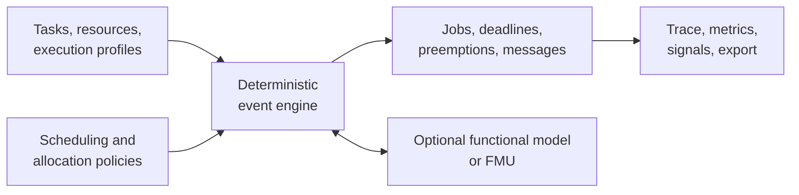

# CPSSim

CPSSim is a portable, deterministic, event-driven C++ simulator for studying
the interaction between real-time execution and cyber-physical behavior. It
separates a reusable simulation core from scheduling policies, resource
allocation, communication models, functional-model adapters, application
services, and visualization.

The first validated scenario is the Bosch Physics-Driven Real-Time CPS
Challenge: a distributed vehicle-control chain whose timing behavior affects
physical performance and whose physical state can inform online scheduling.



## What CPSSim currently supports

- periodic tasks with offsets, deadlines, fixed priorities, and deterministic
  per-resource execution demand;
- independent exclusive resources and explicit task-to-resource assignments;
- preemptive or non-preemptive fixed-priority scheduling;
- deterministic event ordering using integer ticks, semantic phases, and stable
  insertion sequence;
- directed Logical links and fixed-delay Communication links;
- an optional functional-model boundary and FMI 2.0 Co-Simulation adapter;
- Bosch trigger, timing, and functional conformance against captured references;
- a native Qt workbench for project editing, execution, inspection, plotting,
  result analysis, and export;
- a persistent CLI for supplied Bosch workflows;
- unit, integration, GUI, conformance, sanitizer, Release, and Clang workflows.

Current limitations are explicit: resources are exclusive uniprocessors;
migration and global multicore scheduling are absent; Communication links have
fixed timing and no payload, contention, loss, or random delay; and generic
tasks are periodic.

## Quick start

On the supported Ubuntu development environment:

```bash
make
make run-gui
```

Use the terminal interface instead:

```bash
make run-cli
```

Open the verification menu:

```bash
make test
```

## Documentation

Start at the [documentation home](docs/README.md).

- [User Guide](docs/user/README.md): install CPSSim, understand the model,
  build experiments, operate the workbench, inspect results, and run the Bosch
  scenario.
- [Developer Guide](docs/developer/README.md): architecture, source ownership,
  call flows, implementation locations, tests, customization recipes, and
  future development.
- [Supporting documentation](docs/assist/README.md): ADRs, detailed module
  notes, implementation plans, historical guides, and acceptance evidence.

## Bosch provenance

CPSSim originated from the
[Bosch CPS Challenge repository](https://github.com/boschresearch/CPSChallenge)
and is now developed as a standalone simulator. Supplied FMU, Simulink,
trajectory, paper, presentation, and reference materials retain their original
authorship and license notices. The original challenge README is preserved in
[`resources/BOSCH_CHALLENGE_README.md`](resources/BOSCH_CHALLENGE_README.md),
and captured conformance data is documented under
[`experiments/bosch_v10_reference/`](experiments/bosch_v10_reference/).

The generic core must remain independent of Bosch, FMI, MATLAB, Simulink, Qt,
and other GUI libraries.

## License

See [LICENSE.txt](LICENSE.txt). Individual supplied resources retain the
copyright and attribution stated in their accompanying documentation.
