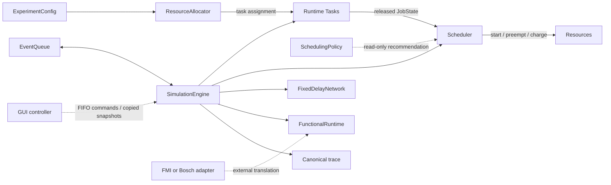
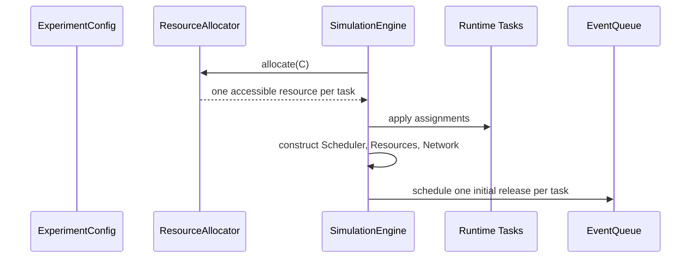
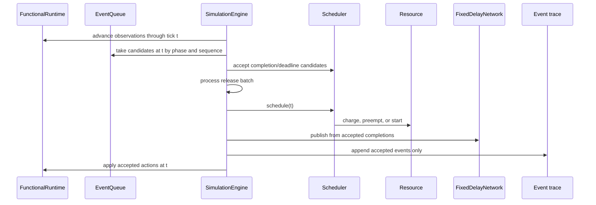
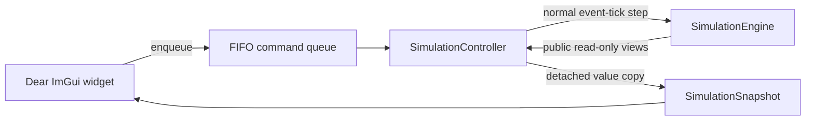

# Module Interactions

This page is the visual runtime reference. For a guided introduction, begin
with the [project tour](guide/PROJECT-TOUR.md). For exact ordering, use
[simulation semantics](guide/SIMULATION-SEMANTICS.md).

## Responsibility at a glance

> The allocator places tasks; the policy recommends jobs; the scheduler
> coordinates transitions; a resource accounts for execution; the engine
> advances and routes the experiment.



## Initialization



The task specification contains accessible resource profiles, not the chosen
resource. The allocator runs before releases. A runtime task owns its applied
assignment and incremental release progression.

## Processing one logical tick



The engine owns the loop, not the module internals. It never implements a
specific ranking rule or directly edits a resource's active interval.

## Completion-to-message causality

```mermaid
sequenceDiagram
    participant E as SimulationEngine
    participant S as Scheduler
    participant N as FixedDelayNetwork
    participant Q as EventQueue

    E->>S: process JobFinish candidate
    alt accepted
        E->>N: publish(completion)
        N->>Q: MessageSend at finish + offset
        Q-->>N: process send
        N->>Q: MessageDelivery at send + delay
        Q-->>N: process delivery
    else stale
        E->>E: discard; do not trace or publish
    end
```

## Online functional coupling

```text
observation(t)
    -> policy sees observation(t)
    -> events and scheduling at t
    -> accepted actions(t)
    -> physical interval [t, t+1)
    -> observation(t+1)
```

The functional runtime preserves a row for every integer tick, while the event
engine may jump over quiet ticks.

## GUI boundary



No widget owns a reference into mutable kernel state. Headless `run()` and GUI
stepping share the same event-tick operation. The
[GUI tutorial](gui/README.md) explains the workbench from a user and beginner
contributor perspective; [GUI architecture](gui/GUI_ARCHITECTURE.md) maps this
boundary to the implementation and tests.

## State ownership

| State | Owner |
|---|---|
| Immutable inputs and scheduling assumption | `ExperimentConfig` |
| Applied assignment and next release | runtime `Task` |
| Pending candidates and event sequence | `EventQueue` |
| Jobs and Ready membership | `Scheduler` |
| Running interval and busy time | `Resource` |
| Messages and their lifecycle | `FixedDelayNetwork` |
| Logical progress and accepted trace | `SimulationEngine` |
| Functional lifecycle and observations | `FunctionalRuntime` |
| GUI command state and presentation copy | `SimulationController` |

Detailed boundaries are documented in the
[fixed-priority](modules/fixed-priority-scheduling.md),
[multiple-resource](modules/multiple-resources.md),
[causal-message](modules/causal-messages.md), and
[online-functional](modules/online-functional-interaction.md) module pages,
plus the [GUI boundary ADR](adr/0018-use-a-single-threaded-snapshot-command-gui-boundary.md).
