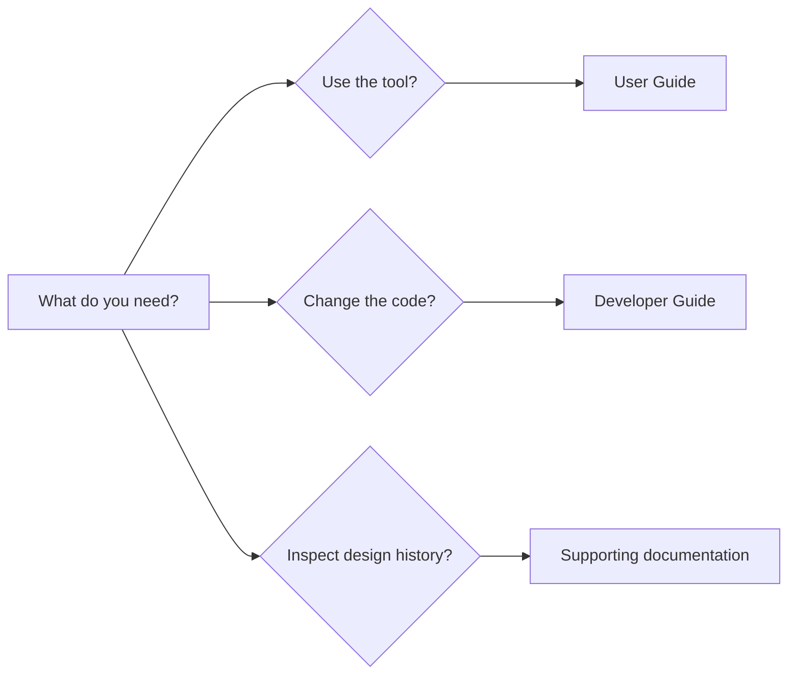

# CPSSim Documentation

Choose the path that matches your goal. You do not need to read every file.

## User path

Start with the [User Guide](user/README.md).

| Goal | Read |
|---|---|
| Understand CPSSim and its research role | [Overview](user/OVERVIEW.md) |
| Install and launch it | [Installation](user/INSTALLATION.md) |
| Learn tasks, jobs, resources, links, ticks, and events | [Core concepts](user/CORE-CONCEPTS.md) |
| Build a small project from start to finish | [First generic experiment](user/FIRST-GENERIC-EXPERIMENT.md) |
| Learn the workbench panels and controls | [GUI workbench](user/GUI-WORKBENCH.md) |
| Run, inspect, and export results | [Execution and results](user/EXECUTION-AND-RESULTS.md) |
| Use the supplied automotive scenario | [Bosch Challenge workflow](user/BOSCH-CHALLENGE-WORKFLOW.md) |
| Diagnose common problems | [Troubleshooting](user/TROUBLESHOOTING.md) |
| Check terminology and current limits | [Glossary and limits](user/GLOSSARY-AND-LIMITS.md) |

## Developer path

Start with the [Developer Guide](developer/README.md).

The developer material explains not only which directory owns a feature, but
also how major functions cooperate, where declarations and implementations
live, which tests establish behavior, and how to customize each subsystem.

## Supporting material

[`assist/`](assist/README.md) contains existing ADRs, detailed module contracts,
implementation plans, migration records, development logs, command references,
and acceptance reports. It is evidence and deep reference, not the primary
linear learning path.

## Documentation rule

Reader-facing documentation describes current behavior. Git preserves
chronology. A future proposal must be labeled as future work and must not be
presented as an available feature.
