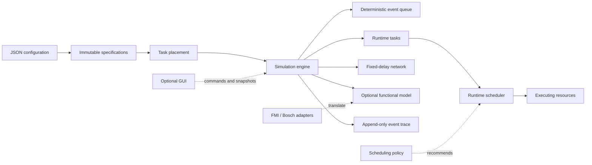

# CPSSim Documentation

This is the documentation home. You do not need to read every file.

## Choose a path

| I want to... | Read |
|---|---|
| Understand the project in 15 minutes | [Project tour](guide/PROJECT-TOUR.md) |
| Understand exact runtime behavior | [Simulation semantics](guide/SIMULATION-SEMANTICS.md) |
| Build, test, or find a command | [Command handbook](COMMANDS.md) |
| Learn the code and make a change | [Developer guide](guide/DEVELOPER-GUIDE.md) |
| See improvements we have not implemented | [Future improvements](guide/FUTURE-WORK.md) |
| Continue work as a coding agent | [Agent handoff](guide/AGENT-HANDOFF.md) |
| Check one module's contract | [Module notes](modules/) |
| Understand why a decision was made | [Architecture decisions](adr/README.md) |
| Review the latest dated implementation evidence | [Development log](devlog/) |
| Build, use, or customize the GUI | [GUI tutorial](gui/README.md) |
| Understand run metrics and exported files | [Results and export](guide/RESULTS-AND-EXPORT.md) |

## One-screen mental model



The generic core owns logical time, jobs, resources, scheduling mechanism,
messages, and traces. Scheduling policies recommend decisions. CLI application
services compose core and adapter APIs without moving terminal, FMI, Bosch,
MATLAB-reference, or GUI code into the core.

## Documentation layers

```text
guide/          connected explanations for readers and contributors
modules/        concise contracts for individual implemented modules
gui/            GUI tutorial and implemented presentation architecture
instructions/   stable charter, architecture, workflow, and roadmap
adr/            durable design and semantics decisions
devlog/         dated implementation and validation evidence
```

Start with the guide that answers your question. Follow links to a module
note, ADR, source file, or test only when you need the detail. Git history is
the chronological record; documentation describes the current project.

## Current boundary

CPSSim currently supports deterministic periodic releases, fixed-priority
scheduling on independent exclusive resources, fixed-delay causal messages,
online functional-model interaction, Bosch timing/trigger conformance, FMI 2.0
Co-Simulation import, strict single-vehicle execution of all three supplied
Bosch trajectory formats, and an optional GUI workbench with run-plan editing,
an architecture graph, a scheduling timeline, functional plots, derived run
results, and atomic raw/Excel export.
The terminal interface supports a persistent command shell plus interactive
and direct execution of the three supplied Bosch trajectories.
Shared-capacity resources, task channels, network contention/loss, multiple
scheduling domains, multi-vehicle functional coupling, multi-run comparison,
and parameter sweeps are future work, not hidden current behavior.
