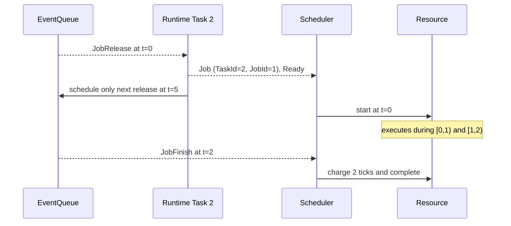

# Simulation Semantics

This page is the compact behavior contract for future implementation work.
If code, a test, and this page disagree, stop and resolve the discrepancy; do
not silently choose the easiest interpretation.

## Time means boundaries, not samples

Canonical time is a signed integer `Tick`. Tick `t` is the boundary before the
physical/execution interval `[t, t + 1)`.

```text
boundary       t                 t+1               t+2
               |-----------------|------------------|
interval          [t, t+1)          [t+1, t+2)
running work      first tick         second tick
```

Therefore, if a job starts at tick 4 and runs without interruption, then at
the start of tick 5 it has received one tick of execution. A job with demand
3 that starts at 4 finishes at tick 7.

The engine is event-driven: it need not wake up at 5 and 6. When the next
relevant event is at 7, the resource charges `7 - 4 = 3` ticks for `[4, 7)`.

Physical seconds exist only at adapters and configuration conversion
boundaries. Floating-point seconds are never canonical queue timestamps.

## Same-tick order

The pending queue uses this total key:

```text
(tick, explicit phase precedence, insertion sequence)
```

At one tick, phases run in this order:

| Order | Phase | Why it is before the next phase |
|---:|---|---|
| 1 | Execution completion | Work through the preceding interval is settled first |
| 2 | Message delivery | Inputs arriving at this boundary become visible |
| 3 | Deadline check | A job finishing exactly at its deadline is on time |
| 4 | Job release | New work becomes Ready at this boundary |
| 5 | Policy update | Observation-derived policy state is available before selection |
| 6 | Scheduling | The next interval's Running jobs are chosen |
| 7 | Caused action | Outgoing effects are recorded after the decision that caused them |

Enum numeric values do not define this order. The explicit mapping in
[event_queue.cpp](../../src/cpssim/kernel/event_queue.cpp) is the authority.
Insertion sequence gives a stable order inside one tick and phase. It is not a
superdense-time microstep or causal-depth value.

Same-tick periodic releases receive one extra semantic batch order:

```text
(smaller priority value, smaller TaskId)
```

This matches the captured Bosch behavior while preserving runtime job
generation. Sequence numbers remain stable event identities.

## Release, execution, and completion example

Assume task 2 has offset 0, period 5, deadline 5, execution demand 2, and
priority 1.



Important consequences:

- a job does not exist before its release is processed;
- a newly released job starts as `Ready`, not `Pending`;
- `JobId` is one-based and local to its task; `(TaskId, JobId)` is the complete
  identity;
- only one future release per task is queued; processing it schedules its
  successor;
- a task may be reassigned before a pending release is scheduled, but a pending
  or released job keeps the resource and demand it already captured;
- overlapping active jobs from the same task are currently rejected.

## Scheduling and preemption

`ResourceAllocator` places tasks before execution. At runtime,
`SchedulingPolicy` ranks jobs and `Scheduler` performs the transitions.

The current fixed-priority order is:

```text
(priority, release tick, TaskId, JobId), smaller first
```

A Ready job preempts a Running job only when its priority value is strictly
smaller. Equal priority does not preempt. In non-preemptive mode, a Running job
stays in place until completion; the policy still chooses work when the
resource becomes idle.

Independent resources are visited in ascending `ResourceId`. This produces a
repeatable trace order; it does not imply that one resource consumes logical
time before another.

Preemption creates a new completion candidate when the job resumes. An older
completion candidate may remain in the queue. The scheduler accepts it only if
job identity and expected completion still match; otherwise it is stale and is
not appended to the canonical trace.

## Deadlines

The absolute deadline is `release tick + relative deadline`.

Because completion precedes deadline checking at the same tick, a job that
finishes exactly at its absolute deadline is on time. A deadline event records
a miss only if the job is still incomplete when that phase is processed.

The complete boundary contract is:

```text
release at beginning of tick r
execution interval [s, s + C)
finish/output availability at beginning of s + C
absolute deadline r + D
finish at r + D is valid
same-tick completion precedes downstream reads and deadline checking
```

## Trace versus queue

The event queue contains candidates. The append-only canonical trace contains
only successfully processed observations. This distinction explains why stale
completion candidates can be popped but never appear in output.

Event sequence is allocated when a candidate is scheduled and is never reused.
Causal events store the sequence of the event that produced them.

## Stop tick

The experiment horizon is inclusive: candidates at `stop_tick` are processed;
candidates after it are not scheduled or processed.

A lifecycle may therefore be truncated. For example, a message can exist as
`PendingSend` when its planned send lies beyond the horizon. That is an
inspectable final state, not an implicit delivery.

The headless engine's `current_tick` is the last processed event tick. When a
functional model is attached, finalization advances functional observations
through `stop_tick`, including quiet ticks.

## Messages

An accepted `JobFinish` may publish one message for each configured route from
that task:

```text
finish tick
  + positive send offset  -> MessageSend
  + positive fixed delay  -> MessageDelivery
```

The causal sequence chain is `JobFinish -> MessageSend -> MessageDelivery`.
The current network has no payload values, contention, loss, receiver release,
or random delay. The planned future channel model is recorded in
[ADR-0011](../adr/0011-plan-user-configured-task-channels.md).

The Bosch adapter preserves a conformance-specific one-tick handoff between
task completion and the internal send trigger. This is not user-visible
communication latency. The GUI presents Bosch communication latency as exactly
80 ticks and never as 81; presentation-only logical connections show latency
zero and create no messages, delays, or canonical message events.

## Functional-model order

An observation for tick `t` exists before scheduling and accepted actions at
`t`. Those actions affect physical interval `[t, t + 1)` and first appear in
observation `t + 1`.

```text
observe(t) -> process/schedule(t) -> apply actions(t) -> advance physics -> observe(t+1)
```

The functional trace has one row per integer tick, even when the event engine
skips quiet ticks. An action accepted at the inclusive stop tick is recorded,
but there is no later physical interval in the run in which to observe it.

## GUI determinism

`step_to_next_event()` processes every event at the next logical tick as one
atomic step. The GUI sends FIFO commands and renders detached snapshots; it
does not mutate kernel containers. Frame rate changes wall-clock playback only,
never simulation order or the canonical trace.

## Decisions behind these rules

The detailed rationale lives in [ADR-0001](../adr/0001-use-integer-ticks.md),
[ADR-0004](../adr/0004-order-events-by-tick-phase-and-sequence.md),
[ADR-0005](../adr/0005-schedule-periodic-releases-at-runtime.md),
[ADR-0009](../adr/0009-separate-scheduler-policy-resource-and-engine-ownership.md),
[ADR-0013](../adr/0013-order-same-tick-periodic-releases-by-task-semantics.md),
[ADR-0017](../adr/0017-order-online-functional-observation-before-same-tick-actions.md),
and [ADR-0018](../adr/0018-use-a-single-threaded-snapshot-command-gui-boundary.md).
