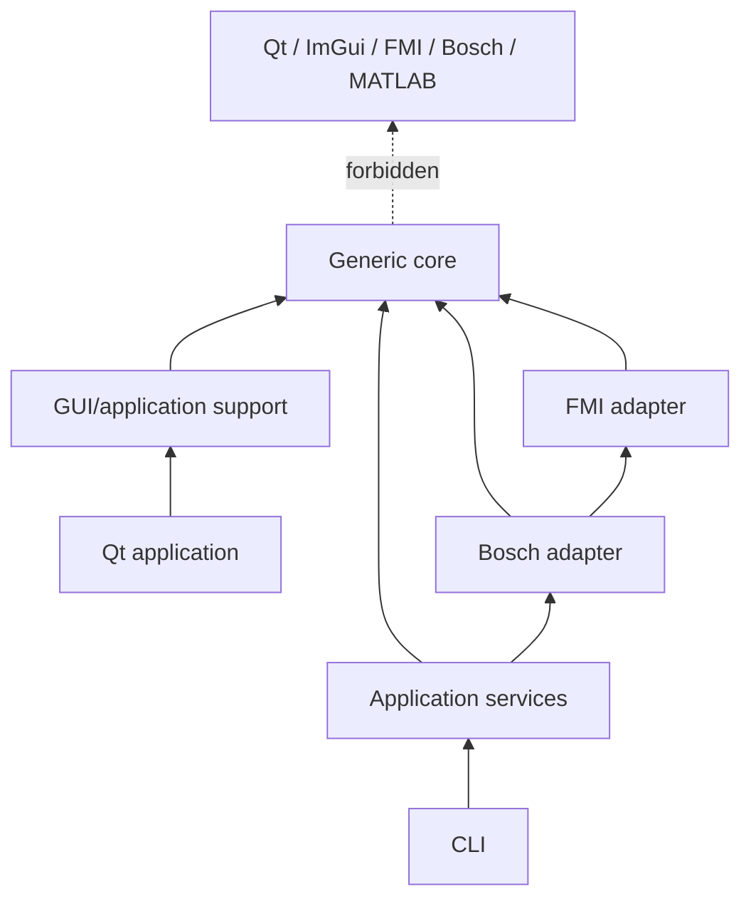
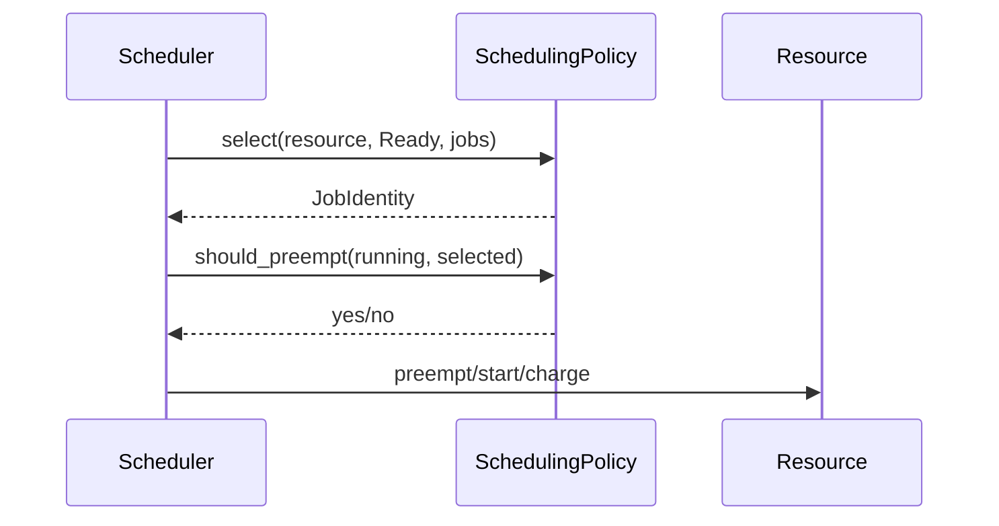
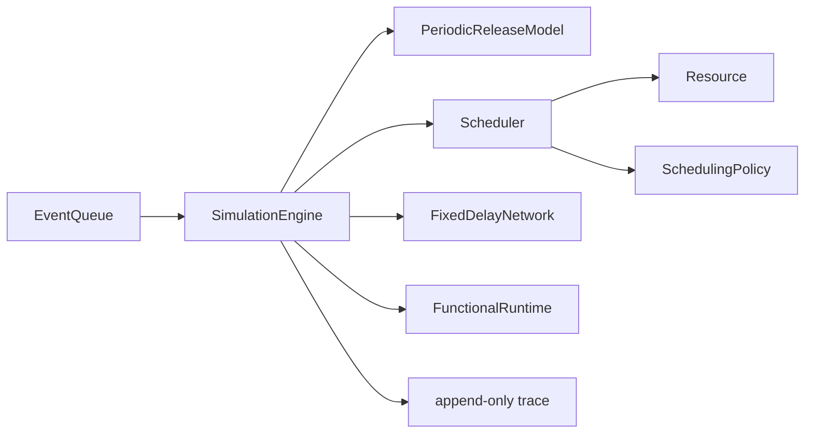
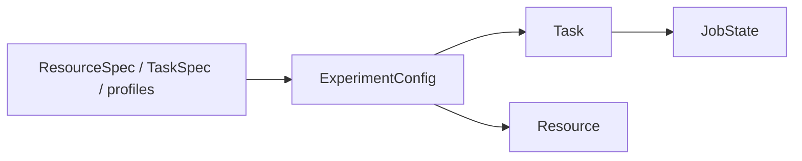
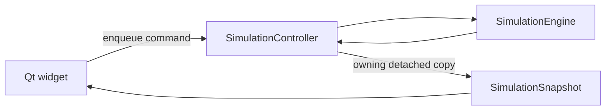
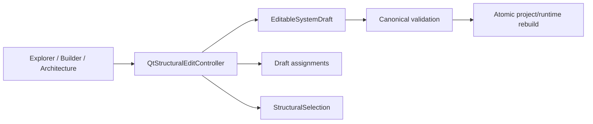

# Architecture Overview

## 1. Central design objective

CPSSim must let scheduling, networking, and physical-model experiments evolve
without allowing adapters or presentation code to redefine the deterministic
core.

The dashed edge is a prohibition. Core code must compile and remain useful
without GUI, FMI, Bosch, or MATLAB.

## 2. Layer responsibilities

| Layer | Primary responsibility | Representative target |
|---|---|---|
| model/config | validated values and serialization boundaries | `cpssim_core` |
| policy | replaceable allocation and job-ordering decisions | `cpssim_core` |
| kernel/network/functional | mutable runtime semantics and orchestration | `cpssim_core` |
| FMI/Bosch | external model and scenario translation | adapter libraries |
| GUI support/application | drafts, projects, commands, snapshots, results | `cpssim_gui_support` |
| Qt frontend | widgets, models, actions, dialogs, painting | `cpssim_qt_gui_support` |
| CLI | command discovery, parsing, terminal workflow | `cpssim_cli_support` |

The actual target graph is defined in
[`CMakeLists.txt`](../../CMakeLists.txt).

## 3. State ownership map

| State/decision | Owner | Important interface |
|---|---|---|
| validated experiment input | `ExperimentConfig` | [`experiment_config.hpp`](../../src/cpssim/model/experiment_config.hpp) |
| placement decision | `ResourceAllocator` | [`resource_allocator.hpp`](../../src/cpssim/policy/resource_allocator.hpp) |
| task release position and assignment | runtime `Task` | [`periodic_release.hpp`](../../src/cpssim/kernel/periodic_release.hpp) |
| pending event candidates and sequence | `EventQueue` | [`event_queue.hpp`](../../src/cpssim/kernel/event_queue.hpp) |
| jobs and per-resource Ready queues | `Scheduler` | [`scheduler.hpp`](../../src/cpssim/kernel/scheduler.hpp) |
| running interval and busy accounting | `Resource` | [`runtime_state.hpp`](../../src/cpssim/model/runtime_state.hpp) |
| ranking/preemption recommendation | `SchedulingPolicy` | [`scheduling_policy.hpp`](../../src/cpssim/policy/scheduling_policy.hpp) |
| messages and lifecycle | `FixedDelayNetwork` | [`fixed_delay_network.hpp`](../../src/cpssim/network/fixed_delay_network.hpp) |
| global tick, routing, canonical trace | `SimulationEngine` | [`simulation_engine.hpp`](../../src/cpssim/kernel/simulation_engine.hpp) |
| external physical state | `FunctionalModel` implementation | [`functional_model.hpp`](../../src/cpssim/functional/functional_model.hpp) |
| GUI runtime commands and copy | `SimulationController` | [`simulation_controller.hpp`](../../src/cpssim/gui/simulation_controller.hpp) |
| project/session/draft/result lifecycle | `WorkbenchApplication` | [`workbench_application.hpp`](../../src/cpssim/application/workbench_application.hpp) |
| editable structural values | `EditableSystemDraft` | [`editable_system_draft.hpp`](../../src/cpssim/gui/editable_system_draft.hpp) |
| Qt structural Undo/Redo | `QtStructuralEditController` | [`structural_edit_controller.hpp`](../../apps/qt_gui/structural_edit_controller.hpp) |
| Qt event-loop adaptation | `QtWorkbenchBridge` | [`workbench_bridge.hpp`](../../apps/qt_gui/workbench_bridge.hpp) |

This table is a change-scope test. Modify the owner and communicate through its
public interface; do not reach into a neighboring module's container.

## 4. Mechanism versus policy

CPSSim separates “what decision should be made?” from “how is it applied?”

The policy reads immutable views and may update only private policy state via
functional observations. The scheduler validates the recommendation and owns
all mutations.

## 5. Event engine versus subsystem ownership

`SimulationEngine` is the clock and router. It does **not** own Ready queues or
perform resource accounting.

The main implementation is
[`simulation_engine.cpp`](../../src/cpssim/kernel/simulation_engine.cpp).
The complete cycle is tested in
[`simulation_engine_test.cpp`](../../tests/kernel/simulation_engine_test.cpp).

## 6. Immutable configuration versus mutable runtime

Specifications are validated immutable inputs. `Task`, `JobState`, `Resource`,
messages, queues, and model adapters hold runtime state. Reset reconstructs
runtime from immutable input instead of attempting to reverse every mutation.

## 7. GUI command/snapshot boundary

`SimulationSnapshot` owns copied values; a widget cannot mutate engine state
through it. Runtime commands are consumed at a safe controller update boundary.
This preserves headless/GUI trace equality.

## 8. Project editing boundary

QtNodes is a graphics adapter, not persistent truth. Every persistent
structural action delegates through the shared controller and Undo stack.

## 9. Error philosophy

- Invalid input is rejected before runtime mutation when possible.
- An obsolete completion candidate is a normal deterministic stale event and is
  ignored.
- Internal ownership or lifecycle mismatch throws rather than silently repairs.
- Project/runtime replacement is constructed completely before publication.
- Export publishes through an atomic rename.
- GUI derivation fails closed when a trace is inconsistent.

## 10. Durable decisions

Detailed rationale is preserved in
[`docs/assist/adr/`](../assist/adr/README.md), especially integer ticks,
event ordering, runtime release generation, ownership separation, functional
ordering, the command/snapshot boundary, typed run plans, atomic project
rebuilds, and the Qt migration.
