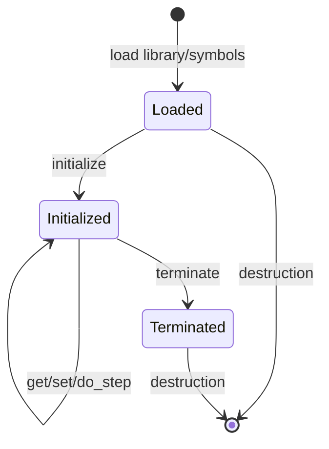
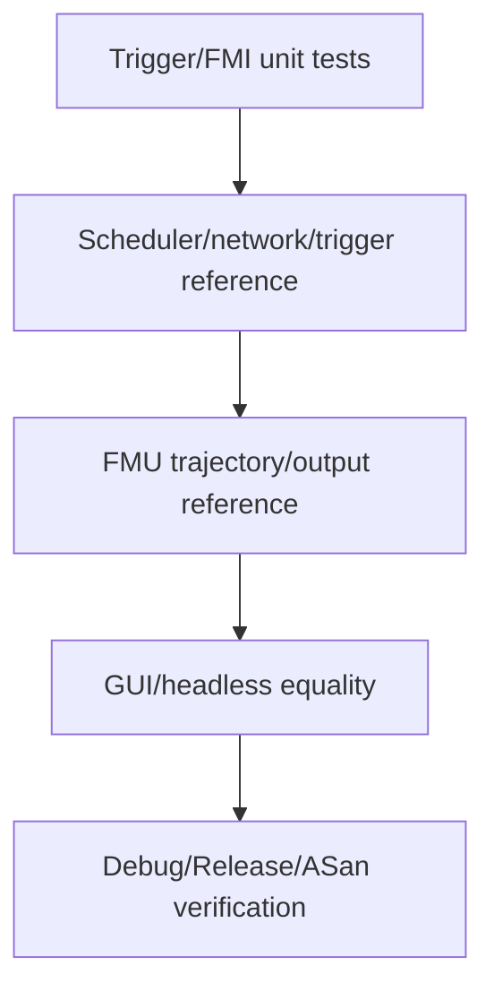

# Bosch, FMI, and Conformance

## 1. Adapter separation


The core knows only `FunctionalModel`. Bosch value references and FMI C API
details remain outside it.

## 2. Generic FMI importer

[`Fmi2CoSimulation`](../../src/cpssim/fmi/fmi2_importer.hpp) owns one
dynamically loaded FMI 2.0 Co-Simulation component.

Implementation:
[`fmi2_importer.cpp`](../../src/cpssim/fmi/fmi2_importer.cpp).

Its `Impl` hides platform handles and FMI function pointers. Public lifecycle:



Construction throws for invalid metadata, library load failure, or missing
required symbols. Runtime FMI calls return typed `Fmi2CallResult`, distinguishing
Ok, Warning, Discard, Error, Fatal, and Pending.

The importer accepts a prepared platform library. It does not currently unpack a
`.fmu` archive or parse `modelDescription.xml`.

## 3. Time boundary

FMI requires floating-point seconds, while core time is integer ticks.
Conversion belongs in the adapter:

```text
engine Tick
-> configured PhysicalDuration
-> exact/checked seconds for FMI call
```

No FMI time type enters `cpssim_core`.

## 4. Bosch functional model

[`BoschFmi2FunctionalModel`](../../src/cpssim/bosch/bosch_fmi2_functional_model.hpp)
implements `FunctionalModel`.

Implementation:
[`bosch_fmi2_functional_model.cpp`](../../src/cpssim/bosch/bosch_fmi2_functional_model.cpp).

It owns:

- one `Fmi2CoSimulation`;
- immutable trajectory sample copy;
- active one-tick trigger references;
- current tick/lifecycle;
- Bosch-specific value-reference translation.

Important functions:

| Function | Behavior |
|---|---|
| constructor | load library and validate trajectory values |
| `initialize` | require Bosch tick, set parameters, initialize, sample tick zero |
| `advance_to` | apply trajectory and trigger pulses, step intervals, sample outputs |
| `apply_actions` | map accepted CPSSim events to trigger references |
| `observation` | read and validate selected outputs |
| `finalize` | terminate component exactly once |

The adapter returns typed signals rather than exposing raw FMI references to
the GUI.

## 5. Trigger encoding

[`trigger_encoder.hpp`](../../src/cpssim/bosch/trigger_encoder.hpp) and
[`trigger_encoder.cpp`](../../src/cpssim/bosch/trigger_encoder.cpp) map
canonical scheduling/network observations into the explicit Bosch trigger
layout.

This is a projection. It does not own scheduling or change event order.

When modifying trigger mapping:

1. preserve the supplied trigger meaning;
2. update explicit source event conditions;
3. compare exact sparse trigger rows;
4. update reference metadata only through a documented regeneration process;
5. retain generic-core independence.

## 6. Trajectory loading

[`example_data.hpp`](../../src/cpssim/bosch/example_data.hpp) /
[`example_data.cpp`](../../src/cpssim/bosch/example_data.cpp) load strict
supplied trajectory formats and validate sample shape/values.

Trajectory data is scenario input, not generated timing behavior.

## 7. Application service

[`BoschRunService`](../../src/cpssim/application/bosch_run_service.hpp) and
[`bosch_run_service.cpp`](../../src/cpssim/application/bosch_run_service.cpp)
compose loading, configuration, engine/model construction, execution, and
result reporting for both CLI modes.

Interactive prompts and direct argv should convert to the same request and
service operation.

## 8. Conformance layers



Reference code:

- [`bosch_reference.hpp`](../../src/cpssim/conformance/bosch_reference.hpp);
- [`bosch_reference.cpp`](../../src/cpssim/conformance/bosch_reference.cpp);
- [`bosch_functional_reference.hpp`](../../src/cpssim/conformance/bosch_functional_reference.hpp);
- [`bosch_functional_reference.cpp`](../../src/cpssim/conformance/bosch_functional_reference.cpp).

Captured evidence:
[`experiments/bosch_v10_reference/`](../../experiments/bosch_v10_reference/).

## 9. Numerical tolerance

Timing/trigger streams can be compared exactly. Floating-point FMU outputs use
documented tolerances because external numerical execution is not byte-exact.

A tolerance must state:

- signal;
- absolute/relative rule;
- reference source;
- platform expectation;
- regeneration procedure.

Do not loosen a tolerance simply to make a changed implementation pass.

## 10. Add another FMU/scenario

Use three layers:

```text
generic FMI loading/lifecycle
scenario-specific FunctionalModel adapter
application/project service and signal metadata
```

Steps:

1. prepare and validate platform library metadata;
2. create a scenario adapter implementing `FunctionalModel`;
3. isolate value references and trigger mapping in that adapter;
4. create strict input loader;
5. register signal descriptors in application layer;
6. add project/runtime resolver;
7. add an independent small FMU lifecycle test;
8. add scenario reference/conformance test;
9. document provenance/license;
10. keep core target links unchanged.
