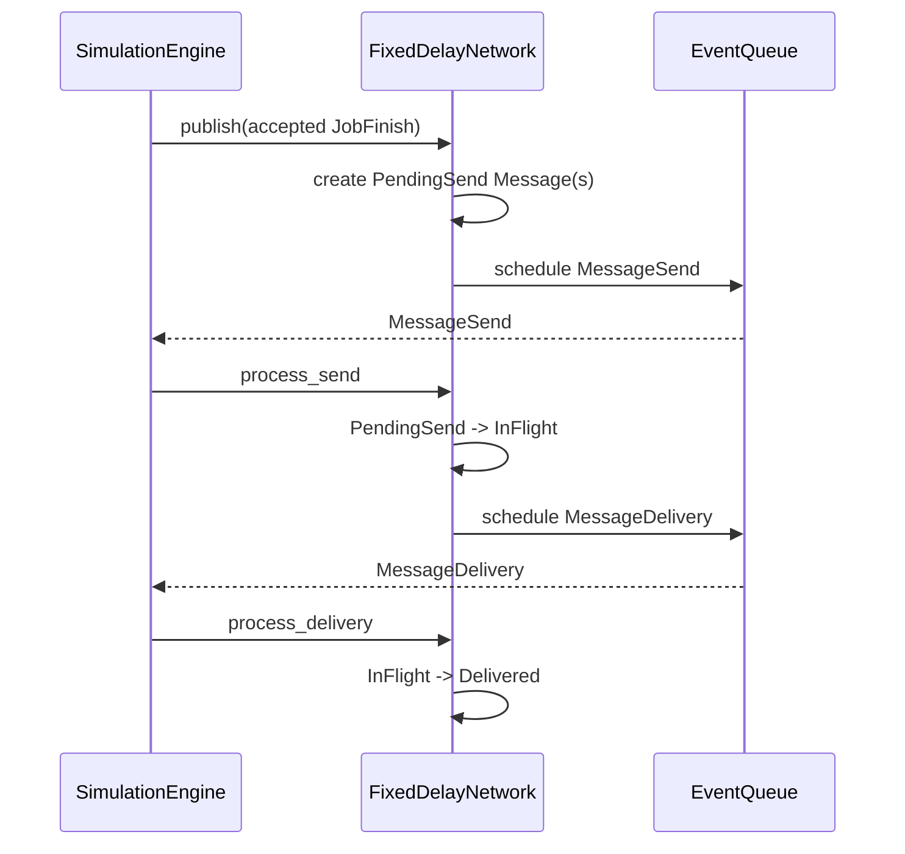
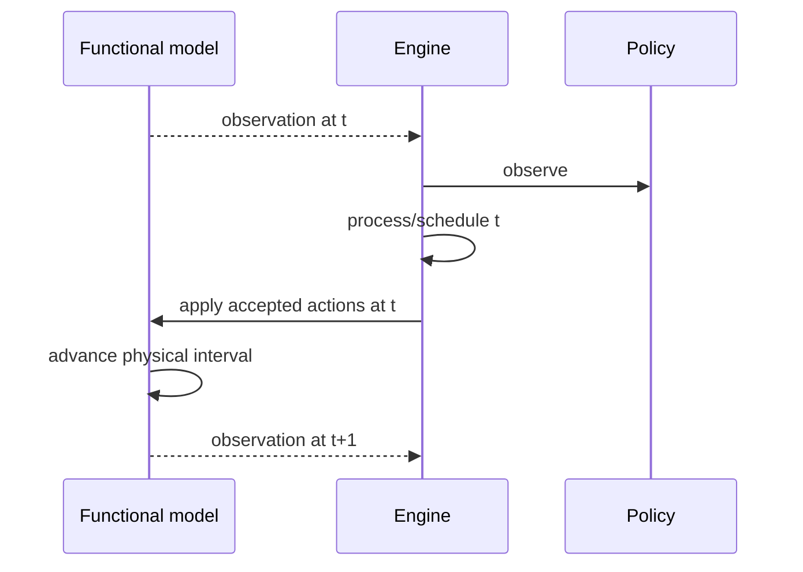

# Communication and Functional Models

## 1. Route specification

[`MessageRouteSpec`](../../src/cpssim/model/specifications.hpp) stores:

```text
source task
destination task
kind
send offset
delay
```

Current kinds:

- Communication: runtime messages and canonical send/delivery events.
- Logical: structural-only; no network traffic.

Generic project validation enforces endpoint and ordered-pair rules.

## 2. Fixed-delay network ownership

[`FixedDelayNetwork`](../../src/cpssim/network/fixed_delay_network.hpp) owns:

- canonically ordered route copies;
- runtime `Message` values;
- message lifecycle;
- one-based `MessageId` allocation;
- horizon.

It does **not** own pending event candidates; `EventQueue` does.

Implementation:
[`fixed_delay_network.cpp`](../../src/cpssim/network/fixed_delay_network.cpp).
Tests:
[`fixed_delay_network_test.cpp`](../../tests/network/fixed_delay_network_test.cpp).

## 3. Completion-to-delivery call flow



Causal sequence:

```text
JobFinish -> MessageSend -> MessageDelivery
```

For completion tick `t`, the core send offset is one tick. Configured delay is
applied after send.

## 4. Horizon truncation

If send lies outside the horizon, a created message may remain `PendingSend`.
If delivery lies outside, it may remain `InFlight`. This state is inspectable
through `network().messages()` and is not automatically promoted.

## 5. Current network boundary

The mechanism currently models causality and fixed timing only. It has no:

- payload values;
- serialization size;
- bandwidth;
- transport queue;
- contention;
- drop;
- duplication;
- random delay;
- receiver activation.

Do not overload `FixedDelayNetwork` with unrelated fields until a second
network mechanism and interface are designed.

## 6. Generic functional-model interface

[`FunctionalModel`](../../src/cpssim/functional/functional_model.hpp) has four
lifecycle methods:

| Method | Contract |
|---|---|
| `initialize(tick_period, stop_tick)` | start run, return tick-zero observation |
| `advance_to(target_tick)` | return every new integer-tick observation |
| `apply_actions(tick, actions)` | accept ordered canonical action batch |
| `finalize()` | close model after inclusive horizon |

Observations retain Real, Integer, and Boolean types.

The interface contains no FMI, Bosch, MATLAB, or GUI types.

## 7. Functional runtime

[`FunctionalRuntime`](../../src/cpssim/functional/functional_runtime.hpp) wraps
a non-owned model and validates:

- lifecycle call order;
- monotonic target ticks;
- observation continuity/shape;
- append-only functional trace;
- action timing.

Implementation:
[`functional_runtime.cpp`](../../src/cpssim/functional/functional_runtime.cpp).
A mock backend provides deterministic tests.

## 8. Timing/functional order



This gives a context-aware policy the observation for tick `t` before it selects
work at `t`, while preventing actions at `t` from retroactively changing that
observation.

## 9. Writing a new functional backend

Implement `FunctionalModel` and keep adapter-specific translation inside the
backend.

Checklist:

1. validate tick period and horizon in `initialize`;
2. define initial observation exactly;
3. maintain adapter-owned current tick;
4. in `advance_to`, return one row for each newly completed integer tick;
5. validate action types and IDs in `apply_actions`;
6. state whether actions affect `[t,t+1)` or another documented interval;
7. terminate exactly once;
8. test online run against offline replay;
9. expose stable signal metadata through the application layer.

Do not convert integer ticks to seconds in core code. Convert at the adapter
boundary using the configured physical tick period.

## 10. Adding payload channels

Payload-bearing dataflow is a planned semantic extension, not a field added to
`Message`.

A staged model should distinguish:

```text
ports/channels: which data version is visible
network: how transport delays or drops it
```

Resolve initial values, same-tick write/read order, fan-in/out, zero-delay
cycles, and data-version identity before implementation. See
[Future Development](FUTURE-DEVELOPMENT.md).
