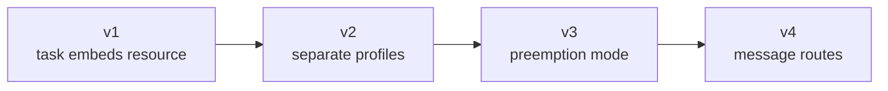
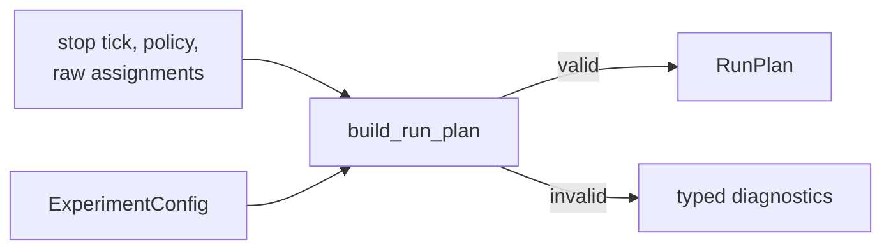
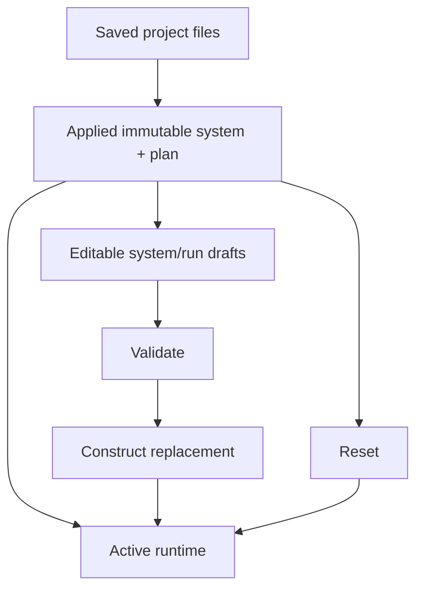
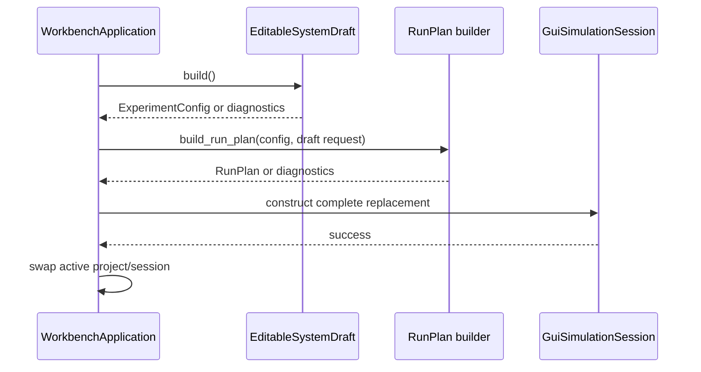

# Configuration and Project Lifecycle

## 1. Strict JSON boundary

Public parsing functions are declared in
[`json_config.hpp`](../../src/cpssim/config/json_config.hpp):

| Function | Purpose |
|---|---|
| `parse_experiment_config` | JSON text -> validated `ExperimentConfig` |
| `serialize_experiment_config_json` | configuration -> canonical JSON |
| `load_experiment_config` | file read + shared parser |
| `save_experiment_config` | serialize before opening destination |

Implementation is in
[`json_config.cpp`](../../src/cpssim/config/json_config.cpp). The JSON library
is private to that translation unit.

The parser:

- requires expected object/array types;
- rejects unknown fields;
- rejects unsupported versions;
- uses checked integer conversion;
- constructs validated model types;
- translates legacy schemas deliberately.

Current canonical serialization is schema version 4. Versions 1 through 4 are
read for compatibility.

## 2. Schema evolution



Legacy v1 fixed mappings are translated into one task-resource profile. Older
documents are not silently interpreted as current fields without an explicit
translation path.

When adding schema v5:

1. define the new model contract;
2. decide whether old input receives a default or translation;
3. add `parse_document_v5`;
4. keep earlier readers unchanged unless correcting a defect;
5. serialize only the new canonical version;
6. add round-trip and rejection tests;
7. document migration.

## 3. Run-plan construction

[`RunPlanRequest`](../../src/cpssim/model/run_plan.hpp) may be invalid.
[`build_run_plan`](../../src/cpssim/model/run_plan.cpp) returns either a
validated immutable `RunPlan` or complete deterministic diagnostics.



The builder does not construct mutable runtime state. This allows GUI and
future CLI workflows to share the exact validation contract.

## 4. Project files

[`ProjectMetadata`](../../src/cpssim/application/project/project.hpp) points to
project-owned relative files:

```text
project.json
system.json
workspace.json
run-plans/default.json
optional scenario file
```

`ProjectContext` owns:

- project root and metadata;
- validated default run plan;
- project workspace;
- one active GUI simulation session;
- runtime-only adapter inputs.

Runtime-only factories and signal registries are resolved from metadata; they
are not serialized as function pointers.

## 5. Create, load, save, Save As

Functions declared in
[`project.hpp`](../../src/cpssim/application/project/project.hpp) and
implemented in
[`project.cpp`](../../src/cpssim/application/project/project.cpp) include:

| Function | Safety property |
|---|---|
| `create_project` | creates directory and writes `project.json` last |
| `load_project` | validates and constructs complete context before return |
| `save_project` | persists system, plan, workspace, metadata |
| `save_project_as` | copies/validates full replacement before return |
| `make_project_context` | applies validated default plan before ownership transfer |

Writing `project.json` last prevents a partly created directory from appearing
as a complete project.

## 6. Editable system draft

[`EditableSystemDraft`](../../src/cpssim/gui/editable_system_draft.hpp) is
graphics-independent and owns detached editable rows:

- system tick/preemption fields;
- resources;
- tasks;
- execution profiles;
- message routes;
- a baseline used for derived dirty state.

It exposes typed operations such as `add_task`, `set_task_timing`,
`set_execution_profile`, `add_message_route`, and confirmed cascade removal.

`build()` converts draft rows back into canonical `ExperimentConfig` and returns
field-addressed diagnostics.

Implementation:
[`editable_system_draft.cpp`](../../src/cpssim/gui/editable_system_draft.cpp).
Test:
[`editable_system_draft_test.cpp`](../../tests/gui/editable_system_draft_test.cpp).

## 7. Draft, applied input, and active runtime

These are deliberately distinct:



- Draft edits do not mutate Active.
- Apply constructs a complete replacement.
- Reset uses Applied, not Draft.
- Save persists Applied.
- Close/replacement resolves unapplied changes explicitly.

## 8. Workbench application orchestration

[`WorkbenchApplication`](../../src/cpssim/application/workbench_application.hpp)
owns the frontend-independent lifecycle. Important operations:

| Function | Role |
|---|---|
| `initialize_system_draft` | create draft from active immutable input |
| `validate_system_draft` | build canonical validation result |
| `apply_system_draft` | atomically replace system/session on success |
| `replace_project` | publish a new active project |
| `create_project`, `open_project` | call project APIs and replace on success |
| `save_project`, `save_project_as` | persist through project layer |
| `resolve_unapplied_changes` | apply/save, discard, or cancel |
| `enqueue`, `update` | control active simulation through GUI-neutral boundary |
| `publish_complete_snapshot` | publish detached presentation generation |
| `export_completed_result` | delegate immutable result export |

Implementation:
[`workbench_application.cpp`](../../src/cpssim/application/workbench_application.cpp).
Behavior:
[`workbench_application_test.cpp`](../../tests/application/workbench_application_test.cpp).

## 9. Atomic apply sequence



Do not update the existing controller incrementally during Apply. A failed
constructor must not leave a half-new runtime.

## 10. Customizing project persistence

When adding a project-owned file:

1. add a relative path to versioned `ProjectMetadata` if necessary;
2. validate that it remains inside the project root;
3. decide create/load/save/Save-As behavior;
4. write dependent content before publishing metadata;
5. define missing/corrupt-file policy;
6. add round-trip, cancellation, and failure-atomicity tests;
7. keep presentation-only state in workspace, not system/run semantics.
