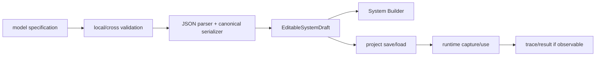

# Customization Cookbook

Each recipe identifies the correct owner, code path, tests, and architectural
risks. Inspect the current branch before editing because symbols can move.

## Recipe 1 — Add a scheduling policy

### Files

- interface:
  [`src/cpssim/policy/scheduling_policy.hpp`](../../src/cpssim/policy/scheduling_policy.hpp)
- example:
  [`fixed_priority.hpp`](../../src/cpssim/policy/fixed_priority.hpp) and
  [`fixed_priority.cpp`](../../src/cpssim/policy/fixed_priority.cpp)
- run selection:
  [`run_plan.hpp`](../../src/cpssim/model/run_plan.hpp)
- controller construction:
  [`simulation_controller.cpp`](../../src/cpssim/gui/simulation_controller.cpp)

### Procedure

1. Derive a class from `SchedulingPolicy`.
2. Implement `select` using read-only Ready/job/resource views.
3. Implement `should_preempt`.
4. Implement `observe` only when context state is required.
5. Add a `SchedulingPolicyKind`.
6. Extend run-plan validation/serialization.
7. Construct the policy in the session/controller factory.
8. Expose it in GUI/CLI only after the shared model accepts it.
9. Test ranking, malformed input, scheduler integration, Reset, and trace
   determinism.

### Do not

- mutate `JobState` from the policy;
- cache pointers into scheduler-owned vectors;
- use wall-clock time;
- make `Scheduler` branch on concrete policy type.

## Recipe 2 — Add a resource allocator

### Files

- interface/implementations:
  [`resource_allocator.hpp`](../../src/cpssim/policy/resource_allocator.hpp) and
  [`resource_allocator.cpp`](../../src/cpssim/policy/resource_allocator.cpp)
- engine validation:
  [`simulation_engine.cpp`](../../src/cpssim/kernel/simulation_engine.cpp)

### Procedure

Return exactly one assignment for every configured task, using only accessible
profile resources. Define deterministic tie-breaking. Add isolated allocation
tests and an engine construction test.

Placement occurs before releases. An allocator is not a runtime migration
policy.

## Recipe 3 — Add a configuration field

### Propagation



### Required decisions

- immutable system field or per-run field?
- default for old schema?
- changes structural signature?
- affects canonical trace?
- affects project compatibility?
- needs an ADR?

Add the field at the narrowest correct owner, not at the GUI first.

## Recipe 4 — Add an event type

### Files

- category:
  [`categories.hpp`](../../src/cpssim/model/categories.hpp)
- record:
  [`event.hpp`](../../src/cpssim/model/event.hpp)
- phase order:
  [`event_queue.cpp`](../../src/cpssim/kernel/event_queue.cpp)
- producer/consumer:
  owning subsystem and [`simulation_engine.cpp`](../../src/cpssim/kernel/simulation_engine.cpp)
- serialization:
  [`event_json.cpp`](../../src/cpssim/trace/event_json.cpp)
- result naming:
  [`run_result.cpp`](../../src/cpssim/analysis/run_result.cpp)

Define required IDs, cause, phase, state transition, and stale/rejection
behavior. Add same-tick ordering and engine-cycle tests.

## Recipe 5 — Change event precedence

This is a semantic change.

1. State the physical/runtime reason.
2. Identify all same-tick interactions affected.
3. Write an ADR.
4. Change `phase_precedence`.
5. Update engine batching if necessary.
6. Update trace/golden references deliberately.
7. Add boundary examples, especially completion versus deadline and delivery
   versus release.
8. Re-run full conformance.

Never reorder enum declarations and assume behavior changed.

## Recipe 6 — Add an activation model

Current `Task` is periodic. For sporadic/event/channel activation:

1. define immutable activation specification;
2. define who requests activation;
3. define minimum separation/queueing/overlap policy;
4. decide job-ID allocation;
5. separate common task identity/profiles from activation state;
6. add a runtime activation interface or composition;
7. preserve periodic behavior byte-for-byte;
8. add engine routing and tests.

Avoid a broad inheritance hierarchy until two concrete activation mechanisms
demonstrate the needed polymorphism.

## Recipe 7 — Add execution-time variation

Start with a finite trace, then seeded distributions.

A reproducible sample key should derive from stable identity:

```text
experiment seed + TaskId + JobId + model purpose
```

Sample exactly once at the documented lifecycle boundary and record the sampled
demand. Do not let unrelated event insertion change the random stream.

## Recipe 8 — Add a network mechanism

Do not mutate `FixedDelayNetwork` into a universal class.

1. define a network interface only when a second mechanism exists;
2. preserve simple fixed-delay implementation;
3. specify link topology, capacity, queueing, serialization, and tie order;
4. define ownership of packets/messages and random state;
5. emit explicit transmission/drop events;
6. preserve causal chain;
7. test capacity conservation and seeded reproducibility;
8. retain legacy fixed-delay traces.

Payload visibility should be designed as channels/ports separately from
transport.

## Recipe 9 — Add a functional backend

Implement `FunctionalModel`.

```cpp
class MyModel final : public cpssim::FunctionalModel {
public:
    FunctionalObservation initialize(
        PhysicalDuration tick_period, Tick stop_tick) override;
    std::vector<FunctionalObservation> advance_to(Tick target_tick) override;
    void apply_actions(Tick tick, const std::vector<Event>& actions) override;
    void finalize() override;
};
```

Keep external API types in the adapter. Test:

- lifecycle misuse;
- continuous observation ticks;
- action order;
- online/offline replay equality;
- finalization;
- reset using a fresh factory instance.

## Recipe 10 — Add an FMU adapter

Use `Fmi2CoSimulation` as the generic lifecycle wrapper and create a
scenario-specific `FunctionalModel`.

Do not put new value references in `fmi2_importer.*`. They belong to the
scenario adapter. Add model metadata, strict input loader, signal registry,
project resolver, and independent reference comparison.

## Recipe 11 — Add a result metric

1. derive from immutable snapshot/public data;
2. use exact integers for canonical tick aggregates;
3. use `optional` when undefined;
4. add hand-calculated unit test;
5. serialize JSON/CSV;
6. add workbook/UI presentation;
7. document range semantics;
8. avoid feeding metric values back into active runtime unless explicitly a
   policy observation defined before scheduling.

## Recipe 12 — Add a Qt panel

1. identify user task and data owner;
2. add detached presentation record/model if derivation is nontrivial;
3. add headless model test;
4. build widget in `apps/qt_gui`;
5. compose in `main_window`;
6. connect through bridge/application operations;
7. persist only presentation state in workspace;
8. test empty/project-switch/running/theme/DPI behavior.

Never store mutable kernel references in a widget.

## Recipe 13 — Add an Architecture interaction

Persistent path:

```text
gesture
-> map QtNodes ID to CPSSim strong ID
-> QtStructuralEditController
-> EditableSystemDraft / assignments / selection
-> validation
-> model/scene rebuild
```

Test:

- new and loaded entities;
- Undo/Redo;
- dirty/no-op behavior;
- selection synchronization;
- save/reopen;
- Running rejection;
- Bosch protection;
- no duplicate graphics records.

## Recipe 14 — Add a CLI command

Implement `CliCommand` under `apps/cli/commands`, register once in
`command_registry.cpp`, use one request for interactive/direct modes, and call
an application service. Use injected streams in tests.

Do not add simulator logic to parser or prompts.

## Recipe 15 — Add project workspace state

Presentation-only state belongs in
[`workspace_state.hpp`](../../src/cpssim/gui/workspace_state.hpp).

1. increment workspace schema;
2. define default/migration behavior;
3. normalize bounds;
4. serialize/parse;
5. make corrupt workspace nonfatal where appropriate;
6. prove no effect on system/run-plan signature or trace.

## Recipe 16 — Add a project template

Use application/project template APIs. Construct a fully valid
`ExperimentConfig` and default `RunPlan`, write optional scenario content, and
create the project atomically. Add create/load/save-as round-trip tests.

## Recipe 17 — Debug a cross-layer defect

Trace by owner rather than by visible symptom:

```text
wrong GUI value
-> copied presentation model correct?
-> snapshot correct?
-> application publication correct?
-> controller/core state correct?
-> configuration/draft correct?
```

For structural issues:

```text
gesture
-> structural controller command?
-> draft/assignment/selection after command?
-> bridge notification?
-> graph/explorer/builder rebuild?
```

Stop at the first layer where expected and actual diverge.
