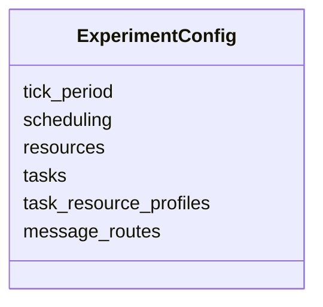

# Domain Model

## 1. Canonical time

[`Tick`](../../src/cpssim/model/time.hpp) is `std::int64_t`.
[`duration_to_ticks`](../../src/cpssim/model/time.cpp) and
[`ticks_to_duration`](../../src/cpssim/model/time.cpp) perform exact
physical-boundary conversion.

Why signed time?

- subtraction can be validated without unsigned wrap;
- parsing can reject negative input consistently;
- the complete simulation domain is explicit.

Conversions reject non-exact duration multiples rather than rounding.

Closest test:
[`time_test.cpp`](../../tests/model/time_test.cpp).

## 2. Strong identifiers

[`identifiers.hpp`](../../src/cpssim/model/identifiers.hpp) defines distinct
types such as `TaskId`, `JobId`, `ResourceId`, `MessageId`, `VehicleId`, and
`EventSequence`.

```cpp
TaskId task{1};
ResourceId resource{1};
// task and resource contain the same integer but are not interchangeable types.
```

`JobIdentity` combines `TaskId` and task-local `JobId`.

Customization rule: add a new strong ID when a new persistent/runtime identity
domain is introduced. Do not use display name, vector index, or a reused ID
class as a shortcut.

## 3. Categories

[`categories.hpp`](../../src/cpssim/model/categories.hpp) names:

- event types;
- event phases;
- job lifecycle;
- preemption mode;
- message lifecycle.

These enums define vocabulary, not transition semantics. For example,
`EventPhase` declaration order does not define precedence; the explicit switch
in [`event_queue.cpp`](../../src/cpssim/kernel/event_queue.cpp) does.

## 4. Specifications

[`specifications.hpp`](../../src/cpssim/model/specifications.hpp) declares:

### `ResourceSpec`

Immutable stable ID and nonempty name.

### `TaskSpec`

Immutable ID, name, periodic timing, and priority. It intentionally contains no
resource assignment.

### `PeriodicTimingSpec`

```cpp
struct PeriodicTimingSpec {
    Tick period;
    Tick deadline;
    Tick offset;
};
```

### `TaskResourceProfile`

```cpp
task ID + resource ID + execution time
```

This relation simultaneously means “accessible” and “execution demand on this
resource.”

### `MessageRouteSpec`

Directed source/destination, kind, fixed send offset, and delay.

Constructors and local validation are implemented in
[`specifications.cpp`](../../src/cpssim/model/specifications.cpp).
Behavior is covered by
[`specifications_test.cpp`](../../tests/model/specifications_test.cpp).

## 5. `ExperimentConfig`

[`ExperimentConfig`](../../src/cpssim/model/experiment_config.hpp) owns the
complete validated immutable system:



Cross-record validation in
[`experiment_config.cpp`](../../src/cpssim/model/experiment_config.cpp)
checks identity uniqueness, references, profile consistency, and route
invariants before runtime construction.

A configuration should be passed by const reference or copied into an owner;
runtime code must not mutate it.

## 6. Canonical event

[`Event`](../../src/cpssim/model/event.hpp) is immutable after construction:

```text
tick
phase
sequence
type
typed optional entity references
optional cause sequence
```

The constructor in
[`event.cpp`](../../src/cpssim/model/event.cpp) validates local time and
causality. The queue, not the event constructor, allocates sequence.

`EventEntityRefs` uses optionals because not every event refers to every entity.
Consumers must validate the fields required by their event type instead of
assuming presence.

## 7. Job runtime state

[`JobState`](../../src/cpssim/model/runtime_state.hpp) stores:

- immutable identity, assignment, priority, release, deadline;
- remaining execution;
- lifecycle;
- first start and finish tick;
- preemption count;
- deadline-miss flag.

Only `Resource` is a friend for execution transitions. This prevents arbitrary
callers from setting `remaining_execution` or lifecycle directly.

Example lifecycle:

```mermaid
sequenceDiagram
    participant S as Scheduler
    participant R as Resource
    participant J as JobState
    S->>R: start_job(J, 0)
    R->>J: Ready -> Running
    S->>R: preempt_job(J, 3)
    R->>J: charge 3; Running -> Ready
    S->>R: start_job(J, 5)
    R->>J: Ready -> Running
    S->>R: charge_execution(J, 8)
    R->>J: remaining 0; Completed
```

Implementation:
[`runtime_state.cpp`](../../src/cpssim/model/runtime_state.cpp).
Test:
[`runtime_state_test.cpp`](../../tests/model/runtime_state_test.cpp).

## 8. Resource runtime state

`Resource` stores one active job identity, active interval, expected completion,
and accumulated busy ticks. It does not store the job object and does not own a
Ready queue.

Important functions:

| Function | Effect |
|---|---|
| `start_job` | validate ownership/state, mark start/resume, set expected completion |
| `preempt_job` | charge elapsed work, mark Ready, clear active state |
| `charge_execution` | apply elapsed work and complete if demand reaches zero |
| `busy_ticks_until` | include accumulated plus current uncharged interval |
| `idle_ticks_until` | observation interval minus busy time |

This division lets `Scheduler` own job storage while `Resource` owns execution
accounting.

## 9. Runtime message

[`message.hpp`](../../src/cpssim/model/message.hpp) defines message identity,
source/destination task, causal event, timing, and lifecycle. The network is the
only owner allowed to advance PendingSend -> InFlight -> Delivered.

## 10. Run plan

[`run_plan.hpp`](../../src/cpssim/model/run_plan.hpp) separates per-run choices
from system description:

```text
ExperimentConfig: what can exist
RunPlan: what this run chooses
```

`build_run_plan` validates assignments against the exact configuration and
canonicalizes them into configured task order. Diagnostics are typed and
field-addressable.

## 11. Adding a domain field

Use this propagation checklist:

```mermaid
flowchart LR
    Type[spec/value type] --> Local[local validation]
    Local --> Cross[ExperimentConfig validation]
    Cross --> JSON[schema parser/serializer]
    JSON --> Draft[editable draft]
    Draft --> Project[save/load]
    Project --> Runtime[runtime capture/use]
    Runtime --> Trace[events/results if observable]
    Trace --> Tests[tests and docs]
```



A field that changes time, ordering, ownership, or observable trace semantics
also requires an ADR and compatibility decision.
