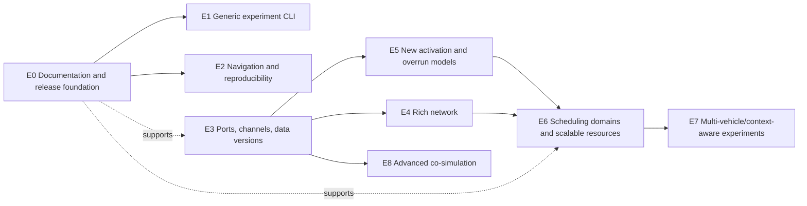
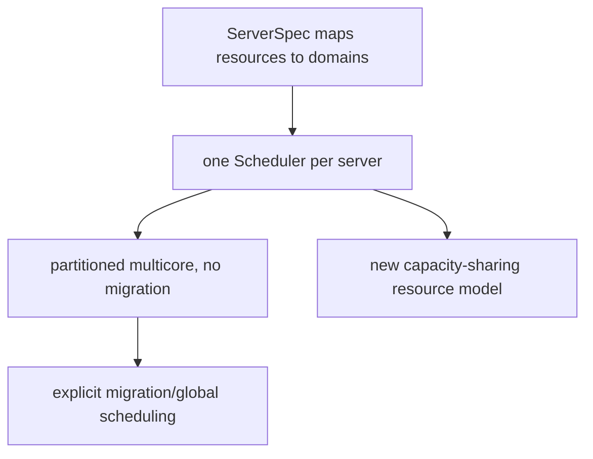
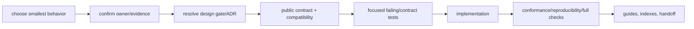

# Future Development Plan

This plan consolidates current gaps into staged, testable directions. It is not
authorization to implement every item. Select the smallest behavior, resolve
its design gate, and define an acceptance oracle first.

## Status vocabulary

| Status | Meaning |
|---|---|
| Near term | suitable after documentation/consolidation |
| Planned | direction already represented by design material |
| Candidate | valuable but semantics still open |
| Deferred | add only for a concrete model |
| Research | requires experiment/question before engineering target |

## Dependency map



## E0 — Documentation, packaging, and engineering foundation

**Status:** Near term.

### Motivation

Make the simulator understandable, reproducible, and installable before adding
large semantics.

### Work

- integrate this User/Developer Guide;
- add Markdown-link and Mermaid checks;
- update root paths after `docs/assist/` move;
- define supported Ubuntu toolchain;
- add hosted GCC/Clang/Debug/Release/sanitizer CI;
- add install/export rules and library consumer example;
- add versioned changelog/release notes;
- measure deterministic performance and memory;
- validate Windows/macOS before claiming support.

### Acceptance

A clean supported machine can clone, configure, build, test, launch the Qt GUI,
run a supplied example, and follow documentation without a developer build
tree.

## E1 — General experiment CLI

**Status:** Near term.

### Current gap

The CLI supports supplied Bosch workflows but not arbitrary Generic project
execution/export.

### Proposed command

```text
cpssim_cli run \
  --config system.json \
  --run-plan run-plan.json \
  --events events.jsonl \
  --output run-directory
```

### Affected code

- `apps/cli/commands/`;
- command registry/parser;
- shared project/run-plan loaders;
- application execution service;
- event/result export.

### Acceptance

Two identical runs produce byte-identical canonical events; invalid input fails
before output publication; CLI and GUI run the same accepted plan through the
same controller/engine semantics.

## E2 — Result navigation, comparisons, and reproducibility

**Status:** Near term/Candidate.

### Work

- jump from miss/preemption to Timeline and signals;
- saved filter presets;
- selected-range export from full-resolution data;
- compare completed runs by manifest/checksum;
- parameter sweep manager only after single-run provenance is complete;
- richer but deterministic performance metrics.

### Design gate

Multi-run comparison must not become hidden experiment execution or mutate
canonical traces.

## E3 — Directed ports, channels, and data versions

**Status:** Planned.

### Motivation

Current links represent structure or message timing, not actual data values or
freshness.

### Target lifecycle

```text
producer completes
-> OutputPort commits DataVersion k
-> Channel transfers k
-> InputPort exposes k
-> consumer snapshots visible versions when it starts
```

### Design gates

- port identity and typing;
- initial values;
- fan-in/fan-out;
- multiple writes at one tick;
- same-tick write-before-read;
- zero-delay cycles;
- compatibility with current routes;
- data-age definition.

### Stages

1. scalar/version metadata with deterministic zero/fixed delay;
2. input snapshot and output commit semantics;
3. compatibility translation from current routes;
4. data freshness/age metrics;
5. typed payloads.

### Acceptance

Tests cover old/new version reads, same-tick visibility, fan-in/out, horizon
truncation, duplicate directed pairs, and repeatability. Reject zero-delay
cycles initially unless microstep semantics are designed.

## E4 — Rich network behavior

**Status:** Candidate, after E3.

### Separation

```text
Channel: what data version should move
Network: serialization, queueing, delay, contention, loss
```

### Stages

1. payload size and link capacity;
2. deterministic FIFO transmission queues;
3. topology/routes;
4. trace-driven variable delay;
5. seeded random delay/loss.

### Acceptance

Capacity is conserved exactly; ties have explicit order; transport lifecycle is
observable; random runs reproduce by seed; fixed-delay legacy traces remain
unchanged.

## E5 — Activation, overruns, execution variation, failures

**Status:** Candidate.

### Activation

Add sporadic, event-triggered, or channel-triggered activation through
composition around common task identity/profiles.

### Overrun/deadline policy

Separate:

```text
OverrunPolicy:
  reject configuration | drop new job | queue overlap | cancel old

DeadlinePolicy:
  observe only | cancel | continue with penalty
```

### Variation/failure

Start with finite traces, then seeded distributions. Sample once using stable
job identity and log the value/result.

### Acceptance

Legacy deterministic runs remain byte-identical; every policy combination has
transition tests; seeded behavior repeats; changed seed affects only documented
samples.

## E6 — Servers, scheduling domains, multicore, shared capacity

**Status:** Candidate.

### Current gap

One scheduler owns all independent exclusive resources. There is no server,
domain, migration, or shared capacity.

### Stages



The engine remains global time/router; each scheduling domain owns jobs and
Ready/running coordination for its server.

### Acceptance

Declaration order does not change trace; domains progress logically
concurrently; no migration occurs without explicit policy; capacity
conservation and completion tie order are defined.

## E7 — Context-aware and multi-vehicle research workflows

**Status:** Research.

### Candidate experiments

- baseline versus state-aware priority;
- critical-section-aware degradation;
- maximum supported vehicle count;
- minimum cloud resources;
- data-driven cloud task activation;
- end-to-end age/control-cost relation.

### Engineering prerequisites

Depending on the question: scheduling-policy observation state, multiple
functional model instances, scheduling domains, channel versions, richer
network, and experiment sweep/provenance.

A research concept should first define:

```text
hypothesis
scenario/input
control performance requirement
timing/resource decision
baseline
metric
acceptance/failure oracle
```

## E8 — Advanced co-simulation

**Status:** Deferred.

Current FMI support is prepared-library FMI 2.0 Co-Simulation, synchronous
`doStep`, one functional model, no rollback/event iteration.

Only add for a concrete model:

- `.fmu` extraction and platform selection;
- modelDescription parsing;
- FMI event mode/discrete-state iteration;
- pending/asynchronous step or rollback;
- multiple coupled models;
- streamed environment input;
- FMI 3.

Repeated evaluations at one integer tick require an explicit `Microstep` type,
queue/trace/causality changes, and an ADR. `EventSequence` must remain identity,
not become superdense time.

## E9 — Visualization and usability candidates

**Status:** Candidate.

- unit-grouped signal axes;
- multi-panel completed plots;
- exportable plot configurations;
- timeline-to-signal linked navigation;
- accessibility and keyboard coverage;
- large-trace profiling before cache redesign;
- presentation-only wall-clock playback pacing.

A “step physical tick” command is not presentation-only and belongs under
engine/functional semantics.

## Ideas not yet prioritized

Detailed preemption costs, limited preemption, SUMO coupling, cooperative
perception, AI inference latency/accuracy/energy models, learning-based
adaptation, multiple cloud endpoints, and distributed orchestration remain
research directions. Promote one only after a concrete experiment and
independent acceptance oracle are defined.

## Turning a roadmap item into an implementation task


