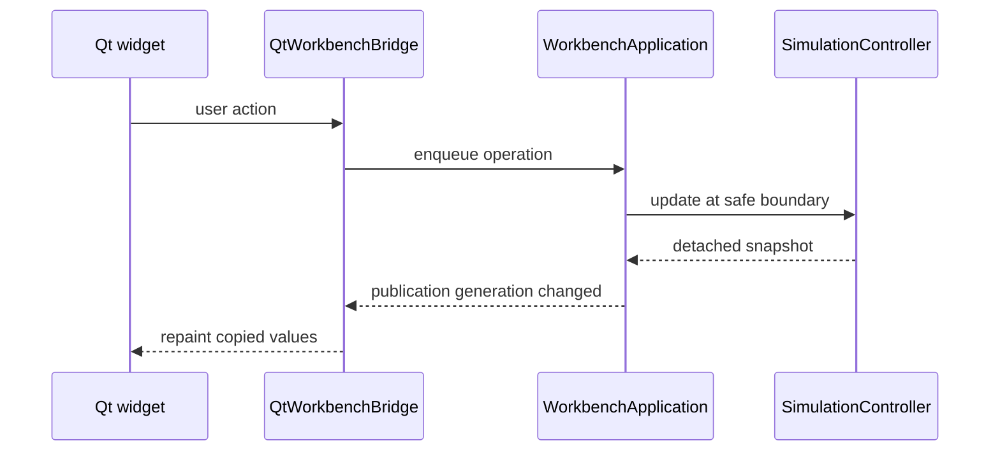
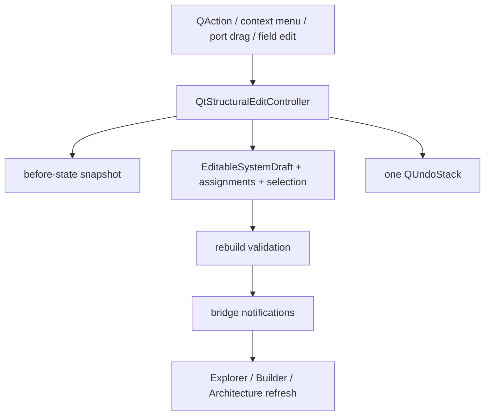

# GUI and Workbench Architecture

## 1. Target layering

```text
cpssim_core
    <- cpssim_gui_support
        <- WorkbenchApplication
            <- QtWorkbenchBridge
                <- Qt widgets/models/painters
```

The default executable is Qt Widgets. The legacy Dear ImGui frontend consumes
the same application owner during the compatibility period.

Detailed supporting architecture remains in
[`docs/assist/gui/GUI_ARCHITECTURE.md`](../assist/gui/GUI_ARCHITECTURE.md).

## 2. `SimulationController`

[`SimulationController`](../../src/cpssim/gui/simulation_controller.hpp)
owns copied configuration, accepted `RunPlan`, allocator, policy, optional
functional model, engine, command queue, and runtime state.

Important functions implemented in
[`simulation_controller.cpp`](../../src/cpssim/gui/simulation_controller.cpp):

| Function | Behavior |
|---|---|
| constructor | revalidate plan and create paused engine |
| `enqueue` | append FIFO command |
| `update` | consume commands, then advance bounded work if Running |
| `snapshot` | build owning detached display copy |
| `reset` | reconstruct policy/model/engine from immutable inputs |
| `step_once` | process one complete logical event tick |

`Run`, `Pause`, `Reset`, and `StepNextEvent` are commands; direct widget calls
into `SimulationEngine` are forbidden.

Closest test:
[`simulation_controller_test.cpp`](../../tests/gui/simulation_controller_test.cpp).

## 3. Snapshot boundary

`SimulationSnapshot` copies:

- run state/current/stop tick;
- experiment presentation;
- canonical event log;
- functional signal registry and observations;
- resource Running/Ready/busy/idle values.

A snapshot has no mutable engine references.



## 4. `WorkbenchApplication`

[`WorkbenchApplication`](../../src/cpssim/application/workbench_application.hpp)
is the non-rendering application owner shared by frontends. It owns:

- current project/session and application screen;
- structural/runtime selections;
- editable system and assignments;
- workspace and recent history;
- publication generations;
- completed-result finalization;
- export;
- status/diagnostics.

Frontend code should translate gestures into public operations rather than
duplicating lifecycle logic.

## 5. `QtWorkbenchBridge`

[`workbench_bridge.hpp`](../../apps/qt_gui/workbench_bridge.hpp) and
[`workbench_bridge.cpp`](../../apps/qt_gui/workbench_bridge.cpp) adapt
`WorkbenchApplication` to Qt signals/timers.

Responsibilities include:

- precise Live timer;
- cooperative Fast continuations;
- no simulation timer while paused/finished/absent;
- queued publication of completed-result worker output;
- synchronization notifications;
- safe shutdown/cancellation.

It is the sole Qt event-loop adapter. A panel must not add a second progression
timer.

## 6. Main window and docks

[`main_window.hpp`](../../apps/qt_gui/main_window.hpp) /
[`main_window.cpp`](../../apps/qt_gui/main_window.cpp) compose menus, toolbar,
central tabs, docks, actions, and project transitions.

The main window owns presentation shell state and forwards lifecycle operations
through the bridge/application. It does not validate simulation semantics.

Closest behavior:
[`main_window_test.cpp`](../../tests/qt_gui/main_window_test.cpp).

## 7. Structural editing

Persistent structural edits use one path:



[`QtStructuralEditController`](../../apps/qt_gui/structural_edit_controller.hpp)
owns the single `QUndoStack` and operations such as `apply`, `create_task`,
`duplicate_selected`, `delete_selected`, `create_connection`, and
`delete_connection`.

Implementation:
[`structural_edit_controller.cpp`](../../apps/qt_gui/structural_edit_controller.cpp).
Test:
[`structural_edit_controller_test.cpp`](../../tests/qt_gui/structural_edit_controller_test.cpp).

Do not persist by inserting/removing QtNodes records and synchronizing later.

## 8. Architecture adapter

Key files:

- [`architecture_model.hpp`](../../apps/qt_gui/architecture_model.hpp):
  CPSSim strong-ID <-> QtNodes adapter and graph model;
- [`architecture_view.hpp`](../../apps/qt_gui/architecture_view.hpp):
  toolbar, context menus, scene/view interactions;
- [`architecture_connection_painter.cpp`](../../apps/qt_gui/architecture_connection_painter.cpp):
  link style;
- [`architecture_node_painter.cpp`](../../apps/qt_gui/architecture_node_painter.cpp):
  task appearance;
- [`architecture_layout.cpp`](../../src/cpssim/gui/architecture_layout.cpp):
  toolkit-independent layout logic;
- [`architecture_graph.cpp`](../../src/cpssim/gui/architecture_graph.cpp):
  detached graph records.

Tasks are nodes. Resources/assignments are presentation badges, not graph
containers/edges. Node position belongs to workspace, while task/link existence
belongs to the system draft.

When adding an interaction:

1. map graphical IDs to full CPSSim identities;
2. call the structural controller for persistent change;
3. rebuild from domain state;
4. preserve selection by stable identity;
5. test loaded and newly created entities;
6. test Running and Bosch rejection.

## 9. Explorer and System Builder

[`explorer_widget.cpp`](../../apps/qt_gui/explorer_widget.cpp) renders the
structural tree and context actions.

[`system_builder_widget.cpp`](../../apps/qt_gui/system_builder_widget.cpp)
hosts reusable property pages and sends field changes through the structural
edit path.

Graphics-independent behavior lives in:

- [`system_builder_interaction.hpp`](../../src/cpssim/gui/system_builder_interaction.hpp);
- project [`system_builder_workflow.hpp`](../../src/cpssim/application/project/system_builder_workflow.hpp);
- [`system_edit_policy.hpp`](../../src/cpssim/application/project/system_edit_policy.hpp).

Keep cascade, selection repair, and edit-policy rules out of widget-specific
ad hoc code.

## 10. Selection

[`selection_model.hpp`](../../src/cpssim/gui/selection_model.hpp) defines
separate strong-identity domains:

- `StructuralSelection` for Explorer/Builder/Architecture;
- `GuiSelection` for events/jobs/runtime resources/tick range.

Cross-view synchronization uses stable IDs, never visible label or row index.

## 11. Presentation models

Complex derivation that can be tested without a window belongs in
`src/cpssim/gui/`:

| Model | Role |
|---|---|
| `timeline_model.*` | event trace -> validated intervals/markers |
| `signal_series.*` | typed observations -> selected/downsampled series |
| `event_table_model.*` | filtering, row projection, cause lookup |
| `resource_presentation.*` | detached utilization rows |
| `plot_visualizer_model.*` | completed plot lanes/overlays |
| `presentation_publication.*` | generation and publication-rate policy |
| `workspace_state.*` | versioned presentation preferences |

Widgets draw these plain values and maintain only local presentation state.

## 12. Add a Qt view

1. Define the user need and state owner.
2. Reuse a snapshot field or add a detached value through GUI support.
3. Put nontrivial derivation in a testable graphics-independent model.
4. Add the Qt widget/model in `apps/qt_gui/`.
5. Compose it in `main_window`.
6. Add visibility/action state and workspace persistence only if needed.
7. Test derivation headlessly.
8. Test shell/action integration with Qt tests.
9. Verify theme, DPI, resize, empty state, project replacement, and Running.

If the panel only formats existing copied values, it must not change core code.

## 13. Presentation versus semantics

Presentation-only:

- theme;
- dock layout;
- filters/columns;
- pan/zoom;
- graph positions;
- selected signals/ranges;
- rendering downsampling.

Semantic:

- tick order;
- job release;
- policy;
- resource transitions;
- communication timing;
- functional action ordering.

A request such as “step one quiet physical tick” may look like a UI feature but
changes engine/functional progression semantics and requires design work.
