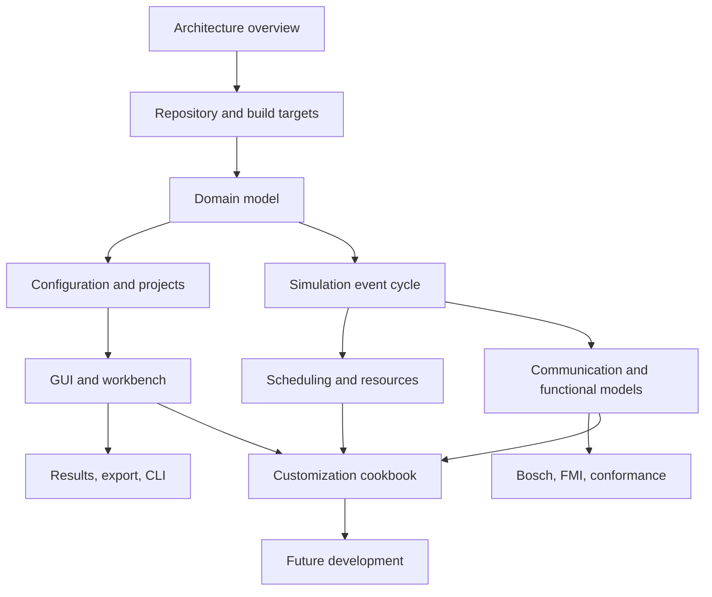

# CPSSim Developer Guide

This guide explains how CPSSim code works, where important functions are
declared and implemented, how those functions are used, which tests establish
their behavior, and how to extend the simulator without weakening determinism.

## Reading path



Recommended chapters:

| Need | Read |
|---|---|
| Understand layers and state ownership | [Architecture overview](ARCHITECTURE-OVERVIEW.md) |
| Find source directories and CMake targets | [Repository and build targets](REPOSITORY-AND-BUILD-TARGETS.md) |
| Understand specifications, jobs, IDs, and time | [Domain model](DOMAIN-MODEL.md) |
| Trace JSON/project/draft/run-plan lifecycle | [Configuration and projects](CONFIGURATION-AND-PROJECTS.md) |
| Follow one complete logical event tick | [Simulation event cycle](SIMULATION-EVENT-CYCLE.md) |
| Understand selection, dispatch, preemption, and accounting | [Scheduling and resources](SCHEDULING-AND-RESOURCES.md) |
| Understand messages and model interaction | [Communication and functional models](COMMUNICATION-AND-FUNCTIONAL-MODELS.md) |
| Understand Qt ownership and structural editing | [GUI and workbench](GUI-AND-WORKBENCH.md) |
| Understand supplied FMU integration | [Bosch, FMI, and conformance](BOSCH-FMI-AND-CONFORMANCE.md) |
| Understand metrics, persistence, and terminal commands | [Results, export, and CLI](RESULTS-EXPORT-AND-CLI.md) |
| Test a change correctly | [Testing and quality](TESTING-AND-QUALITY.md) |
| Implement a new feature | [Customization cookbook](CUSTOMIZATION-COOKBOOK.md) |
| Review staged future directions | [Future development](FUTURE-DEVELOPMENT.md) |

## Source-link convention

A behavior explanation normally links to:

```text
public declaration
    -> implementation
    -> primary caller
    -> closest behavioral test
    -> related ADR/supporting document
```

Headers state what callers may rely on. `.cpp` files explain validation and
non-obvious transitions. Tests are executable examples of the contract.

## Reference indexes

The `reference/` directory provides compact maps:

- [Core symbol index](reference/CORE-SYMBOL-INDEX.md)
- [Application and GUI symbol index](reference/APPLICATION-GUI-SYMBOL-INDEX.md)
- [Adapter symbol index](reference/ADAPTER-SYMBOL-INDEX.md)
- [Test index](reference/TEST-INDEX.md)

These indexes are navigation aids, not substitutes for reading a public header
and its closest test.

## Change rule

Before editing, identify:

1. which object owns the state;
2. which public operation is allowed to mutate it;
3. whether the change alters semantics or only presentation;
4. which narrow test can first prove the behavior;
5. whether compatibility or an ADR is required.
