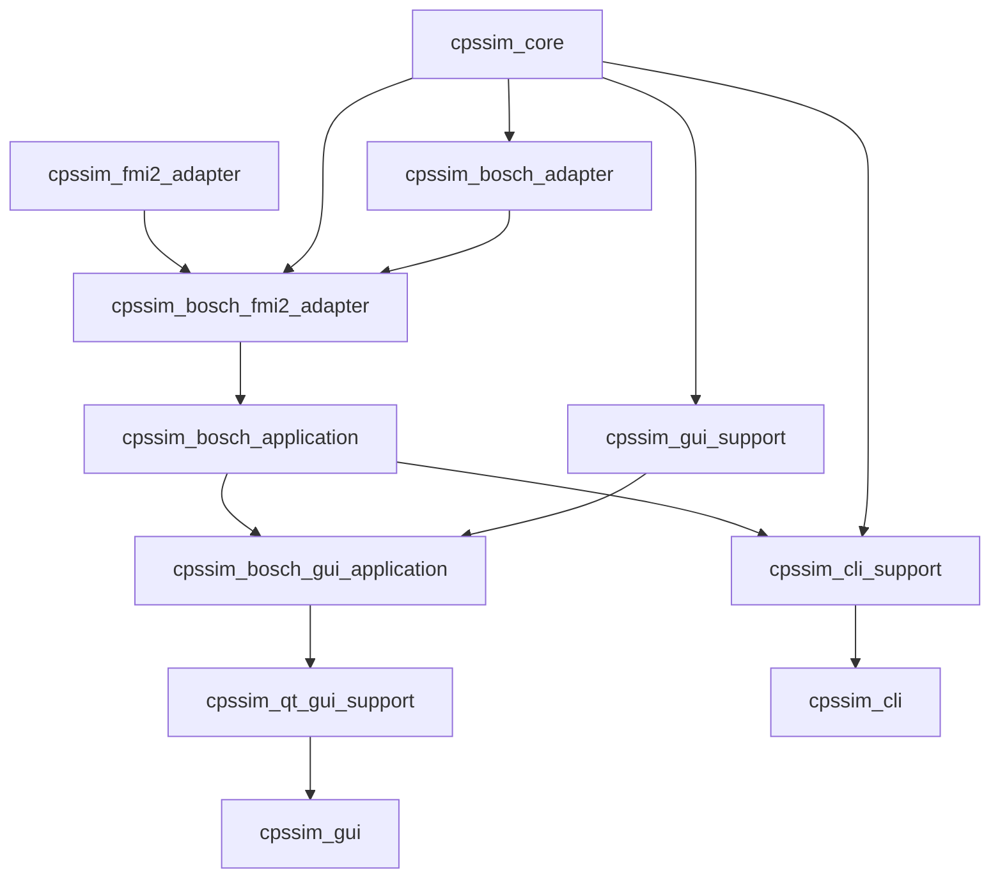

# Repository and Build Targets

## Repository map

| Location | Responsibility |
|---|---|
| `src/cpssim/model/` | IDs, time, specifications, events, jobs, resources, messages, run plan |
| `src/cpssim/config/` | strict JSON translation |
| `src/cpssim/kernel/` | event queue, releases, scheduler mechanism, global engine |
| `src/cpssim/policy/` | resource allocation and job-ordering decisions |
| `src/cpssim/network/` | current fixed-delay message mechanism |
| `src/cpssim/functional/` | generic functional-model boundary/runtime |
| `src/cpssim/fmi/` | generic FMI 2.0 Co-Simulation loader |
| `src/cpssim/bosch/` | Bosch trigger, trajectory, and FMU mapping |
| `src/cpssim/conformance/` | reference comparison |
| `src/cpssim/gui/` | toolkit-independent GUI commands and presentation models |
| `src/cpssim/application/` | reusable services, projects, result export |
| `src/cpssim/analysis/` | immutable result derivation/finalization |
| `apps/cli/` | CLI shell, parser, registry, commands |
| `apps/qt_gui/` | default Qt bridge, models, widgets, painters, main window |
| `apps/gui/` | legacy Dear ImGui frontend |
| `apps/conformance/` | conformance executable |
| `tests/` | behavior examples mirroring the source modules |
| `resources/` | supplied challenge resources and provenance |
| `experiments/` | captured reference/experiment evidence |
| `docs/assist/` | ADRs, module notes, plans, and historical evidence |

All project C++ code uses the `cpssim` namespace; directories express ownership,
not nested namespace taxonomy.

## Principal CMake targets



Review the exact source list and link graph in
[`CMakeLists.txt`](../../CMakeLists.txt).

## Build options

| Option | Purpose |
|---|---|
| `CPSSIM_WARNINGS_AS_ERRORS` | treat project warnings as errors |
| `CPSSIM_ENABLE_SANITIZERS` | AddressSanitizer and UndefinedBehaviorSanitizer |
| `CPSSIM_ENABLE_CLANG_TIDY` | run clang-tidy during compilation |
| `CPSSIM_BUILD_GUI` | build default Qt Widgets GUI |
| `CPSSIM_BUILD_QT_GUI` | explicit Qt frontend option |
| `CPSSIM_BUILD_IMGUI_GUI` | build legacy frontend |

## Make interface

[`Makefile`](../../Makefile) is the normal human-facing wrapper:

```text
make          build CLI, Qt GUI, Bosch FMU target
make run-cli  build and launch CLI
make run-gui  build and launch Qt GUI
make test     open verification selector
make clean    remove documented build directories
make help     list commands
```

Do not add a Make target for every executable or test. CMake owns build logic;
the Makefile remains a small stable interface.

## Presets

[`CMakePresets.json`](../../CMakePresets.json) defines:

- `dev`: GCC Debug;
- `release`: GCC Release;
- `asan`: GCC with ASan/UBSan;
- `clang`: Clang Debug;
- `tidy`: Clang plus clang-tidy;
- `gui` / `qt-gui`: Qt Widgets build;
- `gui-both`: Qt and legacy ImGui;
- `make-*`: Unix Makefiles variants used by the wrapper.

A normal developer loop is:

```bash
cmake --preset dev
cmake --build --preset dev -j
ctest --preset dev --output-on-failure
```

## Adding a source file

1. Put the file in the directory whose layer owns the behavior.
2. Add its `.cpp` to the smallest correct target in `CMakeLists.txt`.
3. Link only the dependencies allowed by architecture direction.
4. Add a test source to the matching test target.
5. Preserve warnings, sanitizers, and C++20 settings through target helpers.
6. Update the relevant Developer Guide/source index.

Header-only value types still need tests but not a target source entry.

## External dependencies

The build currently uses or fetches pinned versions of:

- nlohmann/json;
- zlib and libxlsxwriter;
- Qt 6;
- QtNodes;
- legacy Dear ImGui/ImPlot and portable dialogs when that frontend is enabled.

A new dependency must be justified, pinned, scoped to the layer that needs it,
and excluded from `cpssim_core` unless it is genuinely core infrastructure.

## Executable entry points

| Executable | Entry |
|---|---|
| `cpssim_cli` | [`apps/cli/main.cpp`](../../apps/cli/main.cpp) |
| `cpssim_gui` | [`apps/qt_gui/main.cpp`](../../apps/qt_gui/main.cpp) |
| legacy GUI | [`apps/gui/main.cpp`](../../apps/gui/main.cpp) |
| Bosch conformance | [`apps/conformance/main.cpp`](../../apps/conformance/main.cpp) |
| Bosch example | [`apps/bosch_example/main.cpp`](../../apps/bosch_example/main.cpp) |

Entry points should compose existing services. They must not become owners of
simulation semantics.
