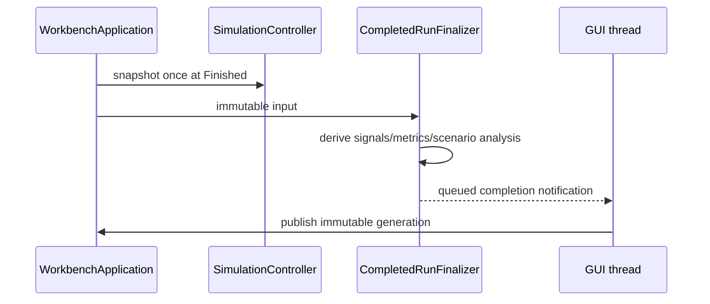
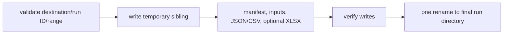
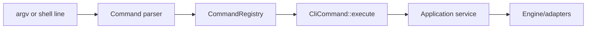

# Results, Export, and CLI

## 1. Detached completed result

[`RunResult`](../../src/cpssim/analysis/run_result.hpp) contains:

- shared immutable `CompletedRunData`;
- scenario kind;
- validated signal build result;
- deterministic derived `RunMetrics`.

`derive_run_metrics` computes task, resource, and message statistics from the
detached snapshot. Implementation:
[`run_result.cpp`](../../src/cpssim/analysis/run_result.cpp).

Metrics are derived; canonical events remain the authoritative runtime history.

## 2. Finalization

Completed-result work is separated from the active controller:



Relevant files:

- [`completed_run_result.hpp`](../../src/cpssim/analysis/completed_run_result.hpp);
- [`completed_run_finalizer.hpp`](../../src/cpssim/analysis/completed_run_finalizer.hpp);
- matching `.cpp` implementations.

The worker must not access controller, FMU, or Qt widget state.

## 3. Export boundary

[`result_export.hpp`](../../src/cpssim/application/result_export.hpp) declares:

- versioned `RunManifest`;
- complete/selected-range options;
- event/signal/metric serializers;
- `export_run_result`.

Implementation:
[`result_export.cpp`](../../src/cpssim/application/result_export.cpp).

Atomic workflow:



An existing run ID is rejected. Failure before rename does not publish a
partial run.

## 4. Workbook output

[`results_workbook.hpp`](../../src/cpssim/application/results_workbook.hpp) /
[`results_workbook.cpp`](../../src/cpssim/application/results_workbook.cpp)
create an optional convenience XLSX using pinned libxlsxwriter.

JSON/CSV are authoritative. Workbook row limits and splitting policy must not
drop data silently.

## 5. Add a metric

1. Decide whether it is canonical or derived; normally derived.
2. Add a plain field/type to `RunMetrics` or scenario analysis.
3. Derive it from immutable snapshot/public values.
4. Test against a hand-calculated small trace.
5. Add JSON/CSV serialization.
6. Add workbook presentation if useful.
7. Add Results UI without changing derivation.
8. Define empty/undefined behavior with `optional`.
9. Update manifest schema only if provenance changes, not for every metric.

Example: data age should wait until payload/data-version semantics exist; it
cannot be inferred reliably from timing-only messages.

## 6. CLI architecture

[`CliCommand`](../../apps/cli/command_registry.hpp) defines metadata and
execution. [`CommandRegistry`](../../apps/cli/command_registry.cpp) owns all
commands and resolves exact names.

Supporting files:

- [`cli_application.hpp`](../../apps/cli/cli_application.hpp): shell/direct
  orchestration;
- [`command_parser.hpp`](../../apps/cli/command_parser.hpp): tokenize direct or
  interactive input;
- `apps/cli/commands/`: one command implementation per operation.



Terminal code should not implement simulator semantics.

## 7. Add a CLI command

1. create `apps/cli/commands/<name>_command.cpp`;
2. implement `CliCommand`;
3. expose a private factory in the registry compilation unit pattern;
4. register once in `command_registry.cpp`;
5. parse direct arguments into a request value;
6. let interactive prompts produce the same request;
7. call an application service;
8. use injected streams for tests;
9. document usage;
10. do not add a Make target for the command.

Closest tests live under [`tests/cli/`](../../tests/cli/).

## 8. General experiment CLI gap

The current CLI has supplied Bosch workflows. A future generic command should
load:

```text
system JSON
run-plan/allocation
stop tick
policy
output location
```

and write canonical trace plus manifest through existing services. It must not
re-implement configuration validation or event serialization.
