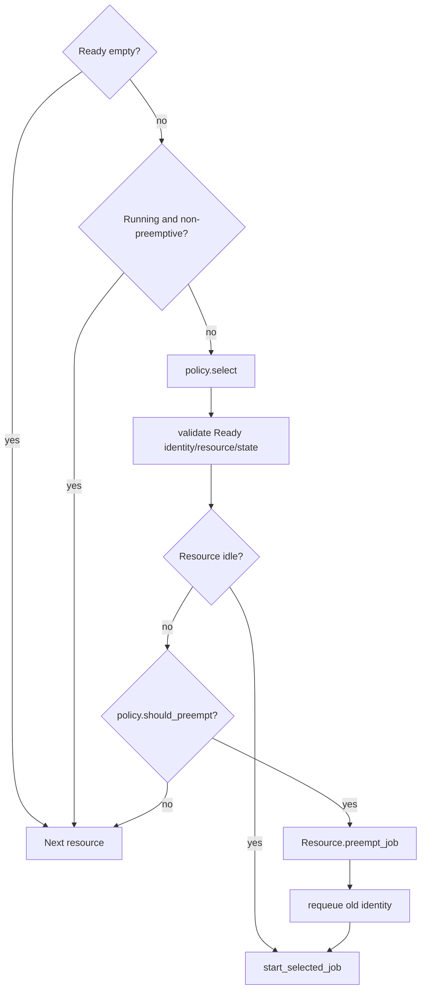

# Scheduling and Resources

## 1. Placement before runtime

[`ResourceAllocator`](../../src/cpssim/policy/resource_allocator.hpp) chooses
one accessible resource for every task before releases begin.

Current implementations include simple/specified allocation. An allocator:

- reads `ExperimentConfig`;
- returns one `TaskAssignment` per task;
- must choose only resources present in that task's profiles;
- must be deterministic;
- does not dispatch jobs.

`SimulationEngine::apply_assignments` defensively revalidates the returned plan.

## 2. Runtime Task and releases

[`Task`](../../src/cpssim/kernel/periodic_release.hpp) owns:

- immutable task spec;
- accessible profiles;
- selected resource for future releases;
- current scheduled release tick and job number;
- pending resource captured by the queued release.

Important functions implemented in
[`periodic_release.cpp`](../../src/cpssim/kernel/periodic_release.cpp):

| Function | Use |
|---|---|
| `assign_resource` | select accessible resource for future jobs |
| `execution_time_on` | resolve deterministic demand |
| `schedule_initial_release` | insert first in-horizon release once |
| `release` | create Ready `JobState`, schedule only successor release |

Only one future release per task is pending. This avoids materializing every
job up to the horizon.

## 3. Scheduler ownership

[`Scheduler`](../../src/cpssim/kernel/scheduler.hpp) owns:

- all `JobState` values;
- one `ResourceSchedulingState` per resource;
- each resource's Ready `JobIdentity` vector;
- non-owned policy reference;
- scheduling assumptions and horizon.

Resources are sorted by ID at construction.

## 4. Submission

`Scheduler::submit` in
[`scheduler.cpp`](../../src/cpssim/kernel/scheduler.cpp):

1. requires new Ready, never-started job;
2. rejects job beyond horizon;
3. rejects active same-task overlap;
4. rejects duplicate complete identity;
5. finds assigned resource state;
6. schedules deadline candidate if in horizon;
7. moves job into owned store;
8. appends identity to Ready membership.

The job object and Ready identity are separate: the store owns data, while the
Ready vector records scheduling membership.

## 5. Policy interface

[`SchedulingPolicy`](../../src/cpssim/policy/scheduling_policy.hpp) defines:

```cpp
virtual void observe(const FunctionalObservation&);
virtual JobIdentity select(
    const Resource&,
    const std::vector<JobIdentity>& ready_jobs,
    const std::vector<JobState>& jobs) const = 0;
virtual bool should_preempt(
    const JobState& running,
    const JobState& ready) const = 0;
```

A policy may maintain private state from `observe`, but cannot mutate jobs,
resources, events, or time.

## 6. Fixed priority

[`FixedPriorityPolicy`](../../src/cpssim/policy/fixed_priority.hpp) is
implemented in
[`fixed_priority.cpp`](../../src/cpssim/policy/fixed_priority.cpp).

Selection order:

```text
priority
-> release tick
-> TaskId
-> JobId
```

Smaller values sort first. Preemption occurs only when the selected Ready
job's priority is strictly smaller than the Running job's priority.

Closest test:
[`fixed_priority_test.cpp`](../../tests/policy/fixed_priority_test.cpp).

## 7. Scheduling cycle

`Scheduler::schedule` visits each resource:



`start_selected_job`:

- verifies Ready membership;
- finds mutable job;
- distinguishes first start from resume;
- calls `Resource::start_job`;
- erases Ready identity;
- schedules `JobStart` or `JobResume`;
- schedules in-horizon completion candidate.

## 8. Completion and stale candidates

On a completion candidate, `Scheduler::process_completion` checks:

```text
resource currently has a Running job
AND identity matches candidate
AND expected completion tick matches
```

If any check fails, the candidate is stale and returns false. This is expected
after preemption because the old completion remains in the priority queue.

If valid, the Resource charges execution and must complete the job exactly.

## 9. Deadline processing

`process_deadline` validates event shape, finds the job, checks resource
identity, and calls `JobState::mark_deadline_missed`.

A completed-on-time job returns false, so the candidate is not appended as a
miss. Wrong tick or repeated recording throws.

## 10. Resource accounting

[`Resource`](../../src/cpssim/model/runtime_state.hpp) owns execution intervals.

Example:

```text
Job starts at 4 with demand 5
preempted at 6 -> charge 2, remaining 3
resumes at 9 -> expected completion 12
completes at 12 -> charge 3
```

Busy intervals are `[4,6)` and `[9,12)`, total 5.

The resource does not know why a job was selected; it only validates and applies
commands.

## 11. Adding a scheduling policy

Minimal steps:

1. derive from `SchedulingPolicy`;
2. implement deterministic `select`;
3. implement `should_preempt`;
4. optionally implement `observe` with policy-private state;
5. add a unit test for ranking and malformed views;
6. add policy kind/factory construction to run/session layer;
7. update run-plan JSON and GUI selection if user-selectable;
8. test scheduler integration and engine determinism;
9. document assumptions and state reset.

Do not place policy-specific fields in `Scheduler` merely for convenience.

## 12. Adding a resource model

The current `Resource` assumes exclusive execution. Fractional capacity or an
accelerator is not a small subclass flag. Define:

- capacity unit;
- concurrent progress;
- completion order;
- preemption/migration rules;
- accounting;
- scheduler-domain ownership;
- event semantics.

Start with an ADR and a new model/interface only when a second mechanism is
concrete.
