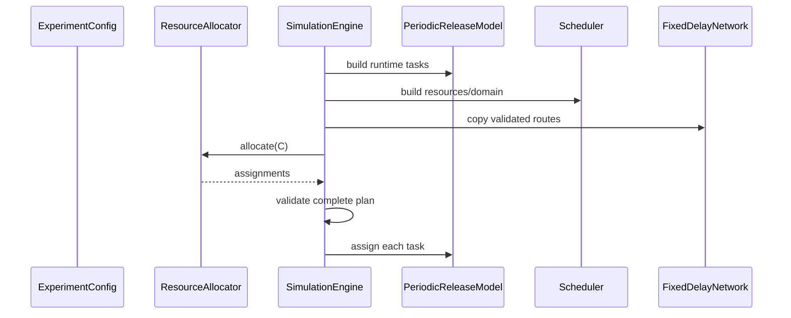
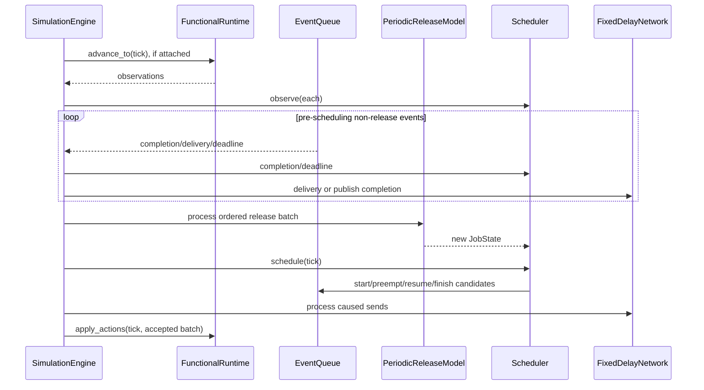

# Simulation Event Cycle

## 1. Main entry points

[`SimulationEngine`](../../src/cpssim/kernel/simulation_engine.hpp) exposes:

| Function | Behavior |
|---|---|
| constructors | build releases, scheduler, network; validate/apply allocation |
| `run()` | process all remaining event ticks once |
| `step_to_next_event()` | process every phase at the next tick |
| `finished()` / `current_tick()` | inspect progression |
| `scheduler()` / `network()` / `trace()` | read-only runtime views |
| `functional_trace()` | read-only typed observations |

Implementation is in
[`simulation_engine.cpp`](../../src/cpssim/kernel/simulation_engine.cpp).

## 2. Construction



`apply_assignments` prevalidates size, uniqueness, task coverage, resource
existence, and accessibility before mutating task assignments.

## 3. Queue ordering

[`EventQueue`](../../src/cpssim/kernel/event_queue.hpp) owns pending events and
allocates `EventSequence`.

The comparator in
[`event_queue.cpp`](../../src/cpssim/kernel/event_queue.cpp) orders:

```text
tick
-> explicit phase_precedence
-> insertion sequence
```

`phase_precedence` names every enum value explicitly. A declaration-order
change cannot alter semantics accidentally.

## 4. Initialization

`SimulationEngine::initialize`:

1. prevents repeated initialization;
2. calls `PeriodicReleaseModel::schedule_initial_releases`;
3. initializes optional `FunctionalRuntime`;
4. forwards initial observations to policy-owned state.

Initialization is lazy: the first `step_to_next_event()` performs it. This
keeps construction separate from progression.

## 5. One complete event tick

Core call flow:



The implementation function is
[`SimulationEngine::process_event_tick`](../../src/cpssim/kernel/simulation_engine.cpp).

## 6. Pre-scheduling events

`process_pre_scheduling_event` dispatches by phase/type:

- accepted `JobFinish` -> `Scheduler::process_completion`; append; publish
  routes;
- `MessageDelivery` -> `FixedDelayNetwork::process_delivery`; append;
- `DeadlineMiss` candidate -> `Scheduler::process_deadline`; append only if
  incomplete;
- `JobRelease` -> `PeriodicReleaseModel::release`; `Scheduler::submit`; append.

Unsupported combinations throw `logic_error`.

## 7. Release batch

Same-tick periodic releases have semantic order:

```text
smaller task priority
-> smaller TaskId
```

`process_release_batch` removes all release candidates at the tick, sorts by
that rule, then submits them. Event sequence remains identity but does not
define periodic-task precedence.

This distinction is essential for captured Bosch behavior and deterministic
runtime-generated releases.

## 8. Scheduling phase

After all pre-scheduling events are settled,
`Scheduler::schedule(tick, queue)`:

- visits resources by ascending `ResourceId`;
- asks the policy about nonempty Ready queues;
- validates the selected identity;
- starts/resumes or preempts as allowed;
- schedules observable `JobStart`, `JobResume`, `JobPreempt`, and future
  `JobFinish` candidates.

The engine does not duplicate this mechanism.

## 9. Post-scheduling events

`process_post_scheduling_events` appends scheduling observations and processes
`MessageSend` caused actions. Positive/controlled timing prevents newly created
same-tick pre-scheduling events from violating phase order.

## 10. Functional action batch

Before processing the tick, the engine records `action_begin = trace_.size()`.
After scheduling and caused actions, it copies the newly accepted trace suffix
and calls:

```cpp
functional_runtime_->apply_actions(tick, actions);
```

Thus the functional model sees only accepted canonical actions in order.

## 11. Stepping and finalization

`step_to_next_event`:

```text
if finished -> false
initialize
if no in-horizon candidate -> finalize, false
process next complete tick
if no later in-horizon candidate -> finalize
return true
```

The horizon is inclusive.

`finalize` advances an attached functional model through `stop_tick` even when
no engine event occurs there, then terminates it exactly once.

`run()` simply calls `step_to_next_event()` until false. It rejects a second
`run()` call.

## 12. Worked example

Task A:

```text
offset 0, period 5, deadline 5, demand 2
```

```mermaid
sequenceDiagram
    participant Q as Queue
    participant E as Engine
    participant T as Task A
    participant S as Scheduler
    participant R as Resource
    Q-->>E: release at 0
    E->>T: release()
    T-->>E: Job A.1; queue release at 5
    E->>S: submit(A.1)
    E->>S: schedule(0)
    S->>R: start A.1
    Q-->>E: completion at 2
    E->>S: process_completion
    S->>R: charge [0,2); complete
```

No event is required at tick 1.

## 13. Extending event behavior

To add an event type:

1. add a category name;
2. choose and document its phase;
3. identify the sole producer and consumer;
4. update explicit phase mapping if adding a phase;
5. define required entity references and causality;
6. update serialization;
7. test queue order and engine acceptance;
8. update timeline/result derivation if observable;
9. add an ADR if same-tick semantics change.

Never use enum numeric value or insertion accident as a semantic shortcut.
