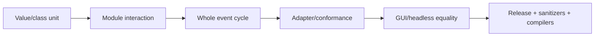

# Testing and Quality

## 1. Verification interface

[`scripts/verify.sh`](../../scripts/verify.sh) is the public selector; CMake and
CTest own build/test logic.

| Command | Use |
|---|---|
| `./scripts/verify.sh quick` | formatting, Debug build, all Debug tests |
| `./scripts/verify.sh all` | all Debug tests |
| `./scripts/verify.sh full` | formatting, Debug, ASan/UBSan, Release, optional Clang/tidy |
| `./scripts/verify.sh module LABEL` | focused maintained CTest label |
| `./scripts/verify.sh format-check` | no-change formatting check |
| `./scripts/verify.sh format-apply` | apply clang-format |

## 2. Test ladder



Start at the narrowest level that proves the contract, then broaden according
to risk.

## 3. Source/test pairing

| Change | Start with |
|---|---|
| tick conversion | `tests/model/time_test.cpp` |
| specification validation | `tests/model/specifications_test.cpp` |
| job/resource transition | `tests/model/runtime_state_test.cpp` |
| queue precedence | `tests/kernel/event_queue_test.cpp` |
| periodic releases | `tests/kernel/periodic_release_test.cpp` |
| policy ranking | `tests/policy/fixed_priority_test.cpp` |
| scheduler mechanism | `tests/kernel/scheduler_test.cpp` |
| whole event cycle | `tests/kernel/simulation_engine_test.cpp` |
| network lifecycle | `tests/network/fixed_delay_network_test.cpp` |
| functional lifecycle | `tests/functional/` |
| GUI command/snapshot | `tests/gui/simulation_controller_test.cpp` |
| system draft | `tests/gui/editable_system_draft_test.cpp` |
| Qt structural edit | `tests/qt_gui/structural_edit_controller_test.cpp` |
| Qt Architecture | `tests/qt_gui/architecture_model_test.cpp` |
| workbench lifecycle | `tests/application/workbench_application_test.cpp` |
| export | `tests/application/result_export_test.cpp` |

See the [test index](reference/TEST-INDEX.md) for broader navigation.

## 4. Determinism tests

A determinism-sensitive change should test:

- declaration order does not alter result where order is semantically defined;
- same input produces identical event sequence/order;
- GUI stepping and headless run produce the same trace;
- stale candidates do not appear in canonical trace;
- Reset reconstructs equivalent runtime;
- serialization is canonical;
- seeded future stochastic models reproduce exactly.

## 5. Negative tests

Validation and ownership are part of the design. Test rejection of:

- unknown/duplicate IDs;
- missing references;
- inaccessible assignments;
- invalid time/demand;
- unsupported event shape;
- wrong lifecycle transition;
- policy selecting outside Ready;
- repeated initialization/finalization;
- partial project/export failure;
- Running/protected structural edits.

A test that only checks the happy path is insufficient for an invariant owner.

## 6. Golden/conformance tests

A golden test must document:

```text
reference source
what is compared
normalization
exact/tolerant fields
tolerance
regeneration procedure
```

Do not regenerate expected output from the implementation being tested without
an independent oracle.

## 7. GUI tests

Prefer headless tests for:

- presentation derivation;
- selection;
- draft mutation;
- action state;
- application lifecycle;
- ID mapping;
- workspace serialization.

Use small Qt integration tests for widgets/actions. Manual smoke remains
necessary for:

- visual clarity;
- real pointer gestures;
- monitor/DPI transitions;
- window-manager behavior;
- large-trace responsiveness.

Do not claim manual coverage when only an offscreen style test ran.

## 8. Sanitizers and Release

Run `full` for changes involving:

- ownership/lifetime;
- asynchronous result finalization;
- dynamic library/FMI;
- container references/iterators;
- project replacement;
- serialization buffers;
- GUI callbacks/timers.

Debug assertions alone are not evidence that Release behavior is safe.

## 9. Documentation-only changes

At minimum:

- check Markdown relative links;
- render Mermaid on GitHub;
- verify commands/paths against current source;
- run `make test` or quick verification if repository tooling is available;
- inspect `git diff --check`.

A documentation statement about current behavior should link to code/test
evidence or a maintained authoritative guide.

## 10. Acceptance criteria

Before implementation, write observable acceptance criteria. Prefer:

```text
Given [validated setup],
when [public operation],
then [state/trace/result],
and [failure/compatibility condition].
```

This prevents an implementation task from being “done” merely because code
compiles.
