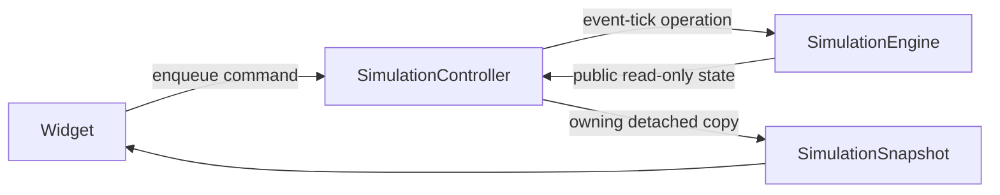
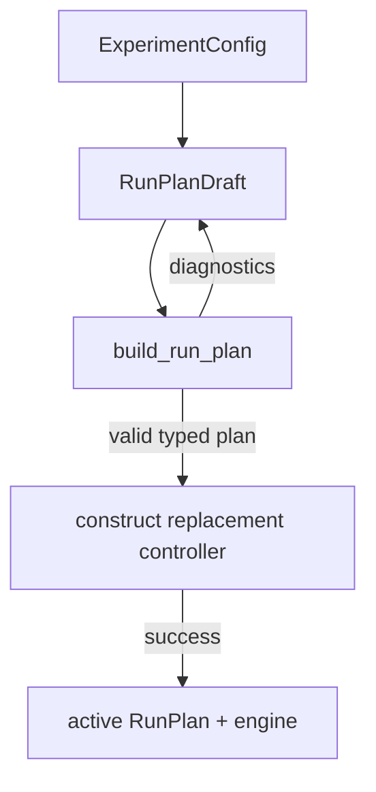
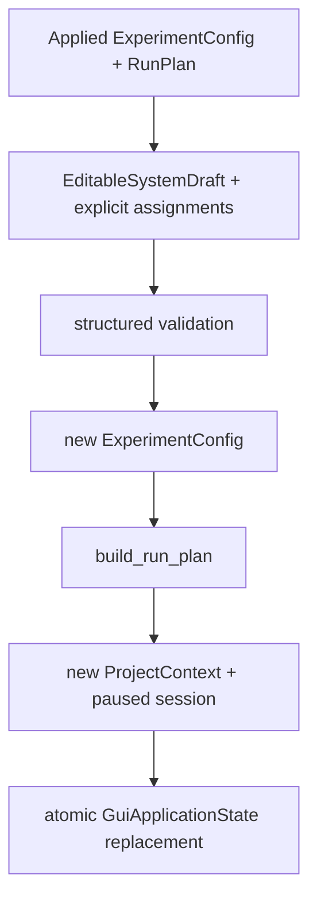
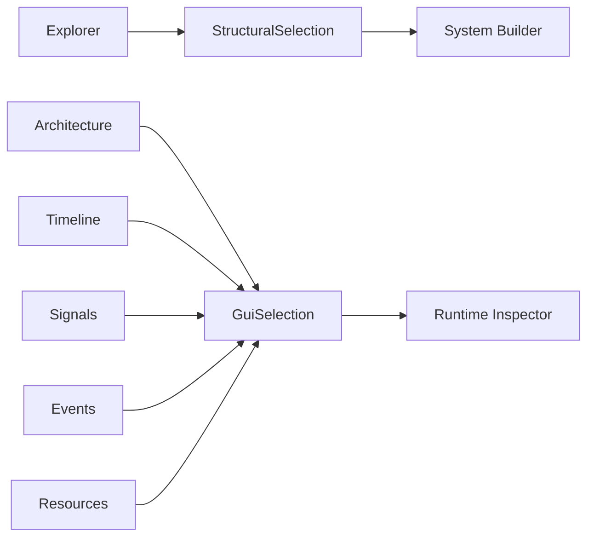

# GUI Architecture

This page explains the implemented GUI boundary and where each kind of change
belongs. Start with the [GUI tutorial](README.md) if you first want to build or
use the application.

## 1. The rule that protects determinism

The GUI may control and observe the simulator, but it does not own simulation
semantics.

```text
cpssim_core <- cpssim_gui_support <- cpssim_gui
```

- `cpssim_core` owns validated specifications and runtime behavior.
- `cpssim_gui_support` owns graphics-independent commands, detached
  presentation values, validation, indexes, and caches.
- `cpssim_gui` owns GLFW/OpenGL startup, Dear ImGui widgets, drawing, and
  transient presentation preferences.

The arrows are one-way dependencies. Core code never includes or links GUI
headers. GUI support may use public core interfaces but does not depend on Dear
ImGui, GLFW, or OpenGL.

The behavioral boundary is:



This boundary is accepted by
[ADR-0018](../adr/0018-use-a-single-threaded-snapshot-command-gui-boundary.md).
The same engine operation drives headless execution and GUI stepping, so the
canonical trace cannot depend on render timing.

## 2. Source map

### Graphics application

| File | Responsibility |
|---|---|
| [`apps/gui/main.cpp`](../../apps/gui/main.cpp) | Argument parsing, current-monitor scale, native window, graphics backends, and frame loop |
| [`gui_application.*`](../../apps/gui/gui_application.hpp) | Workbench layout, panel visibility, independent structural/runtime selection, view-state ownership, and dialogs |
| [`apps/gui/views/`](../../apps/gui/views/) | Immediate-mode widgets and canvas drawing for individual views |

The view files are deliberately small boundaries:

| View | Draws | Presentation state it may change |
|---|---|---|
| `toolbar_view` | Run/Pause/Reset/Next event and status | queued simulation commands |
| `experiment_explorer` | draft structural tree and context actions | structural selection through `SystemExplorerInteraction` |
| `inspector_view` | selected event/job/runtime-resource details | runtime selection may move from event to referenced job |
| `run_plan_editor` | assignments, stop tick, validation/apply actions | pending run configuration only |
| `system_builder` | selected structural properties, profile matrix, route table, diagnostics | `EditableSystemDraft` only |
| `architecture_view` | task/resource/route/assignment canvas | selection, canvas viewport, run-plan draft assignment; system previews are read-only |
| `timeline_view` | Ready/Running intervals and event markers | selection, visible categories, time viewport |
| `signal_view` | typed functional series | selected series, time viewport, shared time selection |
| `resource_view` | copied resource/runtime rows | shared selection |
| `event_view` | canonical event rows | shared event/time selection |
| `results_view` | shared generic metrics and optional Bosch plots | shared resource/time selection |

### Graphics-independent GUI support

| File | Responsibility | Closest test |
|---|---|---|
| [`display_scale.*`](../../src/cpssim/gui/display_scale.hpp) | safe display/framebuffer scale fallback, layout bounds, font-bake floor, and change detection | [`display_scale_test.cpp`](../../tests/gui/display_scale_test.cpp) |
| [`simulation_controller.*`](../../src/cpssim/gui/simulation_controller.hpp) | FIFO commands, current engine/policy/model ownership, detached snapshots | [`simulation_controller_test.cpp`](../../tests/gui/simulation_controller_test.cpp) |
| [`simulation_session.*`](../../src/cpssim/gui/simulation_session.hpp) | loaded experiment, draft/active plan boundary, atomic controller replacement | [`draft_run_plan_test.cpp`](../../tests/gui/draft_run_plan_test.cpp) |
| [`draft_run_plan.*`](../../src/cpssim/gui/draft_run_plan.hpp) | incomplete editable run-plan values and validation input | [`draft_run_plan_test.cpp`](../../tests/gui/draft_run_plan_test.cpp) |
| [`editable_system_draft.*`](../../src/cpssim/gui/editable_system_draft.hpp) | detached system rows, stable IDs, mutation policy, structured diagnostics, canonical conversion | [`editable_system_draft_test.cpp`](../../tests/gui/editable_system_draft_test.cpp) |
| [`system_builder_interaction.*`](../../src/cpssim/gui/system_builder_interaction.hpp) | deterministic Explorer creation, duplication, cascade confirmation, selection repair, and focus/scroll intent | [`system_builder_interaction_test.cpp`](../../tests/gui/system_builder_interaction_test.cpp) |
| [`presentation_model.*`](../../src/cpssim/gui/presentation_model.hpp) | sorted detached experiment descriptions | [`presentation_model_test.cpp`](../../tests/gui/presentation_model_test.cpp) |
| [`selection_model.*`](../../src/cpssim/gui/selection_model.hpp) | independent structural and runtime strong identities plus optional runtime tick range | [`selection_model_test.cpp`](../../tests/gui/selection_model_test.cpp) |
| [`architecture_graph.*`](../../src/cpssim/gui/architecture_graph.hpp) | deterministic graph records and logical layout | [`architecture_graph_test.cpp`](../../tests/gui/architecture_graph_test.cpp) |
| [`timeline_model.*`](../../src/cpssim/gui/timeline_model.hpp) | strict event-to-interval derivation and incremental cache | [`timeline_model_test.cpp`](../../tests/gui/timeline_model_test.cpp) |
| [`signal_series.*`](../../src/cpssim/gui/signal_series.hpp) | typed scalar extraction, diagnostics, cache, and visual downsampling | [`signal_series_test.cpp`](../../tests/gui/signal_series_test.cpp) |
| [`workspace_state.*`](../../src/cpssim/gui/workspace_state.hpp) | versioned presentation preferences and normalized splitter geometry | [`workspace_state_test.cpp`](../../tests/gui/workspace_state_test.cpp) |
| [`resource_presentation.*`](../../src/cpssim/gui/resource_presentation.hpp) | utilization derived from detached resource counters | [`resource_presentation_test.cpp`](../../tests/gui/resource_presentation_test.cpp) |
| [`event_table_model.*`](../../src/cpssim/gui/event_table_model.hpp) | canonical event-row projection, filtering, and cause lookup | [`event_table_model_test.cpp`](../../tests/gui/event_table_model_test.cpp) |
| [`analysis/run_result.*`](../../src/cpssim/analysis/run_result.hpp) | immutable detached run result and deterministic generic metrics | [`run_result_test.cpp`](../../tests/analysis/run_result_test.cpp) |
| [`application/result_export.*`](../../src/cpssim/application/result_export.hpp) | versioned manifest plus atomic authoritative JSON/CSV publication | [`result_export_test.cpp`](../../tests/application/result_export_test.cpp) |
| [`application/results_workbook.*`](../../src/cpssim/application/results_workbook.hpp) | pinned-library XLSX convenience output and row-limit splitting | [`result_export_test.cpp`](../../tests/application/result_export_test.cpp) |
| [`application/gui_layout_store.*`](../../src/cpssim/application/gui_layout_store.hpp) | immutable default layout, disposable staging, and explicit project `imgui.ini` saves | [`gui_layout_store_test.cpp`](../../tests/application/gui_layout_store_test.cpp) |

If logic can be tested without opening a window, it normally belongs in
`cpssim_gui_support`, not in an ImGui draw function.

The fixed workbench composes `Explorer / System Builder` on the left and `Run
Configuration / Runtime Inspector` on the right. The sidebars, analysis/lower
area, and Resources/Canonical Events stack use font-scaled minimum heights and
normalized horizontal-split ratios. The ratios are project workspace state;
no docking geometry is involved.

## 3. One frame and one command

The frame loop in `main.cpp` performs these steps:

```text
poll native events
    -> session.update()
    -> detect current-monitor scale and rebuild style if needed
    -> skip drawing while the framebuffer is unavailable
    -> copy session.snapshot()
    -> start Dear ImGui frame
    -> sanitize framebuffer density
    -> GuiApplication::draw_frame(snapshot)
    -> submit drawing
```

`session.update()` consumes queued commands before the snapshot is copied. If
the state remains Running, the controller processes one complete logical event
tick. VSync or a slow frame can change only how quickly a user sees progress;
it cannot change the sequence of simulated ticks.

GLFW can temporarily report a zero-sized framebuffer while a window is
minimized or crosses monitors. The frame loop does not begin an ImGui frame in
that state. It also retains the last finite positive framebuffer density before
ImGui's dynamic font atlas sees the value. These are rendering guards only;
`session.update()` remains ahead of them.

The `GLFW_SCALE_TO_MONITOR` creation hint lets GLFW preserve the intended native
content-area size on platforms that require pixel resizing. CPSSim separately
rebuilds an unscaled base `ImGuiStyle` when the window's content scale changes,
so text and spacing follow the same monitor without cumulative rounding.

Widgets do not call the engine. The toolbar calls `session.enqueue(...)`, and
`SimulationController::update()` applies commands in FIFO order at the next
safe boundary.

The current simulation commands are:

- `Run` — enter Running unless the engine has finished;
- `Pause` — stop automatic event-tick requests;
- `Reset` — reconstruct policy, functional model, and engine from active
  immutable input; and
- `StepNextEvent` — pause and process one complete event tick.

Zoom, pan, selection, filters, tab visibility, and text scale are presentation
actions. They are not `GuiCommand` values.

## 4. State ownership

Use this table before adding a field:

| State or decision | Owner |
|---|---|
| Validated experiment input | `ExperimentConfig` |
| Validated active assignments, policy, and stop tick | `RunPlan` |
| Incomplete pending edits | `RunPlanDraft` |
| Unapplied system fields and validation | `EditableSystemDraft` in `GuiApplication` |
| Pending default assignments for an edited system | `GuiApplication`, validated through `build_run_plan` |
| Draft validation and active-controller replacement | `GuiSimulationSession` |
| GUI command queue and active engine ownership graph | `SimulationController` |
| Accepted event trace and logical progress | `SimulationEngine` |
| Functional lifecycle and observation trace | `FunctionalRuntime` |
| Current GUI-owned functional model | `SimulationController` |
| Detached experiment/runtime/trace/functional copy | `SimulationSnapshot` |
| Explorer/System Builder structural identity | `StructuralSelection` |
| Runtime entity and inclusive tick range | `GuiSelection` |
| Derived graph/timeline/signal data | corresponding GUI-support builder/cache |
| Immutable run result and generic metrics | `RunResult`, derived from `SimulationSnapshot` |
| Atomic result-directory publication | `result_export` application service |
| Default, staged, and project-specific Dear ImGui layout text | `GuiLayoutStore` |
| Home/Workbench and optional active project/session | `GuiApplicationState` |
| Project specifications, workspace metadata, and sole session | `ProjectContext` |
| Atomic system/project/session reconstruction | `system_builder_workflow` application service |
| Recent-project history | GUI user-preference file through `RecentProjects` |
| Theme, panel visibility, splitter ratios, tabs (including Results), event filters, and selected signals | `GuiWorkspaceState`, mirrored by `GuiApplication` and persisted by `ProjectContext` |
| Non-persisted canvas viewport and text scale | corresponding view-state struct or `GuiApplication` |
| Current monitor scale, base style, last valid framebuffer density | native loop in `main.cpp` |

Dear ImGui runs with `ImGuiIO::IniFilename == nullptr`. The native loop forwards
manual save notifications to `GuiApplication`, which serializes settings into
`GuiLayoutStore`. Project activation clears the previous in-memory settings and
loads either `<project>/imgui.ini` or the fixed `apps/gui/imgui.ini` default.
Only explicit project Save/Save As writes the optional project override;
temporary staging is removed on project replacement or application shutdown.

Moving a value into a view merely because a widget displays it creates two
sources of truth. Modify the actual owner and communicate through its public
interface.

## 5. Run-plan and reset lifecycle

The experiment configuration is immutable after validation. A run-specific
choice belongs in the run plan:



The draft may be incomplete. The active `RunPlan` may not. Applying uses a
replacement object so validation or construction failure leaves the current
run intact. Editing is disabled while the controller is Running.

Reset is different from Apply:

- **Reset** reconstructs from the already accepted active plan.
- **Apply and restart** validates the current draft and replaces the active plan
  and controller on success.
- Loading a JSON plan replaces only the draft.

Run-plan ownership is specified by
[ADR-0019](../adr/0019-use-typed-run-plans-and-atomic-gui-application.md), and
the versioned structural-signature format by
[ADR-0020](../adr/0020-use-versioned-json-run-plans-with-structural-signatures.md).

## 6. System Builder lifecycle

System edits never mutate the active immutable configuration:



The draft uses stable strong IDs internally. Explorer actions are routed
through the headless interaction controller. Task/resource deletion presents
computed profile, route, and assignment impact before one confirmed cascade;
Cancel is inert and all effects remain in drafts. A valid unapplied draft may replace only the
Architecture tab's detached presentation input and is labelled as a read-only
preview. It never becomes engine input until Apply and restart succeeds.

Save Project reads the applied session, not the draft. Open, close, Save As,
generic-project creation, and Bosch-project replacement prompt when system
changes are pending. The lifecycle is fixed by
[ADR-0023](../adr/0023-use-detached-system-drafts-and-atomic-project-rebuilds.md).

## 7. Detached presentation data

`SimulationSnapshot` owns copies needed by the renderer:

```cpp
struct SimulationSnapshot {
    GuiRunState run_state;
    Tick current_tick;
    Tick stop_tick;
    ExperimentPresentationSnapshot experiment;
    std::vector<Event> event_log;
    bool functional_model_attached;
    std::vector<GuiSignalDescriptor> functional_signal_registry;
    std::vector<FunctionalObservation> functional_observations;
    std::vector<GuiResourceSnapshot> resources;
};
```

The exact declaration in
[`simulation_controller.hpp`](../../src/cpssim/gui/simulation_controller.hpp)
is authoritative. The important properties are:

- vectors and strings are owned values;
- rendering receives the snapshot as `const`;
- no mutable engine container crosses the boundary; and
- mutating a caller-held copy cannot affect the engine or a later snapshot.

`ExperimentPresentationSnapshot` is built from validated `ExperimentConfig`.
Views do not reparse configuration JSON. Its records are sorted by strong
identity so declaration order cannot change initial presentation layout.

Copying the current traces favors a simple safe boundary. Derived caches avoid
rebuilding all presentation records on every unchanged frame. If trace-copy
cost becomes measurable, optimize the snapshot contract through an explicit
immutable/incremental design rather than exposing live containers.

## 8. Independent structural and runtime selection

`StructuralSelection` contains the Explorer identity that maps to System
Builder. `GuiSelection` contains runtime highlighting/inspection identity and
an independent optional inclusive tick range:

```text
structural = system | section | resource | task | profile key | route key
runtime    = none | experiment | task | resource | route | job | event
time       = no range | [begin_tick, end_tick]
```

The values have separate owners:



There are no direct view-to-view calls. `synchronize_selection` clears an
identity or time range only when it is no longer valid for the latest snapshot,
such as after Reset.

Stable IDs—not labels, vector positions, canvas coordinates, or colors—connect
views. `EventSequence` is event identity and never a substitute for time.

## 9. Derived models and caches

### Architecture graph

`build_architecture_graph` converts detached experiment records into task and
resource nodes plus message-route and assignment edges. Resources and tasks
are sorted by strong ID. Acyclic message routes influence task layers; cycles
fall back to stable TaskId order. Logical coordinates are graphics-independent.

The draw view owns only canvas pan, zoom, fit, drag feedback, and selection.
A task drop calls the session's draft API. It cannot migrate an active job.
Zoom-scaled architecture labels pass through `sanitize_gui_font_size`, which
keeps ImGui's integer font-bake request above zero even at minimum zoom.

### Scheduling timeline

The timeline builder consumes canonical events in canonical order and derives:

- Ready intervals beginning at release or preemption;
- first and resumed Running intervals;
- a marker for every accepted event; and
- open intervals for unfinished jobs.

Closed intervals use `[begin, end)`. Zero-duration Ready intervals are retained
to preserve exact release/start linkage.

The strict builder validates phase/type pairing, order, sequence and causal
identity, configured entities, job lifecycle, and resource consistency. It
returns no model on the first impossible event and reports its exact location.

`GuiTimelineCache` applies only an unseen append-only suffix. Trace shrink,
experiment change, or boundary replacement causes a rebuild. An invalid suffix
does not corrupt the accepted prefix. Cached experiment, boundary-event, and
derivation optionals are validated before access; an impossible internal cache
shape fails explicitly instead of relying on an unchecked invariant.

### Functional signal series

Functional observations retain one row per canonical integer tick. A stable
signal identity is `(scalar type, adapter source name)`. Optional descriptors
provide hierarchy, display label, unit, and source without changing identity.

```cpp
using GuiScalarValue = std::variant<double, std::int64_t, bool>;

struct GuiScalarSample {
    Tick tick;
    GuiScalarValue value;
};
```

`GuiSignalCache` validates tick order and a stable schema, then appends unseen
rows transactionally. Reset, trace shrink, registry change, or boundary
replacement causes a rebuild. Cached boundary and accumulator optionals are
validated before access. Diagnostics identify the registry entry or
observation index, tick, and signal.

The draw view converts values and ticks to floating-point screen coordinates.
The downsampling call groups its begin tick, end tick, and point budget in a
named request value. Deterministic min/max bucket downsampling preserves
visible endpoints and extrema without modifying the stored series.
Functional-model recreation and snapshot ownership are specified by
[ADR-0021](../adr/0021-recreate-functional-models-and-copy-observations-for-gui-runs.md).

## 10. Immediate-mode rendering

Dear ImGui redraws widgets every frame. Persistent values therefore live in an
owner outside the draw function:

- application-wide visibility and dialog state in `GuiApplication`;
- canvas or plot preferences in `ArchitectureViewState`, `TimelineViewState`,
  or `SignalViewState`;
- shared identity/time selection in `GuiSelection`; and
- simulation input/runtime state in the session/controller/core owners.

Local variables are appropriate for a value derived entirely from the current
snapshot. A `static` mutable widget variable is not appropriate because it
creates hidden global-like state and complicates multiple application
instances or tests.

Custom graph, timeline, and signal canvases use `ImDrawList`. Floating-point
canvas coordinates are presentation transforms only. Canonical event and
sample timestamps remain signed integer `Tick` values.

Use font-relative dimensions for resizable beginner-friendly layouts:

```cpp
const auto width = 18.0F * ImGui::GetFontSize();
const auto row = ImGui::GetTextLineHeightWithSpacing();
```

This preserves automatic current-monitor DPI scaling and user-controlled text
scaling.

## 11. Dependencies, threading, and persistence

Dear ImGui and the header-only portable-file-dialog adapter are pinned and
built only when `CPSSIM_BUILD_GUI=ON`. Platform APIs remain behind the
project-owned `FileDialog` interface. A new graph or
plotting dependency needs separate evidence, a reviewed version/hash, a GUI-only
CMake boundary, and an ADR when it materially changes architecture.

The application and controller are currently single-threaded. A background
simulation would add synchronization, cancellation, shutdown, FMU ownership,
and snapshot-publication decisions. Measure a real responsiveness problem and
write an ADR before introducing it.

Four persistence domains remain separate:

1. project metadata and project-owned relative references;
2. experiment configuration;
3. run plan; and
4. GUI workspace and user preferences.

Only experiment configuration and run plan affect simulation input. Workspace
schema 2 persists theme, panel visibility, splitters, active tabs, event
filters/columns, and selected signals. Schema 1 migrates to defaults. Unknown
fields and unsupported versions reject the optional workspace and report a
fallback diagnostic; invalid known enum/ratio values use safe defaults. The
separate recent-project preference file is also presentation-only.

## 12. Testing strategy

Test the earliest graphics-independent boundary that proves a behavior:

| Change | Required evidence |
|---|---|
| Layout, label, or local styling | GUI build and startup/manual smoke |
| Selection or presentation records | focused headless GUI-support tests |
| Timeline/signal/cache derivation | valid, invalid, determinism, and rebuild-equivalence tests |
| Snapshot/controller ownership | detached-copy, Reset, and sanitizer tests |
| Run-plan editing/persistence | valid, invalid, incomplete, atomic Apply, and round-trip tests |
| Simulation progression | GUI/headless canonical-trace equivalence plus relevant core/conformance tests |

Normal completion commands are documented in the
[command handbook](../COMMANDS.md). Rendering smoke tests remain intentionally
small because window-system tests are environment-sensitive.

## 13. Change-location and ADR checklist

Before editing, ask:

1. Is this simulation state, derived presentation data, or transient view
   state?
2. Can the behavior be tested without Dear ImGui?
3. Does a stable ID already exist for cross-view identity?
4. Can the widget use an existing detached snapshot value?
5. Could the change affect canonical ticks, ordering, or trace bytes?

Create or update an ADR before changing:

- configuration or run-plan ownership;
- the command/snapshot boundary substantially;
- threading or background execution;
- live editing of an active run;
- step-one-physical-tick semantics;
- workspace persistence format;
- graph edges so they imply new functional-data semantics; or
- a major GUI dependency or cross-platform graphics boundary.

Current limitations and candidate improvements are centralized in
[Future improvements](../guide/FUTURE-WORK.md#f3-gui-usability-and-workspace-features).
