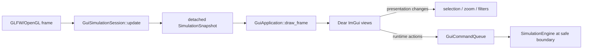

# CPSSim GUI Tutorial

This guide is for two kinds of readers:

- a user who wants to build and explore an experiment visually; and
- a beginner contributor who wants to change a panel without accidentally
  changing simulation behavior.

The GUI is a workbench over the deterministic simulator. It prepares a run,
enqueues controls, and draws detached copies of state. It is not a second
simulation engine.

For the ownership rules behind the tutorial, see
[GUI architecture](GUI_ARCHITECTURE.md). For exact tick and event behavior,
see [Simulation semantics](../guide/SIMULATION-SEMANTICS.md).

## 1. Build and launch

Launch the tracked example with the default inclusive stop tick of 300:

```bash
make run-gui
```

The executable also accepts an experiment configuration and stop tick:

```bash
./build/make-dev/cpssim_gui config/examples/basic.json 500
```

To learn the signal plot without preparing an FMU, attach the deterministic
mock functional model:

```bash
./build/make-dev/cpssim_gui \
  config/examples/basic.json 500 --mock-functional
```

On Ubuntu, GLFW and OpenGL development packages are required:

```bash
sudo apt install libglfw3-dev libgl1-mesa-dev
```

The first application configuration may download the pinned Dear ImGui source.
More build variants and dependency details are in the
[command handbook](../COMMANDS.md#gui-build-and-launch).

GLFW scales the initial native content area for the monitor where the window is
placed. Once the window exists, CPSSim reads the scale of the monitor containing
it and follows that scale as the window moves. Native size, text, and layout
spacing therefore adapt without a restart.

## 2. Your first project and run

The GUI opens on Home. Create a generic project, open an existing project, or
use the Bosch Challenge wizard. A created/opened project starts with a paused
active run. To change its run plan:

1. In **Experiment Explorer**, expand Tasks and Resources to inspect the input.
2. In **Run Configuration**, choose one accessible resource for every task.
3. Set the draft stop tick.
4. Select **Validate changes**. Any problem appears beside the relevant task or field.
5. Select **Apply and restart**. This creates a new paused simulation.
6. Use **Next event** to study one complete logical event tick, or **Run** to
   continue automatically.
7. Use **Pause** before editing the draft. **Reset** recreates the active run
   from the last applied plan; it does not apply pending draft changes.

The toolbar distinguishes four states:

| State | Meaning |
|---|---|
| Not configured | The experiment is loaded, but no draft has been applied |
| Paused | An active run exists and may be stepped or edited around |
| Running | Each rendered frame requests one complete event-tick step |
| Finished | The inclusive stop tick has been completed |

Changing the rendering rate, panel size, or text size cannot change logical
ticks or canonical event ordering.

### Explorer and System Builder

Generic and Bosch-compatible projects place **System Builder** directly below
**Experiment Explorer**. Select System, a section, resource, task, execution profile, or
message route in Explorer to open its corresponding property form. All edits
remain detached until **Apply and restart** succeeds.

- IDs are stable when names or timing fields change.
- Right-click a section to add an entity; the new entity is selected and its
  primary field receives keyboard focus.
- Right-click an entity to duplicate it or request deletion. Task/resource
  deletion lists affected profiles, routes, and pending assignments before a
  confirmed draft-only cascade.
- Each matrix cell enables or removes one deterministic execution profile.
- Each task needs an explicit default resource assignment before Apply.
- A valid modified system appears in Architecture as a labelled read-only
  preview.

Apply validates the canonical configuration and run plan, constructs the full
replacement session, and swaps only on success. **Save Project** writes only
the applied system. Open/close/replacement with pending changes prompts for
Apply and save, Discard, or Cancel. Bosch systems protect FMU task identities
and required route endpoints while allowing timing, resources, profiles,
assignments, route timing, stop tick, and policy edits. Canonical fingerprints
label the applied system as a reference baseline or modified Bosch experiment.

Window and table placement use a separate optional `imgui.ini` in the project
root. The tracked [`apps/gui/imgui.ini`](imgui.ini) is the fixed default and is
never a Dear ImGui output target. Layout changes are staged in a temporary file;
**Save Project** or **Save Project As** publishes the current layout to the
project, while closing or replacing a project without saving deletes the staged
file. A project without `imgui.ini` always uses the fixed default.

## 3. Workbench tour

```text
+------------------------------------------------------------------+
| File / View / Help         Run Pause Reset Next event   status    |
+----------------+----------------------------------+--------------+
| Experiment     | Architecture/Timeline/Signals/Results | Run Config |
| Explorer       |                                  |              |
+ - - splitter - +                                  + - splitter - +
| System Builder |                                  | Runtime      |
|                |                                  | Inspector    |
+----------------+----------------------------------+--------------+
|                | Resources / Canonical events                    |
+------------------------------------------------------------------+
```

The left and right sidebars and upper/lower center groups have draggable
horizontal splitters with minimum heights. Right-click a center tab to move it
between groups; **View → Reset Panel Arrangement** restores the defaults. Their
normalized ratios and panel visibility persist in the project workspace. Use
**View → Theme → Light/Dark** to change both the base ImGui style and window
background. The same menu shows the current monitor scale and provides an
adjustable text-size slider, which remains an in-memory multiplier on top of
automatic DPI scaling. **View → Restore Default Layout** reloads the fixed
layout immediately. Save the project to remove its custom layout permanently;
without a save, reopening the project restores its previously saved layout.
The base style uses compact eight-unit scrollbars, scaled once for the active
monitor, so horizontal and vertical scrolling consume less panel space.

### Structural and runtime selection

Explorer structural selection controls only System Builder. Timeline,
Canonical Events, Architecture, and Resources use a separate runtime selection
that controls Runtime Inspector. Selecting in one domain does not replace the
other domain's identity.

Runtime Inspector contains event, job, runtime-resource, and time-selection
observations. Structural timing, names, routes, and execution profiles are not
duplicated there. Stable IDs or composite keys—not visible labels or row
numbers—identify both selection domains.

### Run plan

The run plan contains the inclusive stop tick, scheduling-policy kind, and one
resource assignment per task. Only resources with a configured execution
profile appear in a task's list.

The draft and active plan are intentionally separate:

```text
edit draft -> validate -> Apply and restart -> new active controller
```

Load and save versioned JSON plans through the **File** menu. Loading replaces
only the draft. Applying a valid draft constructs the complete replacement run
before releasing the previous controller, so a construction failure cannot
partially mutate an active run.

See [ADR-0019](../adr/0019-use-typed-run-plans-and-atomic-gui-application.md)
and [ADR-0020](../adr/0020-use-versioned-json-run-plans-with-structural-signatures.md)
for the ownership and file-format decisions.

### Architecture view

The graph displays tasks, resources, message routes, and applied assignments.
It supports:

- wheel zoom and middle-button pan;
- fit-to-view;
- shared task, resource, and route selection; and
- dragging a task to an accessible resource to edit the pending draft.

A drag changes only the draft. The applied assignment remains visible until
**Apply and restart** succeeds. Dashed message routes describe configured causal
communication; they do not imply typed Simulink-style signal ports.
At extreme fit/zoom levels, canvas labels retain a safe minimum font-bake size;
zoom in to make their content readable.

### Scheduling timeline

The timeline derives Ready and Running intervals plus canonical event markers
from the copied event trace. It never manufactures events for display.

Useful interactions:

- wheel: zoom around the cursor;
- middle-drag: pan;
- **Fit**: show the available run;
- interval click: select a job and its tick range;
- marker click: select the exact canonical event and tick;
- visibility controls: show or hide Ready, Running, and event categories; and
- **Zoom time**: use the tick range selected in another view.

If the trace is inconsistent, the view fails closed and reports the exact
event position, sequence, tick, and related identities.

### Functional signals

When a functional model is attached, the signal tab discovers its typed Real,
Integer, and Boolean observations. Select one or more series and use:

- **Fit data** to show the available samples;
- **Auto-follow** for live progression;
- wheel zoom and middle-drag pan; and
- left-click or left-drag to publish a shared tick or tick range.

Cursor text retains the original scalar type. Floating-point conversion is
used only for drawing. Visual downsampling preserves visible endpoints and
bucket extrema; it never changes full-resolution observations.

The current plot uses one shared value axis. Unit-grouped axes remain future
work. Selected signal identities persist in workspace schema 4.

### Results and export

The **Results** tab is final-run analysis. Running and Paused states show only
lightweight progress. The first Finished transition builds one cached immutable
result with compact run, timing, task-response, and Bosch summaries. **Open
Plot Visualizer** opens a non-modal ImPlot window with signal search, unit-aware
lanes, zoom/pan, tick/second ranges, shared cursor selection, and Bosch overlays.

Use **File → Export Run Results** to export the complete run or the inclusive
time range currently selected in the workbench. Raw JSON/CSV is always written;
the Excel workbook is optional. Choose a destination with **Browse**, or keep
the default project `results/` directory. Cancel writes nothing, existing run
IDs are rejected, and a failed export cannot publish a partial run directory.
See [Results and export](../guide/RESULTS-AND-EXPORT.md) for schemas and exact
integer/large-workbook policies.

### Resources and canonical events

Resources is one table showing the running job, Ready jobs, busy/idle ticks,
and inline labeled utilization with an exact observed-tick tooltip. Canonical Events is a virtualized
column table in sequence order with type/task/resource/vehicle/text filters and
optional columns. Selecting a row opens raw JSON and typed details in Runtime
Inspector; selecting Cause navigates to its canonical predecessor.

## 4. Learn the code from one frame

The shortest useful reading path is:

1. [`apps/gui/main.cpp`](../../apps/gui/main.cpp) — native window, display
   scale, graphics backends, and frame loop.
2. [`gui_application.hpp`](../../apps/gui/gui_application.hpp) and
   [`gui_application.cpp`](../../apps/gui/gui_application.cpp) — workbench
   layout and presentation-owned state.
3. One file under [`apps/gui/views/`](../../apps/gui/views/) — immediate-mode
   widgets for one panel.
4. The matching graphics-independent model under
   [`src/cpssim/gui/`](../../src/cpssim/gui/).
5. The matching test under [`tests/gui/`](../../tests/gui/).

One frame follows this direction:



The renderer receives `const SimulationSnapshot&`. That type choice is an
important guardrail: a widget cannot reach through the snapshot and mutate the
engine.

## 5. Where to make a change

Use the smallest layer that owns the behavior:

| Goal | Start here | Usually test here |
|---|---|---|
| Change startup size, DPI handling, or backend setup | `apps/gui/main.cpp` and `display_scale.*` | `display_scale_test.cpp`, GUI build, and monitor-move smoke |
| Rearrange panels or add a View-menu toggle | `gui_application.*` | GUI build; controller tests remain unchanged |
| Change one widget or canvas interaction | `apps/gui/views/<name>_view.*` | headless model test plus manual smoke |
| Add copied experiment/runtime data | `presentation_model.*` or `simulation_controller.*` | `presentation_model_test.cpp` or `simulation_controller_test.cpp` |
| Add cross-view selection | `selection_model.*` | `selection_model_test.cpp` |
| Derive timeline data | `timeline_model.*` | `timeline_model_test.cpp` |
| Derive functional series | `signal_series.*` | `signal_series_test.cpp` |
| Edit or validate run input | `draft_run_plan.*` / `simulation_session.*` | `draft_run_plan_test.cpp` |
| Edit a generic project system | `editable_system_draft.*`, `system_builder_workflow.*`, and `system_builder.*` | `editable_system_draft_test.cpp` and `system_builder_workflow_test.cpp` |
| Change simulation behavior | the owning core module, not a view | relevant core and conformance tests |

The [GUI architecture guide](GUI_ARCHITECTURE.md) gives the complete source and
ownership map.

## 6. Customization recipes

### Change colors, spacing, or text

For application-wide startup styling, begin in `run_gui` in
[`main.cpp`](../../apps/gui/main.cpp). For a local visual, change only the
corresponding view. Keep semantic colors paired with text, line style, or shape
so information is not encoded by color alone.

`main.cpp` keeps an unscaled base `ImGuiStyle` and reapplies it when the current
monitor scale changes. Add global spacing to that base style before it is
copied; do not repeatedly scale the already-scaled style, because integer
rounding accumulates. Keep user text adjustment independent through
`FontScaleMain`.

Use `ImGui::GetFontSize()` or `ImGui::GetTextLineHeightWithSpacing()` for
layout dimensions that should follow the user's text-size setting. Avoid fixed
pixel dimensions except for small drawing primitives.

### Add a simple panel

1. Create `apps/gui/views/my_view.hpp` with a small `draw_my_view(...)`
   function.
2. Implement the widgets in `my_view.cpp`.
3. Add the `.cpp` only to the `cpssim_gui` target in `CMakeLists.txt`.
4. Add visibility and transient view state to `GuiApplication`.
5. Call the view from `draw_center_panels` or the appropriate workbench column.
6. Build and launch with `make run-gui`, then verify resizing, hiding, and
   selection behavior.

If the panel only formats existing snapshot values, it needs no core or
controller change.

### Add derived data to a view

Do not derive a complicated lifecycle inside an ImGui loop. Define plain value
records and a builder/cache in `src/cpssim/gui/`, test them without a window,
then let the view draw the validated result.

```text
detached source values
    -> graphics-independent builder/cache
    -> plain presentation records
    -> ImGui drawing transform
```

This is the pattern used by `GuiArchitectureGraph`, `GuiTimelineCache`, and
`GuiSignalCache`.

### Add a snapshot field

1. Confirm the core owner already exposes a public read-only value.
2. Add an owning value—not a mutable reference—to `SimulationSnapshot` or an
   existing presentation record.
3. Populate it in `SimulationController::snapshot()`.
4. Add a detached-copy test: mutating the returned snapshot must not affect a
   later snapshot or the engine.
5. Re-run the GUI/headless canonical-trace equality test.

If the required value is not publicly available, reconsider the feature before
adding a core accessor solely for drawing convenience.

### Add a runtime control

Presentation actions such as zoom, filters, and panel visibility stay in view
state. A control that advances or resets simulation must be a `GuiCommand` and
must be applied by `SimulationController` at its safe update boundary.

New stepping semantics, background execution, or wall-clock input to the
engine require an architecture decision. Do not implement them as a widget-only
shortcut.

### Add functional signal labels and units

Keep adapter metadata outside generic GUI support. The application supplies a
`GuiSignalDescriptor` registry whose stable identity matches the typed
functional observation:

```cpp
GuiSignalDescriptor{
    .id = {GuiSignalScalarType::Real, "adapter_signal_name"},
    .path = "Functional/My adapter/State",
    .display_name = "Readable state",
    .unit = "m",
    .source = "my-adapter",
};
```

Do not use `display_name` as identity and do not put Bosch/FMI value references
in `signal_series.*`. See
[ADR-0021](../adr/0021-recreate-functional-models-and-copy-observations-for-gui-runs.md).

## 7. Testing a GUI change

Prefer headless tests for data derivation and ownership. Rendering tests are
kept small because display-server behavior is environment-sensitive.

During development, select the closest test, then run the full suite:

```bash
./scripts/verify.sh module gui
make run-gui
./scripts/verify.sh quick
```

Before handing off an ownership, cache, or lifecycle change, also run:

```bash
./scripts/verify.sh full
git diff --check
```

For a pure documentation change, `make test` and local-link validation are
sufficient. The [developer guide](../guide/DEVELOPER-GUIDE.md#test-ladder)
explains how to choose broader checks.

## 8. Guardrails and current limits

- Integer `Tick` remains the canonical time. Floating-point values are screen
  coordinates only.
- GUI refresh timing must not influence event ordering or functional stepping.
- `cpssim_core` must not include Dear ImGui, GLFW, or OpenGL.
- Views never retain mutable kernel references.
- Reset rebuilds runtime state from validated immutable inputs and the active
  run plan.
- Labels, row positions, and colors are presentation—not identity or semantics.
- The current workbench is single-threaded and uses a fixed resizable layout,
  not docking.
- Theme, panel visibility, splitters, active tabs, event filters/columns, and
  selected signals are persisted; text size and canvas viewports remain local.
- Dear ImGui settings are manually staged and saved per project; the tracked
  default layout is read-only to the application.

Unimplemented improvements and their design gates are kept in
[Future improvements](../guide/FUTURE-WORK.md#f3-gui-usability-and-workspace-features),
not mixed into this tutorial.
