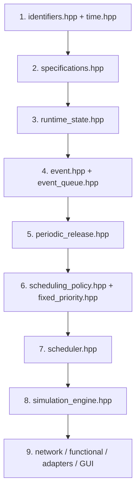
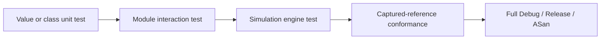

# Developer Guide

Use this page when reading or extending CPSSim. It is organized around small
working loops rather than a complete catalogue of every class.

Before selecting a new capability, check the
[future-work guide](FUTURE-WORK.md) for its current status, dependencies,
design gate, and proposed acceptance tests.

## First working loop

```bash
make test
```

After a normal code change:

```bash
make format
make test
make format-check
```

Before handing off a substantial change:

```bash
make release
make asan
```

The [command handbook](../COMMANDS.md) explains when to use Debug, Release,
sanitizers, Clang, clang-tidy, conformance tools, and the optional GUI.

## Code-reading path

Read a header, its smallest test, and then its `.cpp`. Tests usually show the
contract more quickly than implementation details.



Suggested source/test pairs:

| Concept | Source | Behavior example |
|---|---|---|
| Integer ticks | [time.hpp](../../src/cpssim/model/time.hpp) | [time_test.cpp](../../tests/model/time_test.cpp) |
| Immutable task/resource input | [specifications.hpp](../../src/cpssim/model/specifications.hpp) | [specifications_test.cpp](../../tests/model/specifications_test.cpp) |
| Jobs and executing resources | [runtime_state.hpp](../../src/cpssim/model/runtime_state.hpp) | [runtime_state_test.cpp](../../tests/model/runtime_state_test.cpp) |
| Queue ordering | [event_queue.hpp](../../src/cpssim/kernel/event_queue.hpp) | [event_queue_test.cpp](../../tests/kernel/event_queue_test.cpp) |
| Incremental releases | [periodic_release.hpp](../../src/cpssim/kernel/periodic_release.hpp) | [periodic_release_test.cpp](../../tests/kernel/periodic_release_test.cpp) |
| Policy decisions | [fixed_priority.hpp](../../src/cpssim/policy/fixed_priority.hpp) | [fixed_priority_test.cpp](../../tests/policy/fixed_priority_test.cpp) |
| Scheduling mechanism | [scheduler.hpp](../../src/cpssim/kernel/scheduler.hpp) | [scheduler_test.cpp](../../tests/kernel/scheduler_test.cpp) |
| Whole event cycle | [simulation_engine.hpp](../../src/cpssim/kernel/simulation_engine.hpp) | [simulation_engine_test.cpp](../../tests/kernel/simulation_engine_test.cpp) |
| GUI command/snapshot boundary | [simulation_controller.hpp](../../src/cpssim/gui/simulation_controller.hpp) | [simulation_controller_test.cpp](../../tests/gui/simulation_controller_test.cpp) |

Read [Simulation semantics](SIMULATION-SEMANTICS.md) beside steps 4–8.

## C++ patterns used in this project

| Pattern | Meaning in CPSSim |
|---|---|
| Header plus `.cpp` | The header states what callers may use; the neighboring `.cpp` owns implementation and validation |
| Strong ID class | `TaskId`, `JobId`, and other IDs prevent accidental cross-domain integer use |
| `explicit` constructor | Prevents an integer from silently becoming the wrong identifier |
| `const T&` | Reads an existing object without copying or allowing mutation through that reference |
| `std::move` | Transfers reusable internal storage into an owning object; the source remains valid but its value is unspecified |
| `std::optional<T>` | Represents a value that may be absent, such as no currently Running job |
| `enum class` | Keeps finite states scoped and prevents unrelated enum/integer mixing |
| `virtual` / `override` | Used only at stable replaceable boundaries such as scheduling policies and functional models |
| `operator<=> = default` | Gives same-type IDs deterministic equality and ordering from their stored fields |
| `std::priority_queue` comparator | Returns whether the left event belongs later, so the earliest event appears at `top()` |

When syntax is unclear, read the public header, its closest test, and then the
implementation comment. The [C++ style rules](../instructions/06_CXX_STYLE_AND_DESIGN_RULES.md)
explain why the project favors readable composition and avoids unnecessary
language features.

## Test ladder

Choose the narrowest level that can prove the behavior, then run the broader
levels before handoff.



Examples:

| Change | Start with | Then run |
|---|---|---|
| Tick conversion | `time_test` | full `make test` |
| Queue precedence | `event_queue_test` | engine + conformance tests |
| Scheduling policy | `fixed_priority_test` | scheduler + engine tests |
| Network lifecycle | `fixed_delay_network_test` | network simulation test |
| Bosch trigger mapping | trigger encoder test | Bosch timing conformance |
| GUI controller | simulation controller test | GUI/headless equality test |

CTest test names and filtering examples are in [COMMANDS.md](../COMMANDS.md).

## Extension recipes

### Add a scheduling policy

```text
SchedulingPolicy interface
        ^
        |
new policy: select(...) + should_preempt(...)
        |
policy unit tests -> scheduler integration test -> engine determinism test
```

Keep the policy read-only with respect to jobs, Ready queues, and resources.
It recommends; `Scheduler` mutates. Use `observe(...)` only for policy-owned
state derived from functional observations.

### Add a resource allocator

Implement `ResourceAllocator::allocate`. Return exactly one assignment for
every task, choose only a resource listed in that task's profiles, and make the
result deterministic. The allocator runs before job releases; it does not
dispatch jobs.

### Add a configuration field

```text
specification type -> local validation -> ExperimentConfig cross-validation
        -> JSON schema version/parser -> example -> tests -> documentation
```

Preserve old schema compatibility only when it is intentional. A change to
time, ordering, ownership, or a public contract also needs an ADR.

### Add an event type

Update the event category and explicit phase mapping, define who produces and
consumes it, update JSON string serialization, and test queue order plus engine
acceptance. Never rely on the enum's numeric value for precedence.

### Add a functional backend

Implement `FunctionalModel`; let `FunctionalRuntime` validate lifecycle and
trace shape. Convert integer ticks to an external API's time only inside the
adapter. Test the backend with deterministic observations and online/offline
replay equality.

### Add a GUI view

Expose a detached value in `SimulationSnapshot`, populate it through public
read-only engine interfaces, and render only that copy. Widgets enqueue
commands; they do not hold or mutate runtime state.

Start with the [GUI tutorial](../gui/README.md#5-where-to-make-a-change) for a
source map and worked customization recipes. Use the detailed
[GUI architecture](../gui/GUI_ARCHITECTURE.md) when the change touches state
ownership, selection, caches, run plans, or the command/snapshot boundary.

### Extend networking or resource capacity

Payloads, zero-delay channels, contention, loss, shared-capacity execution,
migration, or multiple scheduling domains change current semantics and
ownership. Start with an ADR and tests that state deterministic ordering. Do
not stretch `FixedDelayNetwork` or exclusive `Resource` until the new model is
agreed.

The staged proposals for these larger extensions are documented in
[Future improvements](FUTURE-WORK.md).

## Change checklist

1. State the behavior and state owner before editing.
2. Read the relevant guide, module page, ADR, header, and test—not all docs.
3. Add the smallest failing/contract test when practical.
4. Implement only the requested behavior through public interfaces.
5. Run the narrow test, full tests, and risk-appropriate Release/ASan checks.
6. Update the relevant semantics, module, user, and agent-handoff documentation.
7. Inspect the diff and stop at the requested target.

The stable rules are in [AGENTS.md](../../AGENTS.md) and
[`docs/instructions/`](../instructions/). Current status belongs in
[the agent handoff](AGENT-HANDOFF.md), not only in chat.
