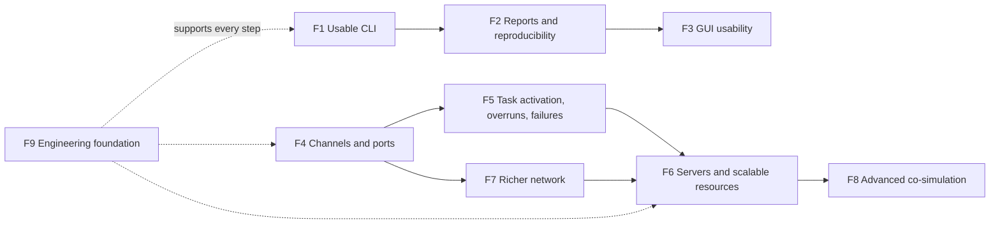
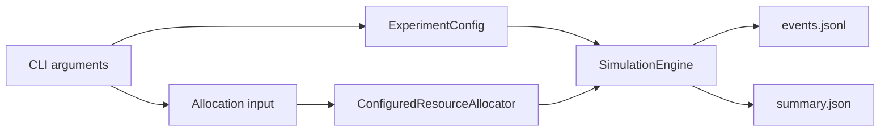
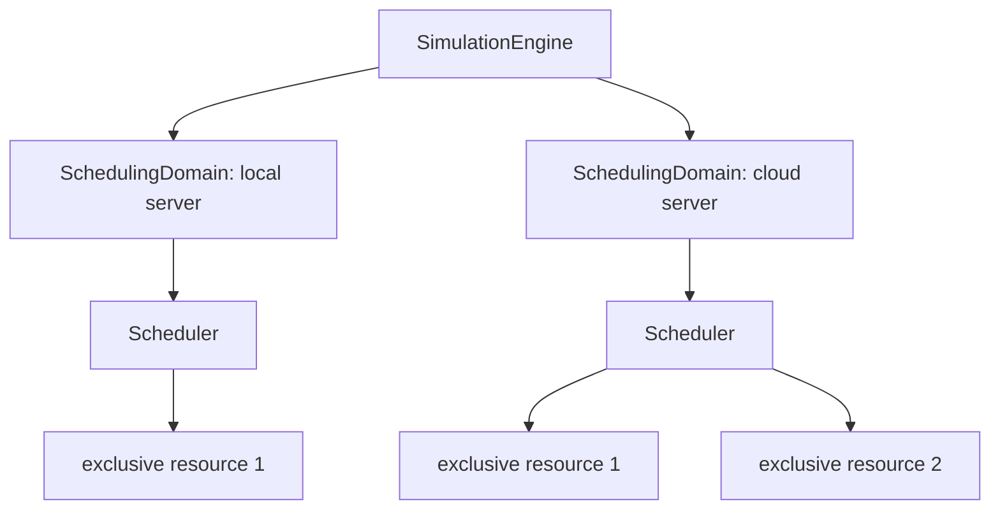

# Future Improvements and Proposed Extension Path

This page records useful capabilities that CPSSim does not implement yet and
proposes how to add them without weakening the current architecture. It is a
planning aid, not an approved task list. Before implementation, select one
proposal, define its acceptance criteria, and assign it an explicit target.

For a quick review, read the status vocabulary, suggested-path diagram, and
overview table only. Open an F-section when that capability becomes relevant;
the page is not intended as one continuous tutorial.

## Status vocabulary

| Label | Meaning |
|---|---|
| Planned | Already named in the roadmap or a proposed ADR |
| Recommended | A practical next improvement suggested by the current prototype |
| Candidate | Valuable Phase 10 work whose exact semantics are undecided |
| Deferred | Add only when a demonstrated use case requires it |

No label authorizes implementation by itself.

## Suggested path



The left branch makes the existing simulator easier to use and inspect. The
middle branch expands modeling semantics. They can progress independently as
long as each change remains small and tested.

## Overview

| ID | Status | Improvement | Why it matters | Design gate |
|---|---|---|---|---|
| F1 | Recommended | Real experiment CLI and trace files | Makes CPSSim usable without writing C++ | Run-plan and allocation input |
| F2 | Recommended | Metrics, manifests, and analysis export | Turns traces into research results | Which metrics are canonical versus derived |
| F3 | Recommended | GUI usability and workspace features | Makes completed visual analysis easier to repeat and navigate | Keep workspace state separate from run semantics |
| F4 | Planned | Directed channels, ports, and data versions | Models information flow, not only timing signals | Resolve ADR-0011 questions |
| F5 | Candidate | Activation types, overruns, execution variation, failures | Supports realistic workloads | Per-task policies and reproducible sampling |
| F6 | Candidate | Servers, scheduling domains, multicore, shared capacity | Supports scalable platforms | Resource and scheduler-domain semantics |
| F7 | Candidate | Network queues, payloads, loss, and variable delay | Supports realistic communication | Transport ownership and deterministic randomness |
| F8 | Deferred | FMI packaging, event mode, superdense iteration, multiple models | Supports more co-simulation cases | Demonstrated model requirement |
| F9 | Recommended | Installation, CI, coverage, benchmarks, portability | Makes the research prototype easier to trust and share | Supported platforms and release scope |

## F1 — Real experiment-running CLI

Current gap: [`apps/cli/main.cpp`](../../apps/cli/main.cpp) prints only the
version. Tests and conformance applications can run simulations, but a user
cannot yet run an arbitrary JSON experiment and save its trace.

Proposed first command:

```text
cpssim_cli run \
  --config experiment.json \
  --allocation allocation.json \
  --stop-tick 10000 \
  --events events.jsonl \
  --summary summary.json
```

Proposed stages:

1. Parse command-line options in the application layer.
2. Load `ExperimentConfig` through the existing JSON boundary.
3. Load a separate task-to-resource assignment file and construct
   `ConfiguredResourceAllocator`. Keeping this separate avoids putting a
   selected runtime resource back into `TaskSpec`.
4. Select the fixed-priority policy explicitly and run `SimulationEngine`.
5. Stream the existing canonical JSON Lines representation to a file.
6. Write a small run manifest containing input paths/checksums, stop tick,
   policy, allocation method, software version, and later random seeds.



Acceptance proposal: an example experiment runs twice with byte-identical
event output; invalid configuration/allocation fails before output is partly
written; the CLI adds no simulator behavior of its own.

## F2 — Derived reports and reproducible experiment records

Current gap: resources expose busy/idle ticks and the engine exposes events,
but there is no general report for response time, deadline misses,
preemptions, utilization, or run provenance.

Proposed design:

- introduce a read-only analysis target that depends on the core;
- compute metrics from the final trace and public resource/job views;
- keep event history canonical and metrics derived—never insert report-only
  values into scheduling state;
- export a machine-readable summary plus a small human-readable table; and
- record seeds and every random sample once stochastic models exist.

Example output:

```text
Task  Jobs  Misses  Mean response  Preemptions
1       20       0            4.0            3
2       10       1            8.2            0
```

Later channel work can add data age, version freshness, and end-to-end latency.
Acceptance proposal: metrics are independently checked against a hand-written
small trace, and changing report formatting cannot alter canonical trace bytes.

## F3 — GUI usability and workspace features

Current support includes a DPI-aware panelized workbench, explicit validated
run plans, shared strong-ID selection, a deterministic architecture graph,
incremental scheduling timeline, typed functional plots, resource/runtime
inspection, and canonical events. The [GUI tutorial](../gui/README.md) describes
the implemented workflow; the
[GUI architecture guide](../gui/GUI_ARCHITECTURE.md) records its ownership and
test boundaries.

Remaining improvements should be selected as separate small tasks:

1. Persist presentation-only workspace preferences such as panel visibility,
   text size, graph/timeline viewport, filters, and selected signals. Define a
   versioned workspace format that cannot silently become simulation input.
2. Add navigation actions such as jump from a deadline miss to the timeline
   and signal cursor, saved filter presets, and keyboard shortcuts through the
   existing `GuiSelection` boundary.
3. Export a selected timeline/signal range from full-resolution detached data.
   Visual downsampling must never affect exported values.
4. Add wall-clock playback pacing that only determines when the existing
   event-tick command is requested. It must not pass elapsed time into the
   engine.
5. Measure large-trace snapshot copying, cache updates, table rendering, and
   canvas transforms before changing the current clarity-first design.
6. Improve accessibility without relying on color alone, and validate the GUI
   on Windows and macOS before claiming those platforms.
7. Add adapter-specific launch wiring and signal metadata only in an
   application/adapter layer; generic GUI support must remain independent of
   Bosch and FMI value references.

Docking, a native file dialog, unit-grouped signal axes, and multiple plot
panels are presentation candidates. A new GUI dependency must be pinned behind
`CPSSIM_BUILD_GUI` and justified separately.

Step-one-physical-tick is a semantic change, not a presentation enhancement.
Quiet ticks currently need no engine event, so defining this control may change
`current_tick` and functional-model advancement. Record the behavior in an ADR
before adding the command.

Acceptance proposal: workspace or navigation changes remain presentation-only;
headless, event-step GUI, and continuous GUI runs retain byte-identical
canonical traces; persisted preferences do not affect a run-plan signature;
and export uses full-resolution detached values.

## F4 — Directed task channels, ports, and data versions

Status: planned in
[ADR-0011](../adr/0011-plan-user-configured-task-channels.md). The current
`MessageRouteSpec` and `FixedDelayNetwork` model causal timing for Bosch
conformance, but they do not carry readable task data.

Target model:

```text
producer job completes
    -> OutputPort commits DataVersion k
    -> directed Channel transfers k
    -> InputPort makes k available
    -> consumer job snapshots k when it starts
```

Each directed task pair has at most one channel. Every channel has its own
source output port and destination input port. Reverse communication uses a
different channel.

Proposed stages:

1. Resolve port identifiers, initial values, payload shape, same-tick multiple
   writes, and zero-delay cycle handling in ADR-0011.
2. Add immutable `ChannelSpec`/port descriptions and a new JSON schema version.
3. Add strong channel/port/data-version identifiers and runtime port/channel
   state; keep them outside `Scheduler` and `Resource`.
4. First support deterministic scalar/version metadata and zero or fixed delay.
5. Commit outputs only after accepted completion and snapshot inputs only when
   a job successfully starts.
6. Translate legacy schema-v4 routes into compatible fixed-delay channels or
   keep a documented compatibility adapter.
7. Add payload types and data-age analysis only after lifecycle/order tests
   pass.

For a zero-delay channel, completion/write/delivery must occur before the
same-tick scheduling read. Reject zero-delay cycles initially; do not reuse
`EventSequence` as a microstep.

Acceptance proposal: tests cover one-way dataflow, fan-in/out through distinct
ports, old/new-version reads, same-tick write-before-read, duplicate directed
pairs, horizon truncation, compatibility traces, and repeatability.

## F5 — Broader task and workload behavior

This proposal groups related ideas but they should be implemented as separate
small targets.

### Additional activation types

The runtime `Task` is currently periodic. When a second real activation model
is needed, extract common immutable task information and compose it with a
periodic, sporadic, event-triggered, or channel-triggered activation rule.
Avoid a `BasicTask` inheritance hierarchy until runtime polymorphism is truly
needed; composition keeps task identity, timing, and activation ownership
clear.

### Overrun and deadline policies

Current behavior rejects a new job when the same task already has an active
job, and a deadline miss is an observation rather than cancellation. Define
these independently:

```text
OverrunPolicy: reject run | drop new job | queue overlap | cancel old job
DeadlinePolicy: observe only | cancel at deadline | continue with penalty
```

The task owns release/overrun semantics; the scheduler coordinates removal or
submission; the resource accounts for any stopped interval.

### Execution-time variation and failures

Keep deterministic execution as the default. Add alternative workload models
incrementally: finite trace first, then seeded distributions. A failure model
should be a separate optional specification rather than an unrelated field
inside periodic timing.

For reproducibility, derive a sample stream from the experiment seed and
stable `(TaskId, JobId, model-purpose)` identity. Sample exactly once at the
documented lifecycle boundary and log the value/result. This prevents unrelated
event insertion from changing later jobs' samples.

Acceptance proposal: legacy deterministic traces remain byte-identical;
overrun/deadline combinations have transition tests; seeded runs repeat; a
changed seed changes only documented sampled behavior.

## F6 — Servers, scheduling domains, and scalable resources

Current boundary: one `Scheduler` manages all independent exclusive resources.
There is no server identity, migration, multicore domain, or resource capacity
sharing.

Proposed topology:



Add this in increasing semantic difficulty:

1. Introduce immutable `ServerSpec` and map resources to exactly one server.
2. Create one scheduling domain/scheduler per server while retaining exclusive
   resources and partitioned task placement.
3. Add partitioned multicore allocation without migration.
4. Only then design migration or global scheduling.
5. Treat spatial/fractional capacity as a new execution-resource model, not a
   Boolean flag on the current exclusive `Resource`. It must define capacity
   units, concurrent progress, completion ordering, allocation ownership, and
   utilization accounting.

The simulation engine still owns global time and routes events among domains;
each scheduler owns Ready/running coordination inside its server.

Acceptance proposal: declaration order cannot change traces; separate domains
progress logically concurrently; no task migrates without an explicit policy;
fractional allocation conserves capacity exactly.

## F7 — Richer network behavior

Build this after the channel lifecycle is stable. Separate logical dataflow
from transport behavior:

```text
Channel/ports: who communicates and which version is visible
Network model: serialization, queueing, delay, contention, loss
```

Proposed stages are payload size and link capacity, deterministic FIFO queues,
multiple links/routes, trace-driven delay, then seeded random delay/loss.
`FixedDelayNetwork` remains the simple conformance implementation; a new
network interface should be introduced only when there is a second mechanism.

Log queue entry, transmission start/finish, delivery/drop, and sampled values
as appropriate. Keep random-number state owned by the network instance, never
global.

Acceptance proposal: capacity is conserved, ties have an explicit order,
fixed-delay legacy traces remain unchanged, and seeded stochastic traces are
repeatable.

## F8 — Advanced FMI and co-simulation behavior

Current support is intentionally small: a prepared FMI 2.0 Co-Simulation
library, synchronous `doStep`, one functional model, no rollback, and no FMI
event iteration.

Only add these capabilities for a concrete model:

- portable `.fmu` archive extraction and platform-binary selection;
- FMI event mode and discrete-state iteration;
- asynchronous/pending steps or rollback;
- multiple coupled functional models;
- streamed external trajectories; or
- FMI 3 support.

If repeated evaluations at one integer tick become necessary, introduce a
distinct `Microstep` through an ADR. Update queue ordering, trace schema,
serialization, causality, and conformance together. `EventSequence` remains an
identity and must not become time.

Acceptance proposal: the existing Bosch FMI references remain within tolerance
and a new test model proves the exact advanced feature that justified the
change.

Optional Simulink replay remains a diagnostic route under
[ADR-0015](../adr/0015-defer-simulink-replay-and-use-captured-oracles.md), not
the architecture of the simulator.

## F9 — Engineering foundation and portability

These improvements can accompany feature work in small independent changes:

- installation/export rules and a documented library-consumer example;
- hosted CI for GCC, Clang, Debug, Release, and sanitizers;
- code coverage used to find missing behavior, not as a quality score;
- deterministic performance benchmarks and large-trace memory measurements;
- Windows and macOS build/FMI/GUI validation;
- release packages, versioned changelog, and configuration/trace migration
  notes; and
- documentation link/diagram checks in CI.

Acceptance proposal: a clean supported machine can configure, build, test,
install, and run the example without depending on a developer's build tree.

## How to turn one proposal into a task

```text
choose one smallest behavior
    -> confirm current evidence and owner
    -> resolve listed design gate / ADR
    -> define public contract and compatibility
    -> write focused tests
    -> implement
    -> run conformance and reproducibility checks
    -> update guides, module page, and agent handoff
```

Do not combine all stages of a proposal. For example, F4 should first establish
channel identity and deterministic version visibility; contention and random
loss belong to F7 later. This keeps each change reviewable and makes semantic
mistakes easier to locate.

## Ideas intentionally not prioritized

Global migration, detailed preemption costs, limited-preemption scheduling,
learning-based adaptation, SUMO coupling, cooperative perception, AI
latency/accuracy/energy models, multiple cloud endpoints, and distributed
orchestration remain research directions from the roadmap. They should gain a
concrete experiment and acceptance oracle before becoming implementation
targets.
