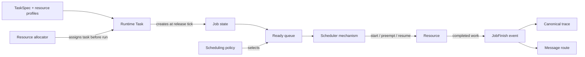
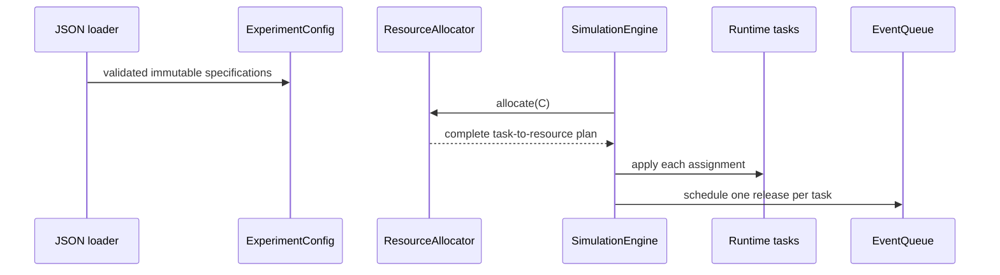
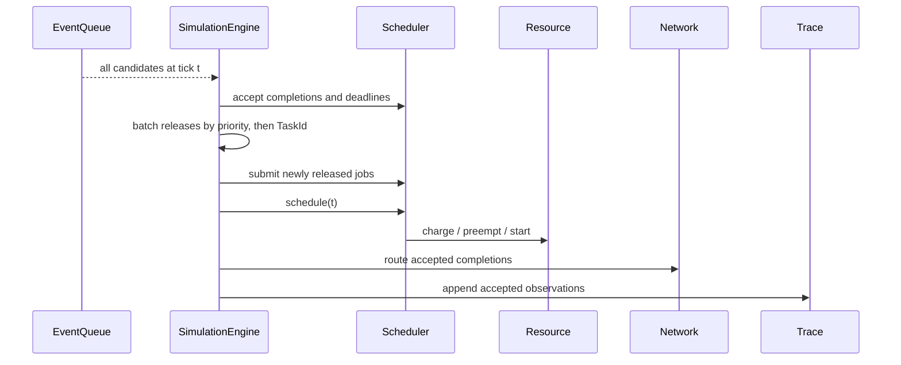
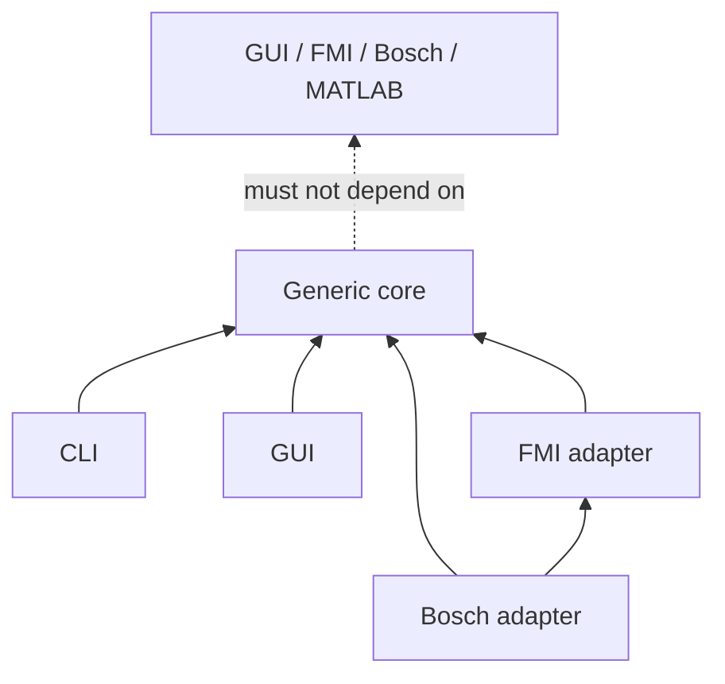

# Project Tour

This page gives the smallest useful picture of CPSSim. Read it once, then open
source files through the links rather than reading directories alphabetically.

## 1. What CPSSim simulates

A periodic task releases jobs. A placement policy has already assigned that
task to an accessible resource. The runtime scheduler orders Ready jobs, and a
resource accounts for the selected job's execution. Accepted events may also
produce messages or actions for an external functional model.

Specifications are immutable input. `Task`, `JobState`, `Resource`, messages,
and queues are mutable runtime state.

## 2. Repository map

| Location | Responsibility | Start with |
|---|---|---|
| `src/cpssim/model/` | Values, specifications, events, jobs, resources, messages | [event.hpp](../../src/cpssim/model/event.hpp) |
| `src/cpssim/kernel/` | Queue, releases, scheduler mechanism, global engine | [simulation_engine.hpp](../../src/cpssim/kernel/simulation_engine.hpp) |
| `src/cpssim/policy/` | Replaceable placement and job-ordering decisions | [scheduling_policy.hpp](../../src/cpssim/policy/scheduling_policy.hpp) |
| `src/cpssim/network/` | Current fixed-delay communication mechanism | [fixed_delay_network.hpp](../../src/cpssim/network/fixed_delay_network.hpp) |
| `src/cpssim/functional/` | Generic physical/functional model boundary | [functional_model.hpp](../../src/cpssim/functional/functional_model.hpp) |
| `src/cpssim/trace/` | Stable event serialization | [event_json.hpp](../../src/cpssim/trace/event_json.hpp) |
| `src/cpssim/fmi/` | Generic FMI 2.0 loader; not a core dependency | [fmi2_importer.hpp](../../src/cpssim/fmi/fmi2_importer.hpp) |
| `src/cpssim/bosch/` | Bosch-specific translation and FMI orchestration | [trigger_encoder.hpp](../../src/cpssim/bosch/trigger_encoder.hpp) |
| `src/cpssim/gui/` | GUI-neutral commands, snapshots, and derived presentation models | [GUI tutorial](../gui/README.md) |
| `apps/` | CLI, conformance runner, and optional GUI entry points | [apps](../../apps/) |
| `tests/` | Behavior examples mirroring source modules | [tests](../../tests/) |

Folder names organize code; the project intentionally uses one C++ namespace,
`cpssim`.

## 3. Initialization

`TaskSpec` deliberately contains no resource ID. `ExperimentConfig` separately
owns `TaskResourceProfile` records that list each accessible resource and the
task's execution demand there. The allocator selects one before the current
run. A job captures its runtime task's current assignment when its pending
release is scheduled.

## 4. One event tick

The engine is the clock and router. It does not implement fixed-priority
ranking, own Ready queues, or perform a resource's execution accounting.

## 5. Ownership map

| State or decision | Owner |
|---|---|
| Validated experiment input | `ExperimentConfig` |
| Task-to-resource placement decision | `ResourceAllocator` |
| Applied assignment and next release | runtime `Task` |
| Pending event candidates and insertion sequence | `EventQueue` |
| Jobs and Ready queue per resource | `Scheduler` |
| Running job, execution interval, busy time | each `Resource` |
| Job ranking and preemption recommendation | `SchedulingPolicy` |
| Messages and their lifecycle | `FixedDelayNetwork` |
| Current tick and accepted event trace | `SimulationEngine` |
| Physical state and functional observations | `FunctionalModel` / `FunctionalRuntime` |
| GUI commands and detached display copy | `SimulationController` |

This table is a change-scope test: modify the owner of the state, and communicate
through its public interface. Do not reach into another module's container.

## 6. Dependency direction

The dashed edge is a prohibition, not a dependency. A new adapter may depend
on the core; the core must remain usable without that adapter.

## 7. What to read next

- For exact time, ordering, deadline, horizon, network, and GUI rules, read
  [Simulation semantics](SIMULATION-SEMANTICS.md).
- To follow the implementation from simple types to orchestration, use the
  [code-reading path](DEVELOPER-GUIDE.md#code-reading-path).
- To understand why a durable design choice exists, follow the relevant
  [architecture decision](../adr/README.md).
- To build the visual workbench or customize a panel, follow the
  [GUI tutorial](../gui/README.md).
