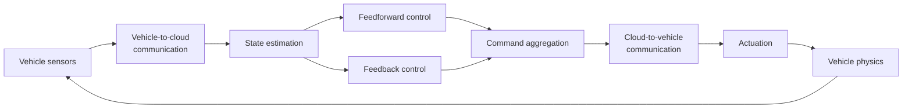
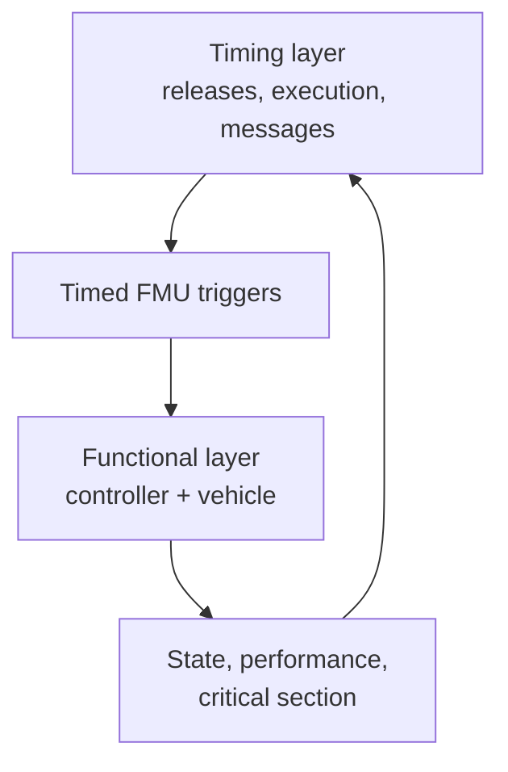
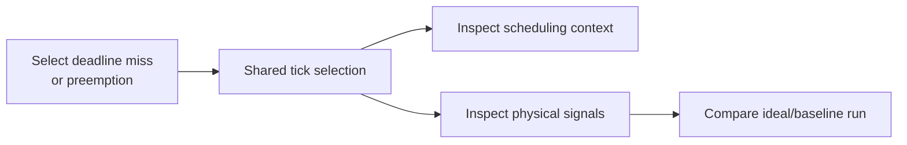

# Bosch Physics-Driven CPS Challenge Workflow

## Why this scenario matters

The Bosch challenge couples a distributed real-time task chain to a lateral
vehicle-control model. Timing is not evaluated only by deadline satisfaction:
the same pattern of delayed or skipped updates can have very different physical
impact in a straight section and a demanding curve.



The challenge encourages scheduling and resource policies that use online
performance and criticality observations rather than only static worst-case
timing.

## Functional and timing layers



CPSSim's generic engine owns integer time, jobs, resources, scheduling,
messages, and traces. The Bosch adapter translates accepted events into the
specific FMU trigger interface and returns typed output observations.

## Supplied trajectory choices

The repository supports the supplied 10, 12.5, and 15 m/s trajectory formats.
The exact labels and file paths are presented by the Bosch project wizard and
CLI command.

Higher speed does not merely scale a plot: it changes the physical trajectory
and sensitivity, so compare runs using the exact same selected trajectory and
initialization.

## Create a Bosch project

From Home, choose the Bosch Challenge wizard. The wizard gathers the project
location and scenario inputs, then constructs the complete project before
replacing the current workbench.

A cancelled or failed wizard does not partially replace the active project.

## Protected structure

Bosch task identities and required route endpoints are adapter-owned. They map
to explicit FMU triggers. Therefore:

- protected tasks and links remain selectable and inspectable;
- unsupported creation/deletion/endpoint changes are rejected;
- timing, resources, profiles, assignments, run horizon, and supported policy
  settings remain editable;
- the hidden one-tick adapter handoff is not displayed as extra user latency.

This prevents a visually plausible edit from silently corrupting the FMU
mapping.

## Communication latency

The Bosch presentation reports the configured network latency, for example 80
ticks. A separate one-tick completion-to-send handoff is a core/adapter timing
invariant and is intentionally not presented as 81 ticks of network delay.

## Run workflow

1. Create or open a Bosch project.
2. Inspect the fixed task chain in Architecture.
3. Inspect resources, profiles, assignments, and run settings.
4. Validate any supported modifications.
5. Apply and restart.
6. Use Next event for timing inspection or Run/Fast for completion.
7. Inspect Timeline and Canonical Events.
8. Inspect functional Signals and Results.
9. Export the run with trajectory and FMU identity in the manifest.

## Interpreting physical output

The original challenge emphasizes lateral control error and operating context.
A timing variation may be almost invisible on a straight section yet create a
large deviation during a rapid maneuver.

A useful analysis pattern is:



Do not conclude that “four misses are acceptable” solely from a count. Check
where the misses occur, which task was affected, the age of data reaching the
actuator, and the physical state.

## Conformance evidence

CPSSim includes:

- captured scheduler/network/trigger reference comparison;
- real Bosch FMU execution on Linux;
- trigger encoding tests;
- full functional trajectory comparison within documented numerical tolerance.

These tests establish that the adapter reproduces the supplied reference
scenario. They do not imply that every future scheduler or network extension is
automatically conformant.

## Headless CLI

Launch:

```bash
make run-cli
```

Then use `help` to inspect the Bosch run command and its direct/interactive
forms. Both paths reach the same application service, so prompt handling does
not define simulator semantics.

## Research directions

The scenario supports questions such as:

- baseline versus context-aware scheduling;
- maximum number of supported vehicles;
- minimum cloud resources for fixed demand;
- state-dependent timing abstractions;
- end-to-end age and latency;
- data-driven rather than purely periodic activation.

Some of these require simulator extensions listed in the Developer Guide's
[future-development plan](../developer/FUTURE-DEVELOPMENT.md). A research idea
should not be presented as current simulator capability until its semantics and
acceptance oracle are implemented.
