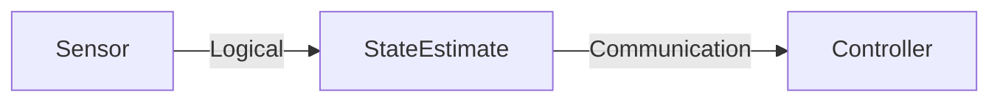
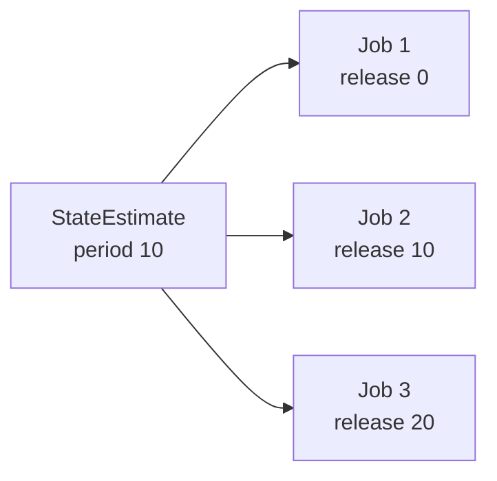
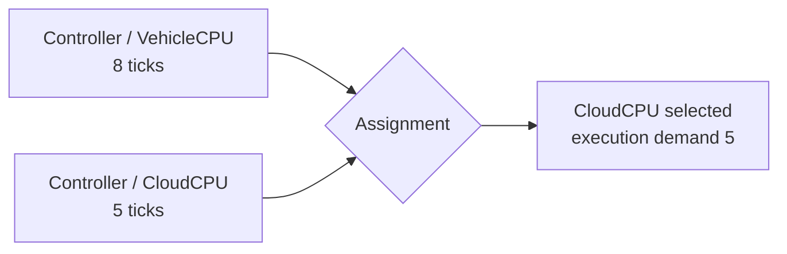
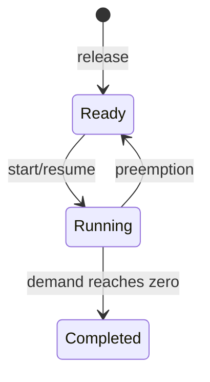
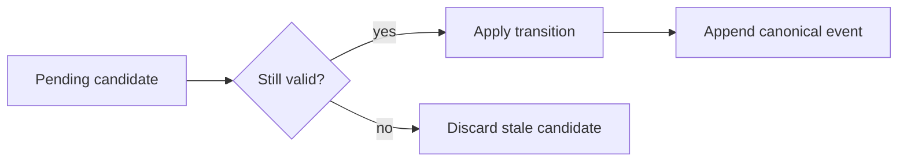
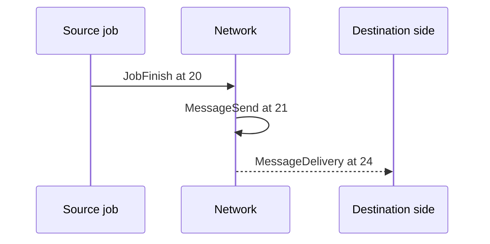
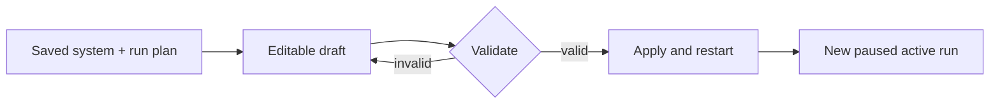

# Core Concepts

This chapter defines the important CPSSim concepts through one running example.



## 1. Logical time and ticks

A **tick** is CPSSim's canonical unit of time. It is a signed integer, not a
floating-point timestamp.

Suppose one tick represents `100000 ns`:

```text
1 tick   = 0.1 ms
10 ticks = 1.0 ms
20 ticks = 2.0 ms
```

Tick `t` is the boundary before interval `[t, t+1)`:

```text
boundary       4                 5                 6
               |-----------------|-----------------|
execution          [4,5)             [5,6)
```

A job that starts at tick 4 and needs 2 execution ticks finishes at tick 6.
The engine may jump directly from 4 to 6 if no event is needed at 5; it charges
the elapsed interval exactly.

**Why integer time matters:** equality, deadlines, queue order, serialization,
and regression comparison remain exact. Physical seconds are introduced only
at adapter boundaries such as FMI.

## 2. Resource

A **resource** represents one exclusive execution processor. It can execute at
most one job at a time.

Example:

```text
Resource 1: VehicleCPU
Resource 2: CloudCPU
```

A resource owns:

- the identity of its currently Running job, if any;
- the start of the active execution interval;
- the expected completion tick;
- accumulated busy time.

The scheduler, not the resource, owns the Ready queue and decides which job
should run.

Current resources are independent exclusive uniprocessors. CPSSim does not yet
model fractional capacity, migration, or one global multicore Ready queue.

## 3. Task

A **task** is an immutable periodic workload description.

Example:

```text
Task: StateEstimate
Period:   10 ticks
Deadline: 10 ticks
Offset:    0 ticks
Priority:  1
```

The fields mean:

- **Period:** distance between successive releases.
- **Deadline:** relative time from a release to its required completion.
- **Offset:** tick of the first release.
- **Priority:** ranking used by the fixed-priority policy; smaller values have
  higher priority.

The task does not embed a selected resource. This separation lets the same task
description be evaluated under different placements.

## 4. Job

A **job** is one runtime execution instance released by a task.



`JobId` is local to its task. Therefore, the complete identity is:

```text
(TaskId, JobId)
```

`(Task 2, Job 1)` and `(Task 3, Job 1)` are different jobs.

A new job captures:

- release tick;
- absolute deadline;
- assigned resource;
- execution demand on that resource;
- priority.

After release, later changes to the task's assignment do not retroactively
change that job.

## 5. Execution profile

An **execution profile** says that a task can execute on a resource and gives
its deterministic execution demand there.

Example:

```text
Controller
├── VehicleCPU: 8 ticks
└── CloudCPU:   5 ticks
```

This means both resources are accessible to `Controller`, but the job is
modeled as faster on `CloudCPU`.

If the run assignment is:

```text
Controller -> CloudCPU
```

each new `Controller` job captures an execution demand of 5 ticks.

A missing profile is not the same as an unknown WCET: it means the resource is
not an accessible choice for that task.

## 6. Task assignment

A **task assignment** chooses one accessible resource for a task for the run.



Every task must receive exactly one assignment before a run can be constructed.
The assignment is part of the `RunPlan`, while accessibility and execution
demand belong to the system configuration.

## 7. Run plan

A **run plan** is the validated immutable set of choices used to construct one
simulation run:

```text
stop tick
scheduling policy kind
one resource assignment per task
```

Example:

```text
Stop tick: 100
Policy: Fixed Priority
Assignments:
  Sensor        -> VehicleCPU
  StateEstimate -> CloudCPU
  Controller    -> CloudCPU
```

The stop tick is inclusive: events at tick 100 are processed; events after 100
are not.

## 8. Ready, Running, completion, and preemption

A released job starts in `Ready`. When selected, it becomes `Running`.



Example:

```text
Low-priority job starts at 0 with demand 8.
High-priority job releases at 3 with demand 2.
```

In preemptive mode:

```text
[0,3) Low executes: remaining 5
t=3   High releases and preempts Low
[3,5) High executes and completes
t=5   Low resumes
[5,10) Low completes
```

In non-preemptive mode, Low continues until tick 8; High waits.

Equal priority does not cause preemption. Tie-breaking among Ready jobs is
deterministic.

## 9. Deadline

The absolute deadline is:

```text
release tick + relative deadline
```

A job released at 10 with deadline 7 has absolute deadline 17.

Completion is processed before deadline checking at the same tick. Therefore,
finishing exactly at 17 is on time. A miss is recorded only if the job remains
incomplete during the deadline-check phase.

Current deadline handling records the miss but does not automatically cancel
the job.

## 10. Event and event phase

An **event** is an immutable canonical observation such as:

- `JobRelease`
- `JobStart`
- `JobPreempt`
- `JobResume`
- `JobFinish`
- `DeadlineMiss`
- `MessageSend`
- `MessageDelivery`

An event contains a logical tick, semantic phase, stable sequence, type,
relevant entity IDs, and an optional causal predecessor.

Events at the same tick are ordered by:

```text
(tick, phase precedence, insertion sequence)
```

Same-tick phase order:

| Order | Phase | Meaning |
|---:|---|---|
| 1 | Execution completion | settle work from the preceding interval |
| 2 | Message delivery | make arriving communication visible |
| 3 | Deadline check | decide whether incomplete work missed |
| 4 | Job release | create new Ready jobs |
| 5 | Policy update | update policy-owned context |
| 6 | Scheduling | choose work for the next interval |
| 7 | Caused action | record effects caused by accepted decisions |

This order is semantic; it is not derived from enum declaration order.

## 11. Event queue and canonical trace

The **event queue** contains pending candidates. The **canonical trace**
contains only candidates that were accepted and processed.

A preempted job may leave an old completion candidate in the queue. When it
appears, the scheduler checks whether the resource still runs that job and
whether the expected completion tick still matches. A stale candidate is
discarded and never appended to the trace.



## 12. Logical link

A **Logical link** represents directed structural or functional dependency:

```text
source task -> destination task
```

It has zero presented latency and generates no network message events. It is
useful for expressing the task graph without claiming that the current network
model transports a message.

The reverse direction is a different link. Each ordered task pair can contain
at most one link.

## 13. Communication link

A **Communication link** creates completion-triggered messages.

For source completion at tick `t`:

```text
MessageSend     at t + 1
MessageDelivery at t + 1 + configured delay
```

Example with delay 3:



The one-tick send offset is a core invariant. The configured delay may be zero
or positive in current Generic projects. Current messages carry timing and
causality, not payload data.

## 14. Functional model and observation

A **functional model** is an optional external model driven by accepted timing
actions. It returns typed observations:

- Real signals;
- Integer signals;
- Boolean signals.

At tick `t`:

```text
observe(t)
-> process events and schedule(t)
-> apply accepted actions(t)
-> advance physical interval
-> observe(t+1)
```

Actions at tick `t` affect the following physical interval, not the observation
already taken at `t`.

## 15. Project, system draft, and active run

A project separates persistent inputs, editable drafts, and active runtime
state:



Editing a draft does not mutate the current active run. `Apply and restart`
constructs a full replacement and swaps it only after construction succeeds.

## 16. Snapshot and result

The GUI never renders mutable engine containers directly. It receives a
detached `SimulationSnapshot` containing copied events, resources, experiment
data, and functional observations.

After a run finishes, CPSSim derives immutable results:

- task response statistics;
- deadline misses;
- preemption count;
- resource busy/idle time and utilization;
- message counts and delivery delay;
- functional signal series.

Derived metrics do not alter the canonical event trace.
