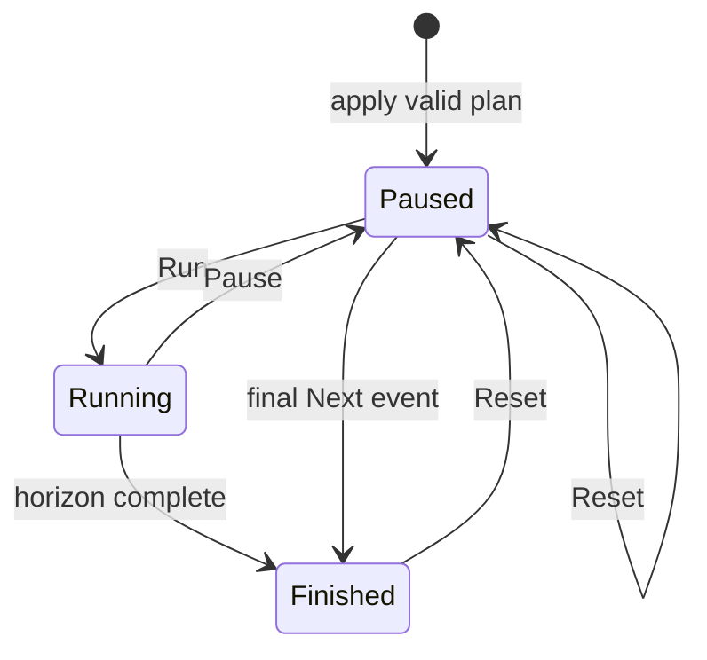
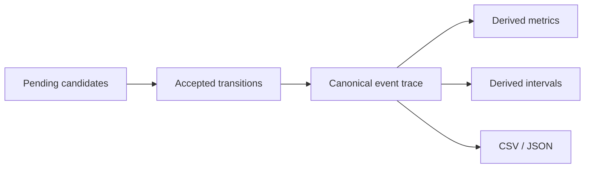

# Execution and Results

## Run states

| State | Meaning |
|---|---|
| Not configured | no active validated run |
| Paused | active run exists and does not advance automatically |
| Running | controller advances cooperatively |
| Finished | inclusive horizon completed |



## Next event

**Next event** processes one complete logical event tick, including every
semantic phase at that tick. It is not “one queue pop.”

Example at tick 10:

```text
1. accept completion events
2. accept message deliveries
3. check deadlines
4. process all releases in semantic order
5. update policy context
6. schedule resources
7. record caused actions
```

This atomic step is the safest way to study ordering.

## Live and Fast modes

- **Live** advances through bounded GUI updates suitable for observation.
- **Fast** processes cooperative event/tick batches within a wall-clock budget.

Both use the same engine operation. Batch size and rendering rate affect
wall-clock responsiveness, not logical time, policy ranking, or trace order.

## Reading a timeline

Suppose:

```text
Task A: priority 2, demand 6, release 0
Task B: priority 0, demand 2, release 3
```

Preemptive timeline:

```text
tick      0       3       5          8
          |-------|-------|----------|
A         Running Ready    Running
B                 Running Completed
```

Canonical observations include `JobStart(A)`, `JobPreempt(A)`,
`JobStart(B)`, `JobFinish(B)`, `JobResume(A)`, and `JobFinish(A)`.

## Response time

For a completed job:

```text
response time = finish tick - release tick
```

Example:

```text
release = 3
finish  = 9
response time = 6 ticks
```

Per-task results report exact integer minimum, maximum, total, count, and a
presentation-only mean.

## Deadline misses

A deadline miss counts an incomplete job at its absolute deadline. Finishing
exactly at that tick is on time because completion precedes deadline checking.

A miss does not currently cancel the job. Therefore, a job can both record a
deadline miss and later complete.

## Preemption count

Each time a Running job is stopped by a higher-priority Ready job, its
preemption count increases. Resume does not create a new job.

## Resource utilization

For an observation interval `[0, t)`:

```text
utilization = busy ticks / t
```

Busy time includes the uncharged portion of a currently active interval when
the snapshot is taken.

Example:

```text
observed through tick 20
busy ticks = 15
idle ticks = 5
utilization = 15 / 20 = 0.75
```

## Message metrics

The current result model reports:

- sent messages;
- delivered messages;
- fixed delivery-delay statistics.

A message near the horizon may remain `PendingSend` or `InFlight`. That is an
explicit truncated lifecycle, not an implicit delivery.

## Functional signals

Functional observations have exact integer ticks and typed values. Plotting may
convert values to screen coordinates, but the underlying Real/Integer/Boolean
identity is preserved.

For Bosch runs, examples include physical state, performance values, and
critical-section indicators supplied by the adapter.

## Canonical versus derived data



The trace records accepted observations. Metrics and intervals are
reconstructable analysis products. Changing a chart or table must not change
the trace.

## Selected range

A shared tick range can be selected in Timeline or signal plots. Result export
can use either:

- the complete run; or
- the inclusive selected range.

The selection filters the detached result; it does not rerun the simulation.

## Export layout

A run export contains authoritative machine-readable artifacts, normally
including:

```text
<run-id>/
├── manifest.json
├── system.json
├── run-plan.json
├── metrics.json
├── metrics.csv
├── events.csv
├── signals.csv
└── results.xlsx        # optional convenience output
```

The manifest records project/run identity, CPSSim version, checksums, policy,
stop tick, scenario, and creation time.

Export writes to a temporary sibling and publishes through one rename.
Existing run IDs are rejected and a failed export leaves no partial published
directory.

## Reproducible comparison

When comparing policies:

1. keep the system, trajectory, stop tick, and assignment assumptions explicit;
2. save each run under a unique ID;
3. compare manifests and checksums before comparing metrics;
4. retain canonical event data, not only screenshots;
5. document any adapter tolerance or stochastic seed when those features are
   introduced.
