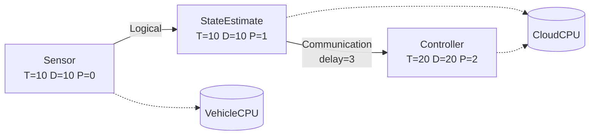
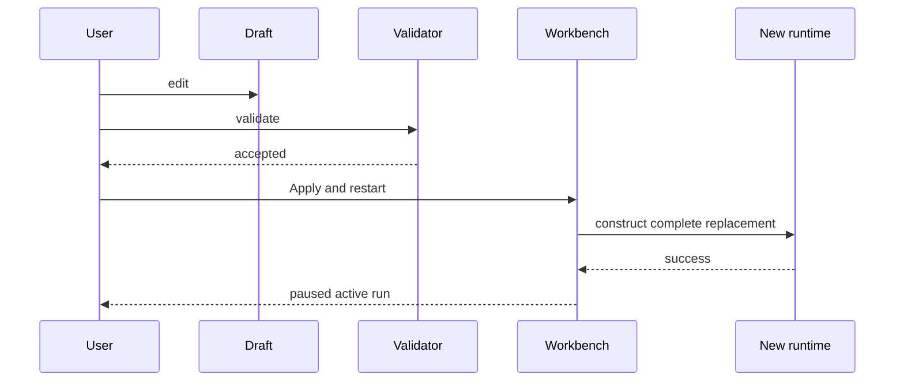

# First Generic Experiment

This tutorial builds a three-task experiment and follows it through validation,
execution, inspection, saving, and export.

## Target system



Use this data:

| Task | Period | Deadline | Offset | Priority |
|---|---:|---:|---:|---:|
| Sensor | 10 | 10 | 0 | 0 |
| StateEstimate | 10 | 10 | 0 | 1 |
| Controller | 20 | 20 | 0 | 2 |

Execution profiles:

| Task | Resource | Execution time |
|---|---|---:|
| Sensor | VehicleCPU | 1 |
| StateEstimate | CloudCPU | 3 |
| Controller | CloudCPU | 5 |

Run plan:

```text
Stop tick: 100
Preemption: Preemptive
Policy: Fixed Priority
```

## 1. Launch CPSSim

```bash
make run-gui
```

The application opens on Home without an active project.

## 2. Create a Generic project

Choose **New Generic Project**, select a parent directory, and enter a project
name such as:

```text
first-generic-experiment
```

A project directory contains persistent files such as:

```text
first-generic-experiment/
├── project.json
├── system.json
├── workspace.json
└── run-plans/
    └── default.json
```

`project.json` is metadata. `system.json` stores the system. The run-plan file
stores stop tick, policy, and assignments. `workspace.json` stores
presentation-only state such as graph positions and filters.

## 3. Create resources

In **Experiment Explorer**, use the Resources section context menu to add two
resources.

Select each resource and edit it in **System Builder**:

```text
Resource 1 -> VehicleCPU
Resource 2 -> CloudCPU
```

Resource IDs are stable identities. Names are labels and may be changed without
changing identity.

## 4. Create tasks

Create three tasks through either:

- the Tasks section in Experiment Explorer;
- **Add Task** in the Architecture toolbar; or
- the empty-canvas context menu in Architecture.

Edit each task in System Builder using the table above.

A useful visual arrangement is:

```text
Sensor       StateEstimate       Controller
```

Use **Auto Layout** for deterministic placement, **Center View** to center at
the current zoom, or **Fit All** to fit the entire graph.

## 5. Define execution profiles and assignments

For `Sensor`:

```text
VehicleCPU: WCET 1
Assignment: VehicleCPU
```

For `StateEstimate`:

```text
CloudCPU: WCET 3
Assignment: CloudCPU
```

For `Controller`:

```text
CloudCPU: WCET 5
Assignment: CloudCPU
```

The assignment selector shows only resources with a profile. If a resource is
missing, add its execution profile first.

The Resource Assignments table is read-only. Selecting a row opens the task in
System Builder, where assignment and WCET are edited.

## 6. Create links

### Sensor to StateEstimate

Set the Architecture link type to **Logical**. Drag from the Sensor output port
to the StateEstimate input port.

Expected result:

- directed dashed Logical link;
- latency zero;
- no message events at runtime.

### StateEstimate to Controller

Set the link type to **Communication**. Drag from the StateEstimate output port
to the Controller input port.

Select the link and use System Builder to set:

```text
Delay: 3 ticks
```

Expected result:

- directed Communication link;
- every accepted StateEstimate completion creates a send one tick later;
- delivery occurs three ticks after the send.

## 7. Configure the run

In **Run Configuration**, set:

```text
Stop tick: 100
Policy: Fixed Priority
Preemption: Preemptive
```

Assignments should already match the selected task pages.

## 8. Validate

Choose **Validate changes**.

A valid draft has:

- unique task and resource IDs;
- nonempty names;
- positive period and deadline;
- nonnegative offset and priority;
- at least one execution profile for each assigned task;
- execution demand consistent with validation rules;
- one assignment per task;
- valid link endpoints;
- no duplicate ordered endpoint pair.

Errors appear beside the related editor field or in Diagnostics. Validation
never partially updates the active simulation.

## 9. Apply and restart

Choose **Apply and restart**.



If construction fails, the previous active run remains intact.

## 10. Step through the first tick

Choose **Next event**. One click processes every phase at the next pending
logical tick.

At tick 0, all three tasks release. Because they use two resources:

- Sensor can start on VehicleCPU;
- StateEstimate can start on CloudCPU;
- Controller waits in CloudCPU's Ready queue behind the higher-priority
  StateEstimate job.

Expected scheduling sketch:

```text
VehicleCPU: [0,1) Sensor
CloudCPU:   [0,3) StateEstimate, then [3,8) Controller
```

At StateEstimate completion tick 3, the Communication route creates:

```text
MessageSend at 4
MessageDelivery at 7
```

The Logical link from Sensor generates no message events.

## 11. Inspect the workbench

Use:

- **Architecture** for task/link structure and assignment badges;
- **Timeline** for Ready and Running intervals;
- **Resources** for Running job, Ready queue, busy/idle time, and utilization;
- **Canonical Events** for exact sequence and causality;
- **Runtime Inspector** for the selected event/job/resource;
- **Diagnostics** for current validation and application messages.

Click the Cause cell of a message event to follow its predecessor.

## 12. Run to completion

Choose **Run** in Live mode for observable progression or Fast mode for
cooperative batching. Rendering rate changes wall-clock playback only; it does
not change logical ordering.

Pause at any time. Structural editing remains disabled while Running and
becomes available again after Pause or Reset.

## 13. Inspect results

When the inclusive stop tick is complete, Results is finalized from one
detached immutable snapshot.

Check:

- event count;
- completed jobs;
- deadline misses;
- preemptions;
- per-task response time;
- resource utilization;
- message sent/delivered count and delay.

## 14. Save and export

Use **Save Project** to persist the applied system and project workspace.

Use **Export Run Results** to choose:

- complete run or selected tick range;
- destination directory;
- run ID;
- optional Excel workbook.

Authoritative JSON/CSV files are written atomically. A failed export does not
publish a partial run directory.

## What this experiment teaches

- Task descriptions and run assignments are separate.
- Execution demand depends on the assigned resource profile.
- Jobs are runtime instances, not task definitions.
- Resources progress independently under one deterministic global clock.
- Logical links describe structure; Communication links create message events.
- Draft editing does not mutate the active run.
- GUI rendering is detached from simulation semantics.
