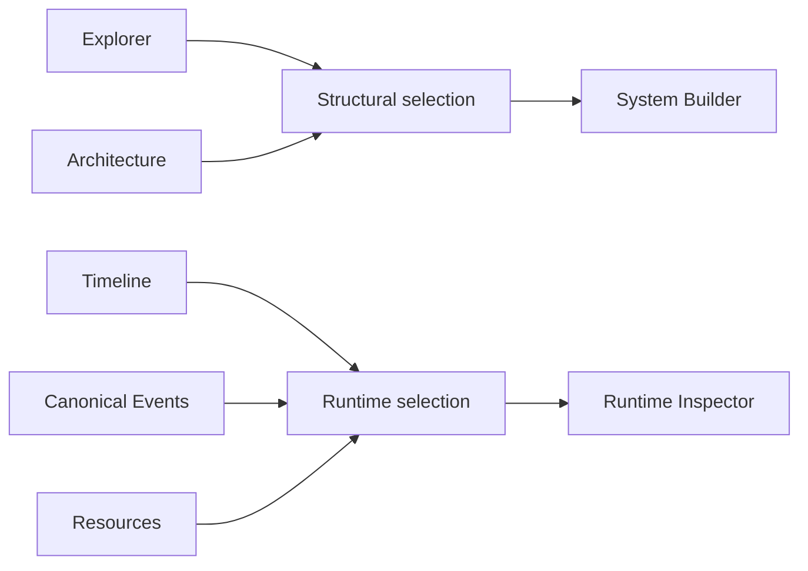

# GUI Workbench

The Qt workbench is a visual application over the same deterministic engine
used by headless execution. It does not implement a second simulator.

## Workbench layout

```text
+-----------------------------------------------------------------------+
| File / Edit / View / Help          Run Pause Reset Next Event  status |
+-------------------+--------------------------------+------------------+
| Experiment        | Architecture / Timeline /      | Run Configuration|
| Explorer          | Signals / Results / Plot       |                  |
+-------------------+--------------------------------+------------------+
| System Builder    |                                | Runtime Inspector|
+-------------------+--------------------------------+------------------+
| Resources / Canonical Events / Diagnostics                            |
+-----------------------------------------------------------------------+
```

Docks can be resized, floated, tabified, hidden, and restored. Theme and Qt
dock geometry are global user preferences. Project workspace stores
presentation-only values such as architecture positions, filters, selected
signals, and view ranges.

## Home screen

Before a project is active:

- project create/open actions are available;
- recent projects are shown;
- Light/Dark theme remains available;
- run, save, structural editing, and dock actions are disabled.

Opening, creating, or replacing a project transitions to the workbench and
centers the Architecture graph once.

## Experiment Explorer

Explorer is the structural tree for:

- project;
- resources;
- tasks;
- connections.

Selecting an entity updates **System Builder** and synchronizes structural
selection with Architecture.

Context menus create, duplicate, or delete supported entities. Task/resource
deletion first reports affected profiles, assignments, and routes, then applies
a confirmed draft-only cascade through shared Undo/Redo.

## System Builder

System Builder is the property editor for the selected structural entity.

Examples:

- System: tick period and preemption mode.
- Resource: stable ID and name.
- Task: name, period, deadline, offset, priority, assignment, and per-resource
  execution profiles.
- Link: source, destination, kind, fixed send offset, and delay.

Edits affect the detached system draft. They do not alter the current active
simulation until **Apply and restart** succeeds.

## Run Configuration

The run plan contains:

- inclusive stop tick;
- scheduling policy kind;
- one resource assignment per task.

Only resources with a configured execution profile are valid assignment
choices.

Important actions:

- **Validate changes:** build diagnostics without changing runtime.
- **Apply and restart:** atomically construct a replacement paused run.
- **Reset:** reconstruct from the last applied plan; it does not apply pending
  draft changes.

## Architecture

Architecture is a flat task graph:

- each task is a node;
- resources are not containers;
- assignments are shown through a resource badge/accent, not edges;
- Logical and Communication links are directed edges.

Toolbar operations:

| Action | Effect |
|---|---|
| Fit All | change pan and zoom to show all nodes |
| Center View | center graph without changing zoom |
| 100% | reset zoom |
| Auto Layout | deterministic layout |
| Snap to Grid | snap moved nodes to shared grid |
| Add Task | create a task through the domain edit path |
| Link type | choose Communication or Logical before port drag |

A task node has one stable input port and one stable output port. Drag output to
input to create a link. Each ordered task pair supports at most one link.

While Running, selection, pan, zoom, Fit All, Center View, and 100% remain
available, but structural changes are rejected.

## Timeline

Timeline derives Ready and Running intervals from the canonical event trace.

Interactions include:

- mouse wheel: zoom around cursor;
- middle drag: pan;
- Fit: show available trace;
- interval click: select job and tick range;
- event marker click: select exact event;
- category visibility controls;
- Zoom time: use shared selected range.

Timeline never invents events. If lifecycle data is inconsistent, derivation
fails closed and reports the exact problematic event.

## Functional Signals

When a functional model is attached, Signals shows typed Real, Integer, and
Boolean observations.

You can:

- search/select series;
- fit data;
- enable auto-follow;
- zoom and pan;
- click or drag a shared tick/range selection.

Drawing may downsample for performance, but stored observations and exported
values remain full resolution.

## Resources

Resources presents one row per execution resource:

- running job;
- Ready jobs;
- busy ticks;
- idle ticks;
- utilization.

Selecting a resource or job updates Runtime Inspector. Utilization uses the
current observed interval; consult the tooltip for the exact denominator.

## Canonical Events

Canonical Events is a virtualized sequence-ordered table. Filters include event
type, task, resource, vehicle, and text. Columns can be shown or hidden.

Selecting a row publishes event and tick selection. Selecting its Cause cell
navigates to the causal predecessor.

The raw event JSON is generated only for the selected event, not for every row.

## Runtime Inspector

Runtime Inspector presents the current runtime selection:

- event details and raw JSON;
- job identity and lifecycle;
- runtime resource state;
- selected tick or range.

It intentionally does not duplicate structural properties. Edit those in
System Builder.

## Results and plot views

While Running or Paused, Results shows lightweight progress. On Finished, one
immutable detached snapshot is finalized in managed background work and then
published at the GUI boundary.

Results summarizes generic timing and task metrics. Plot views show completed
functional series and scenario overlays where available.

## Diagnostics

Diagnostics combines:

- application errors/status;
- system-draft validation;
- run-plan validation;
- workspace warnings.

A diagnostic should tell you which entity and field is invalid. It never fixes
input silently.

## Selection model

Structural selection and runtime selection are separate:



Selecting a runtime event does not unexpectedly replace the task being edited.

## Undo and Redo

System Builder, Explorer, and Architecture share one structural Undo stack.
Undo history is cleared when the active project root changes or Save As creates
a new root. Workspace-only movement is not confused with system semantics.

## Save behavior

`Save Project` persists the **applied** system. When unapplied edits exist,
close/open/replacement flows ask whether to apply and save, discard, or cancel.
A no-op interaction should not mark the project dirty.
