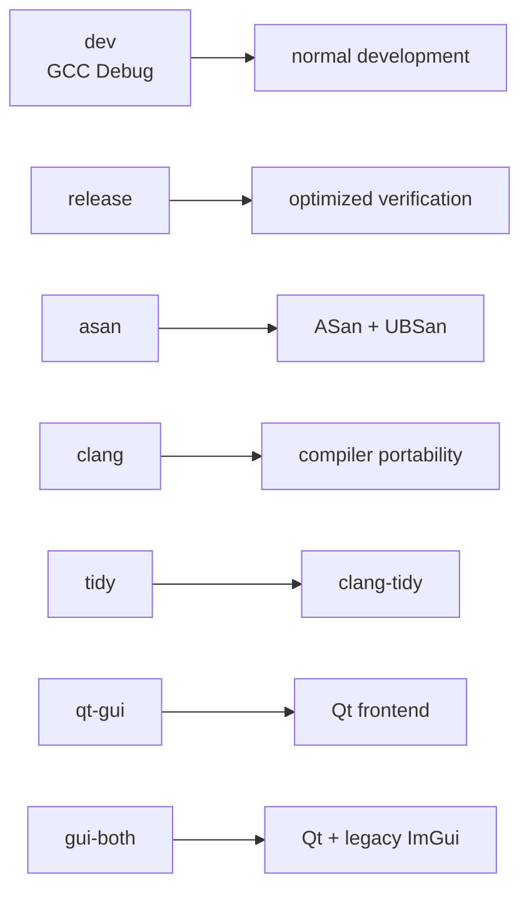

# Installation and Launch

## Supported baseline

The documented development environment is Ubuntu with:

- a C++20 compiler;
- CMake 3.24 or newer;
- Git and Make;
- Qt 6 Widgets/OpenGL development packages for the default GUI;
- Catch2 3 for tests;
- `clang-format` for the verification workflow;
- Ninja for the standard CMake presets.

On Ubuntu 24.04, the principal GUI packages are:

```bash
sudo apt update
sudo apt install \
  build-essential cmake ninja-build git \
  qt6-base-dev libgl1-mesa-dev \
  catch2 clang-format
```

Package availability differs across Ubuntu releases. The repository also fetches
pinned source dependencies when configured.

## Clone and build

```bash
git clone https://github.com/gaochuanchao/CPSSim.git
cd CPSSim
make
```

`make` configures the `make-dev` preset and builds the CLI, default Qt GUI, and
the prepared Linux Bosch FMU target.

## Launch the Qt workbench

```bash
make run-gui
```

The equivalent executable is normally:

```bash
./build/make-dev/cpssim_gui
```

An existing project may be passed directly:

```bash
./build/make-dev/cpssim_gui path/to/project.json
```

## Launch the CLI

```bash
make run-cli
```

The CLI currently focuses on the supplied Bosch workflows. Use its `help`
command to inspect registered commands.

## Verify the installation

Interactive verification:

```bash
make test
```

Non-interactive quick verification:

```bash
./scripts/verify.sh quick
```

Full verification before a substantial handoff:

```bash
./scripts/verify.sh full
```

Focused module test:

```bash
./scripts/verify.sh module kernel
```

Available labels include `core`, `config`, `kernel`, `scheduler`, `network`,
`functional`, `fmi`, `bosch`, `conformance`, `gui`, and `cli`.

## Build presets



Typical direct commands:

```bash
cmake --preset qt-gui
cmake --build --preset qt-gui -j
ctest --test-dir build/qt-gui --output-on-failure
```

## First-launch dependency downloads

The first GUI configuration may download pinned QtNodes source. Other pinned
dependencies include JSON and spreadsheet-writing support. A failed download is
usually a network or certificate problem, not a simulator error.

## Clean generated builds

```bash
make clean
```

This removes the documented generated build directories, not project data or
source files.
