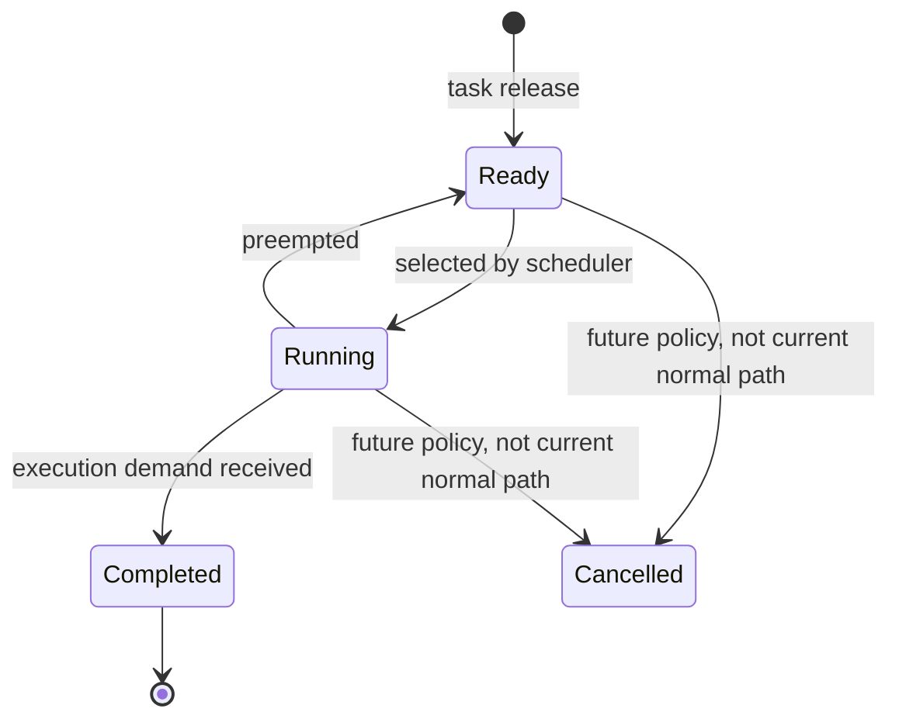
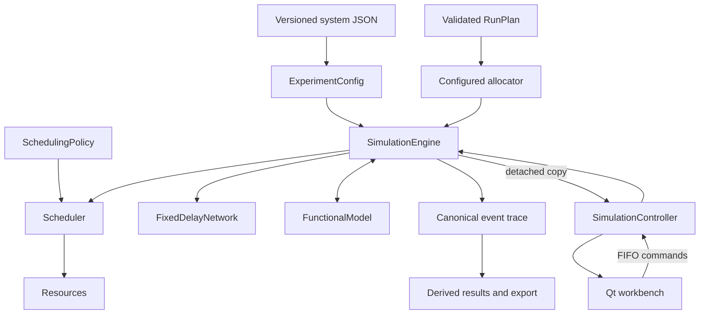

# Overview

## The problem CPSSim addresses

Traditional real-time analysis often abstracts functionality into fixed
periods, deadlines, and execution times. A cyber-physical system may be more
context-dependent: the physical impact of delayed computation can be small in
one operating region and severe in another.

CPSSim provides a deterministic timing engine that can interact with an
optional functional or physical model:

This enables two complementary questions:

1. **How does computing and communication timing affect functional
   performance?**
2. **How can functional state or performance guide timing decisions?**

## What CPSSim simulates

At the timing layer, a configured periodic task releases a sequence of jobs.
Each job is assigned to one resource, waits in a Ready queue, executes, may be
preempted, completes, and may cause outgoing messages.

At the functional layer, an attached model receives accepted timing actions and
returns typed observations. The supplied Bosch adapter maps these actions to
FMU trigger inputs and reads vehicle-control outputs.

## Determinism

Given identical validated input and deterministic adapters, CPSSim is designed
to produce the same canonical event trace. Important safeguards include:

- integer logical time;
- explicit same-tick phase precedence;
- stable event insertion sequence;
- deterministic resource and Ready-job ordering;
- no dependence on GUI frame rate;
- explicit ownership of mutable state;
- no hidden global random source.

Determinism is essential for debugging, regression testing, and comparing
scheduling policies.

## Current architecture in one picture

## Generic and Bosch projects

A **Generic project** lets you create and modify resources, tasks, execution
profiles, and both link kinds.

A **Bosch-compatible project** is constructed from the supplied scenario.
Adapter-owned task identities and structural dependencies are protected because
the FMU trigger mapping relies on them. Timing, assignment, run, and selected
scenario parameters remain available where supported.

## What CPSSim is not yet

CPSSim is not currently a general network simulator, a global multicore
scheduler, a distributed co-simulation master, or a stochastic workload
framework. The current model favors a small deterministic semantic foundation
that future research extensions can build upon explicitly.
