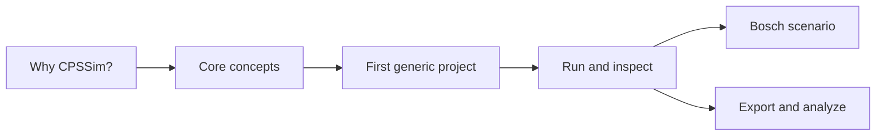
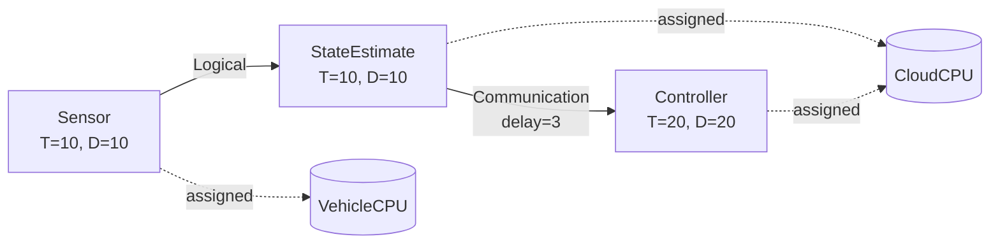

# CPSSim User Guide

This guide teaches CPSSim as a model and workflow, not as a list of buttons.

## Learning path

Recommended order:

1. [Overview](OVERVIEW.md)
2. [Installation](INSTALLATION.md)
3. [Core concepts](CORE-CONCEPTS.md)
4. [First generic experiment](FIRST-GENERIC-EXPERIMENT.md)
5. [GUI workbench](GUI-WORKBENCH.md)
6. [Execution and results](EXECUTION-AND-RESULTS.md)

Use the [Bosch Challenge workflow](BOSCH-CHALLENGE-WORKFLOW.md) when working
with the supplied FMU. Keep [Troubleshooting](TROUBLESHOOTING.md) and the
[Glossary and limits](GLOSSARY-AND-LIMITS.md) as references.

## Running example

The guide uses one small experiment consistently:

The example is intentionally small enough to calculate by hand. It is used to
explain configuration, resource assignment, scheduling, messages, event
ordering, GUI interaction, and results.

## What this guide assumes

You should be comfortable with software configuration and basic CPS concepts.
The guide defines real-time terms such as task, job, period, deadline,
preemption, and logical tick when they first appear. No knowledge of the C++
implementation is required.
